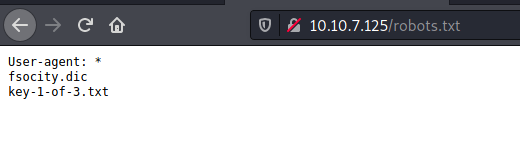

|  | Difficulty |  |  IP Address   |  | Room Link |  |
|--| :--------: |--|:------------: |--| :--------:|--|
|  |   Medium   |  |  10.10.7.125  |  | [Mr Robot CTF](https://tryhackme.com/room/mrrobot) |  |

### [ What is key 1? ]

Let's start off with an `nmap` scan on the target machine. We run the scan with standard scripts loaded and version enumeration enabled. We also do a full scan on all ports.

```
sudo nmap -sC -sV -vv -T4 -p- 10.10.7.125
```

**Results:**


From the results, we can see that there are 2 ports discovered on our target: **22 (SSH)** and **80 (HTTP)**. The SSH server is closed, so looks like we won't be able to connect to it directly.

Let's take a look at the HTTP website:


We have a pretty cool web page that allows us to input some preset commands.

Inputting any of the commands will bring us to different pages which look cool as well, but ultimately are of no use to us.

**Eg: inputting 'inform'**


Next, I did some manual enumeration of the site, starting off with some low-hanging fruit.

Firstly, I checked the source code for the main page:


We have a hidden message: "YOU ARE NOT ALONE". We also have a 'USER_IP' variable pointing to '208.185.115.6'. Not sure if this will be useful in the future, let's keep note of it for now.

Next, let's see if we can access the robots.txt file on the web server:



Nice, we found the first key! We can access it by visiting `http://10.10.7.125/key-1-of-3.txt`:


---

### [ What is key 2? ]

Visiting `http://10.10.7.125/fsocity.dic` prompts us to download a file called **fsocity.dic**.

**Snippet of fsocity.dic:**


Looks like we have a username / password wordlist. This will come in useful later, but for now let's continue to enumerate the web server.

Now, let's run a `gobuster` scan to find any hidden directories on the web server. We make sure to check for common extensions such as .php and .txt. 

```
gobuster dir -u http://10.10.7.125/ -w /usr/share/wordlists/dirbuster/directory-list-2.3-medium.txt -x php,txt,html -t 100
```


From the results, we can tell that the web server is using WordPress. There are also two notable directories: **/admin** and **/login**.

When we visit **/admin**, we get a blank screen that seems to be constantly refreshing and loading. It does not seem that we can interact with the page.

Next, visiting **/login** brings us to the WordPress dashboard login page:


I tried using common credentials to log in, such as **admin:admin**. Unfortunately, that did not work. Looks like we'll have to carry out a dictionary attack. To do that, we first need to figure out an existing username.

The good thing about WordPress is that it actually tells us if a username exists or not. For example, if we were to input a non-existing username, we would get the error message: "Invalid username." On the other hand, if we were to input an existing username, we would get the error message: "The password you entered for the username XXX is incorrect."  

With this in mind, I tried various usernames that were found within the website: 'mrrobot', 'friend', 'fsociety', 'root' etc. Unfortunately, none of them belonged to existing accounts.

Perhaps the **fsocity.dic** file contains the username? Let's use `wpscan` to try enumerating the username with that wordlist:

```
wpscan --url http://10.10.7.125 -e u --users-list fsocity.dic
```


We found some usernames that we can use!

> Elliot, elliot, ELLIOT 

I'll use **elliot** as the username for my dictionary attack. 

Normally, my go-to password wordlist for dictionary attacks is the classic rockyou.txt file. However, I wanted to check whether fsocity.dic contained the password.

Once again, we'll use `wpscan` to carry out the dictionary attack. However, before doing so, note that fsocity.dic contains 858160 lines! That's a lot of words and will make our attack very slow. Furthermore, many of the words are duplicated, so we can surely optimize the wordlist by removing the duplicates.

We can use the `sort` program with the `-u` option to do so:

```
sort -u fsocity.dic > fsocity_sorted.dic
```

**Before sorting (858160 lines):**


**After sorting (11451 lines):**


We then use `wpscan` like so:

```
wpscan --url http://10.10.7.125 -U elliot -P fsocity.dic
```


Great! WPScan managed to find elliot's password: 

> ER28-0652

With that, let's log into the WordPress dashboard with elliot's account:


Looks like we have version 4.3.1 of WordPress running with the 'Twenty Fifteen theme'. From past experiences, I know that we can exploit the **Theme Editor** to upload a [PHP reverse shell](https://github.com/pentestmonkey/php-reverse-shell). This will then allow us to gain an initial foothold into our target machine.

The Theme Editor can be accessed via **Appearance** > **Editor**.

We copy the entire reverse shell and replace one of the PHP files in the Theme Editor. In this case, I'll replace **archive.php**.

**archive.php before replacing:**


**archive.php after replacing:**


After saving the file, we then run a netcat listener that is ready to catch our reverse shell connection.

Finally, we navigate to: `http://10.10.7.125/wp-content/themes/twentyfifteen/archive.php` to trigger the reverse shell:


With that, we managed to open up a shell into our target machine! :smile:

Searching around, I found the **second flag** in the home directory of the user 'robot': 


Unfortunately, we do not have the permissions to open the file. Looks like we need to find a way to log in as robot.

In the same directory, there is a **password.raw-md5** file:


The file contains the md5-hashed password for robot! We can use `john` to crack the password:

```
john hash.txt --wordlist=/usr/share/wordlists/rockyou.txt --format=Raw-MD5
```


And we have robot's password: 

> abcdefghijklmnopqrstuvwxyz

When trying to log in as root in our reverse shell, I realized that I couldn't as the shell was non-interactive shell. Hence, programs that require user input, such as `su`, will not work. 

We are also not able to ssh into the machine as the SSH port is closed:


One way that we can upgrade our shell to a fully-interactive shell is by using Python:

```
python -c 'import pty; pty.spawn("/bin/bash")'
```

With our shell upgraded, we can `su` into robot's account:


and access the **second flag**:


---

### [ What is key 3? ]

We now have to find a way to escalate our privileges.

I first did some manual enumeration by searching around the various directories on the machine, such as /opt and /tmp. However, I was unable to find anything of interest. Next, I checked for robot's sudo privileges, but turns out that they had none:


Next, let's look for SUID-bit enabled files on the system:

```
find / -type f -perm /u=s 2>/dev/null
```


Immediately I noticed an interesting file with the SUID bit set: `nmap`

*(Instead of using `find`, we could have also automated the process by using a privesc automation script such as [LinPEAS](https://github.com/carlospolop/PEASS-ng/tree/master/linPEAS))*

Doing some research online, I found an [article](https://null-byte.wonderhowto.com/how-to/use-misconfigured-suid-bit-escalate-privileges-get-root-0173929/) online on how we can exploit an SUID-bit enabled nmap.

To do so, we first run nmap in interactive mode.

```
./nmap --interactive
```

Then, we break out of nmap by spawning a shell.

```
!sh
```


Since the program is run as root, the shell that we spawn will have root privileges. We have managed to escalate our privileges! 

With that, we can obtain the **third flag** which is located in /root:


