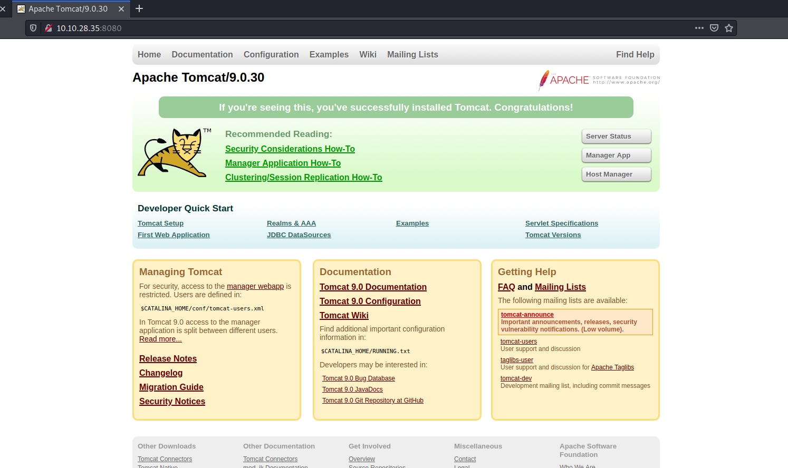
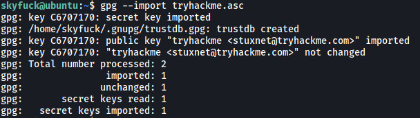

| Difficulty |  |  IP Address   |  |
| :--------: |--| :-----------: |--|
|    Easy    |  |  10.10.28.35  |  |

---

### [ Compromise this machine and obtain user.txt ]

Let's first start off with an `nmap` scan on the target machine.

```
sudo nmap -sC -sV -vv -T4 10.10.28.35
```

**Results:**


From the results, we can see that we have 4 ports open on our target machine: **22 (SSH)**, **53 (Possibly DNS)**, **8009 (AJP)** and **8080 (HTTP)**

Let's take a look at the HTTP Web Server running on port 8080:



Looks like we have an Apache Tomcat default page. From the webpage, we know that the server is running on **version 9.0.30**.

I then ran a `gobuster` scan to enumerate any hidden directories:

```
gobuster dir -u http://10.10.28.35/ -w /usr/share/wordlists/dirbuster/directory-list-2.3-medium.txt -x php,txt,html -t 50
```

I did manage to get a few directories like /docs and /examples, but they were ultimately of no use.

Next, after doing some research on vulnerabilities that exist for Apache Tomcat 9.0.30, I stumbled across a recently discovered vulnerability called **GhostCat** (CVE-2020-1938). This [webpage](https://scottc130.medium.com/understanding-the-ghost-cat-vulnerability-cve-2020-1938-79ceae327599) does a good job of summarizing the vulnerability.

---

**From the webpage:** 

*AJP (Apache JServ Protocol) is used as an optimized version of HTTP protocol in binary form. It can be used to reduce the processing costs related to HTTP requests, and is mostly used in scenarios that require clustering or reverse proxies.*

*If the AJP port (default - 8009) is exposed to the internet and is not configured correctly, attackers can freely access it to read from and write files to the server. When configured correctly, AJP should require a secret by anyone who queries the protocol. The issue is that this secret mechanism is not enabled by default. Hence, anyone who has not explicitly enabled this mechanism is susceptible to the GhostCat vulnerability.* 

*Exploiting GhostCat can allow us to read any resources that exist on the Tomcat server, including configuration files. Furthermore, if the server allows uploading of files, attackers can upload malicious jsp files and access it via their browser, resulting in Remote Code Execution.*

---

We know that version 9.0.30 of Tomcat, which is the one in the room, is vulnerable to the GhostCat vulnerability . Furthermore, from our Nmap scan earlier, we know that the **AJP port is accessible** by us. This means that we will be able to exploit the GhostCat vulnerability to attack this machine!

We'll be using a GhostCat exploitation tool found on [Github](https://github.com/00theway/Ghostcat-CNVD-2020-10487).

Let's read the **web.xml** file from the Tomcat server. This is one of the main configuration files and can contain potentially useful information. We use the tool like so:

```
python3 ajpShooter.py http://10.10.28.35 8009 /WEB-INF/web.xml read
```


Nice, looks like there is a set of credentials hidden in the web.xml page:

> skyfuck : 8730281lkjlkjdqlksalks

Let's try logging in via SSH using the credentials:


And we're in!

The home page of the skyfuck user contains two files:


* **credential.pgp**: Pretty Good Privacy (PGP) encrypted message

* **tryhackme.asc**: Armoured PGP key

We can first import the **tryhackme.asc** key using `gpg`:

```
gpg --import tryhackme.asc
```



Next, let's use this key to decrypt **credential.pgp**:

```
gpg --decrypt credential.pgp
```


Unfortunately, we need a passphrase in order to decrypt the credential.pgp file.

Fortunately for us, we can use `john` to crack this passphrase. The specific tool we'll use is `gpg2john`. After downloading the tryhackme.asc file onto our local machine, we can run:

```
gpg2john tryhackme.asc > hash
```

This converts the tryhackme.asc file to a format that can be cracked by `john`.

Next, we run:

```
john hash --wordlist=/usr/share/wordlists/rockyou.txt
```


John managed to get the passphrase hidden within the tryhackme.asc file: **alexandru**.

Let's use this passphrase to decrypt the credential.pgp file:


Nice! We've got another set of credentials: 

> merlin : asuyusdoiuqoilkda312j31k2j123j1g23g12k3g12kj3gk12jg3k12j3kj123j

The **merlin** user is actually another user on the machine. With that, we can log into his account. 

The user flag can be found in merlin's home directory:


---

### [ Escalate privileges and obtain root.txt ]

Next, let's find a way to escalate our privileges.

Firstly, let's check out what **sudo privileges** merlin has:


Interesting, looks like merlin can run `zip` as root.

Looking at GTFOBins, we can find the following way to exploit the zip program:


All we have to do is to copy-paste the code given and we will be able to open up a shell with root privileges:


With that, we can obtain the root flag from /root:


