| Difficulty |
| ---------- |
|   Medium   |

---

### [ Enumerate the machine.  How many ports are open? ]

As always, we start off with a `nmap` scan on the target machine:

```
sudo nmap -sC -sV -vv -T4 -p- 10.10.186.111
```

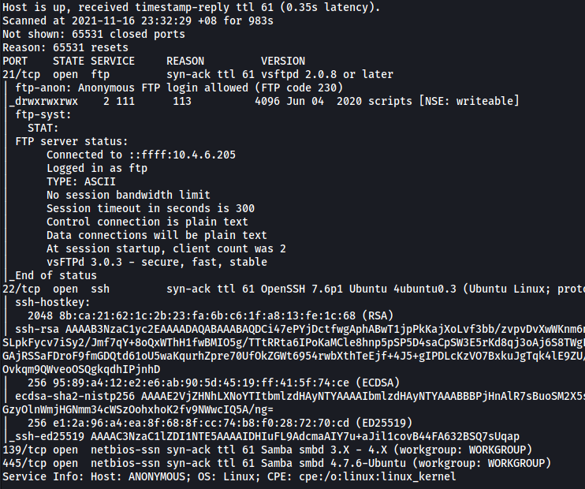

From the results, we can see that there are **4** ports open.

---

### [ What service is running on port 21? ]

**FTP** is running on port 21.

---

### [ What service is running on ports 139 and 445? ]

**SMB** (Samba) is running on ports 139 and 445.

---

### [ There's a share on the user's computer.  What's it called? ]

To enumerate the share on the SMB server, we can use the command:

```
smbclient -L 10.10.186.111
```

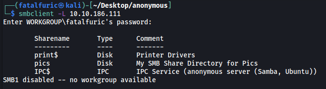

This will list out all of the shares on the machine that we are allowed to access.

The share is called **pics**.

---

### [ user.txt ]

Let's first take a look at the **pics** share. We can connect to it using:

```
smbclient //10.10.186.111/pics
```

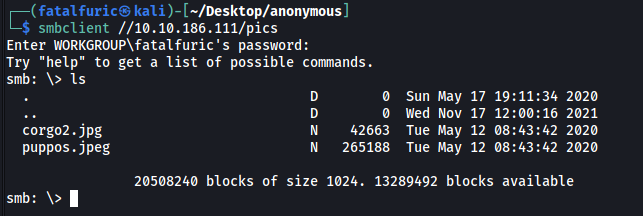

We have two image files: **corgo2.jpg** and **puppos.jpeg**.

I downloaded these files onto my local machine and used tools like `steghide` to check for steganography. However, there was nothing hidden within these files.

Next, let's check out the **FTP** server. From the Nmap scan earlier, we know that **anonymous login** is enabled. This means that we will be able to access the server without providing a password:

```
ftp 10.10.186.111
```

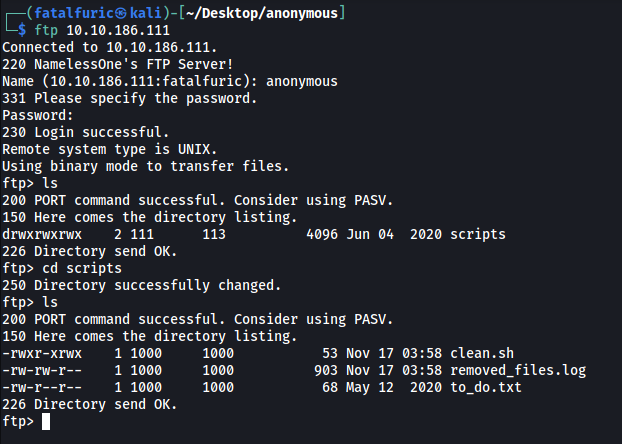

In the FTP server, there is a directory called **scripts**. There are 3 files in the scripts directory: **clean.sh**, **removed_files.log** and **to_do.txt**.

**clean.sh:**

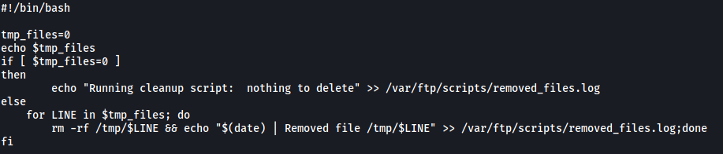

Looks like a script that removes files and logs the files removed to **removed_files.log**.

**removed_files.log:**

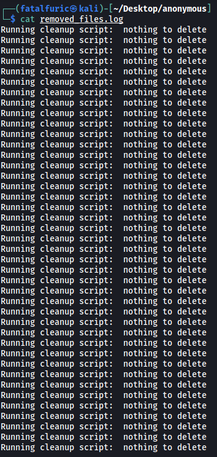

The log file that **clean.sh** is saving to.

**to_do.txt:**

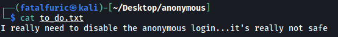

Too late buddy :sweat_smile:

From what we have, it would seem that we have a script that is running as a cronjob. We can deduce this from the numerous lines within removed_files.log, indicating that clean.sh is being run periodically.

As such, what we can do is to replace **clean.sh** in the FTP server with our own malicious reverse shell script. When clean.sh is then executed, a reverse shell will be opened, allowing us to gain an initial foothold into the machine.

The reverse shell payload we'll use is from [PayloadsAllTheThings](https://github.com/swisskyrepo/PayloadsAllTheThings/blob/master/Methodology%20and%20Resources/Reverse%20Shell%20Cheatsheet.md).

**Our clean.sh script:**

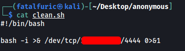

To replace the clean.sh file, we log into the FTP server and run:

```
put clean.sh
```

We then set up a netcat listener on our local machine:

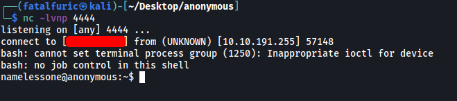

After a few seconds, the reverse shell is successfully opened and we are logged in as the user **namelessone**!

**user.txt** can be found in the **home** directory of namelessone:

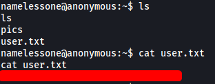

---

### [ root.txt ]

Now we need to find a way to escalate our privileges.

Firstly, I was unable to check for our **sudo privileges** as I did not know the password to namelessone's account.

Next, I looked around directories such as **/tmp** and **/opt** to see if there were any files of interest. There were none unfortunately.

I then decided to search the machine for files with the **SUID** bit set.

```
find / -type f -perm /u=s 2>/dev/null
```

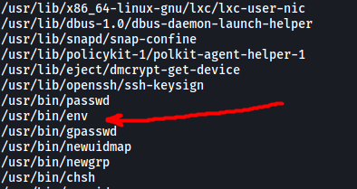

There was an interesting file that had its SUID bit set: `/usr/bin/env`

Looking on [GTFOBins](https://gtfobins.github.io/gtfobins/env/), we find that we can exploit **env** to gain a shell as root:

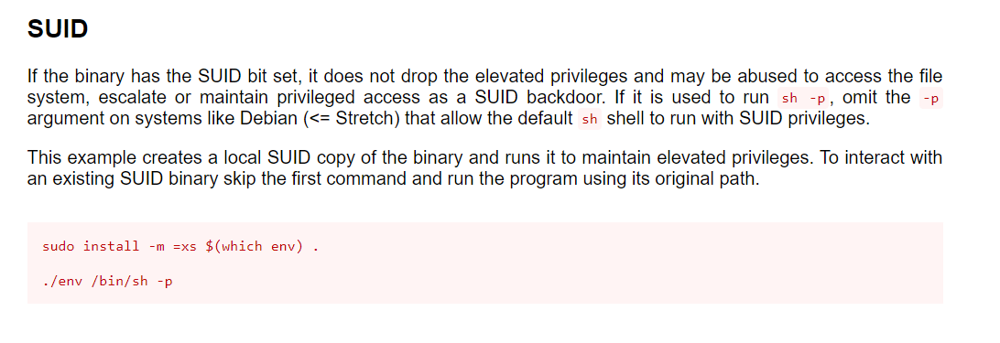

With that, we just have to run the following command to escalate our privileges:

```
./env /bin/sh -p
```

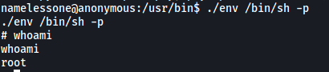

With that, we can navigate to **/root** and obtain **root.txt**:

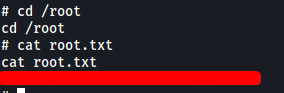

