| Difficulty |
| ---------- |
|    Easy    |

---

### [ What is the services flag? (services.txt) ]

Let's first conduct an `nmap` scan on the target machine.

```
sudo nmap -sC -sV -vv -p- -T4 10.10.102.151
```

**Results:**

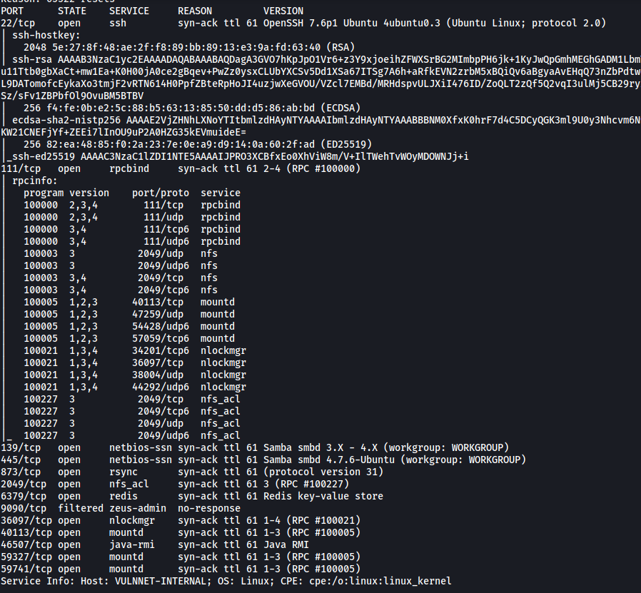

We can see that there are many open ports on our target machine, running services like SSH and Samba.

Let's first take a look at enumerating the **Samba** server running on ports **139** and **445**. I'll use [enum4linux-n](https://github.com/cddmp/enum4linux-ng) to run a scan on the server.

*enum4linux-ng is an alternative to enum4linux*

```
/enum4linux-ng/enum4linux-ng.py 10.10.102.151
```

**Results:**

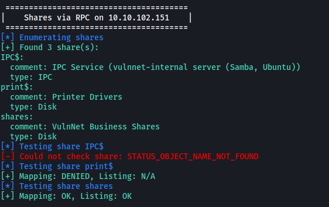

From the results, we can see that there is a share called '**shares**' that we can access anonymously. This means that we do not need to supply a password in order to access the files within. 

*Alternatively, we could also check the shares that we can access by using `smbclient -L 10.10.102.151`* 

Let's connect to the share and take a look.

```
smbclient //10.10.102.151/shares
```

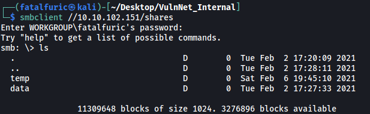

There are two directories in the share: **temp** and **data**

**/temp** contains the **services.txt** file! 

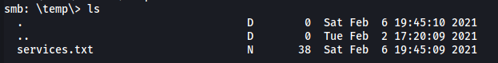

After downloading the file onto our local machine using the `get` command, we get the first flag:

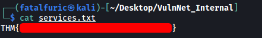

---

### [ What is the internal flag? ("internal flag") ]

Let's now take a look at **/data**: 


There are two files: **data.txt**, **business-req.txt**

**Contents of data.txt:**

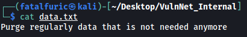

**Contents of business-req.txt:**


Interesting stuff, but nothing we can really use right now.

Let's move on to the **Redis** Database server running on port **6379**. We can connect to the DB using `redis-cli`:

```
redis-cli -h 10.10.102.151 -p 6379
```

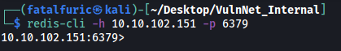

After successfully connecting, I tried to dump out all of the keys within the database:

```
// in redis-cli
keys *
```

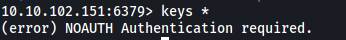

Unfortunately, we are unable to as we need to authenticate ourselves first. Hitting this dead-end, we can try enumerating the other services first.

Now we will try to enumerate **NFS** running on port **2049**. Perhaps there are directories on our target that we can mount onto our local machine?

To check, we can use `showmount`:

```
showmount -e 10.10.102.151
```

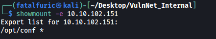

Looks like there is a directory **/opt/conf** that we can mount. We then run the following commands to mount the directory:

```
mkdir /mnt/conf
mount -t nfs 10.10.102.151:/opt/conf /mnt/conf -o nolock
```

*The `-o nolock` option is required for mounting old-style (RH 5.2 or older) NFS servers, as well as other NFS servers that don't support lockd.*

With the directory mounted, we can go ahead and explore it:

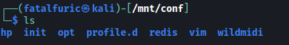

There are a few directories, but what really interested me was the **/redis** directory.

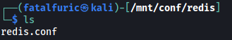

In it, we find the **redis.conf** configuration file.

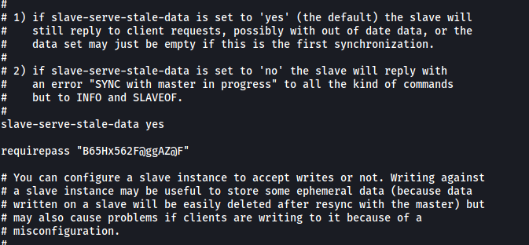

Fortunately for us, the configuration file actually contains the **master password** for the Redis DB: **B65Hx562F@ggAZ@F**

With that, we can connect back to the Redis server and authenticate ourselves using the `auth` command

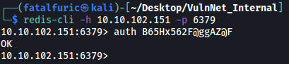

Nice! Using `keys *`, we can see there a few keys in the database:

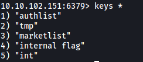

We can then obtain the **internal flag** value using the `get` command:

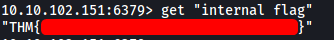

---

### [ What is the user flag? (user.txt) ]

Amongst the keys, the '**authlist**' seems the most interesting. Using `type`, we can find out what type of file it is:


Since this is a list, we have to use the `lrange` command to read it, instead of `get`. (More info on this can be found [here](https://stackoverflow.com/questions/37953019/wrongtype-operation-against-a-key-holding-the-wrong-kind-of-value-php)) 


We have a **base64-encoded** string that has been repeated a few times.

```
echo 'QXV0aG9yaXphdGlvbiBmb3IgcnN5bmM6Ly9yc3luYy1jb25uZWN0QDEyNy4wLjAuMSB3aXRoIHBhc3N3b3JkIEhjZzNIUDY3QFRXQEJjNzJ2Cg==' | base64 -d
```

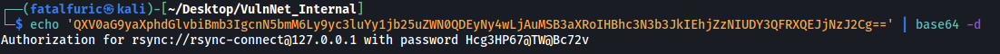

Looks like we have a password for **rsync**.

I have never heard of rsync before this room, so I did some research.

---

*In general, rsync is a utility for copying and synchronizing files and directories remotely as well as locally in Linux/Unix systems. It can be also be used via SSH and is more optimized than`scp`. More info [here](https://www.tecmint.com/rsync-local-remote-file-synchronization-commands/)*

---

I also found out how we can enumerate this service from [hacktricks](https://book.hacktricks.xyz/pentesting/873-pentesting-rsync).

Firstly, we need to enumerate the rsync modules (or shares) that is available.

```
rsync --list-only rsync://10.10.102.151
```

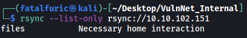

We have a **files** module.

Next, we transfer all of the files within this **files** module to our local machine. We will also be prompted to input the password that we obtained earlier.

```
rsync -av rsync://rsync-connect@10.10.102.151/files ./rsyn_shared 
```

*`-a` ensures files are transferred in archive mode, which ensures that symbolic links, devices, attributes, permissions, ownerships, etc. are preserved in the transfer. `-v` is just for verbosity.*

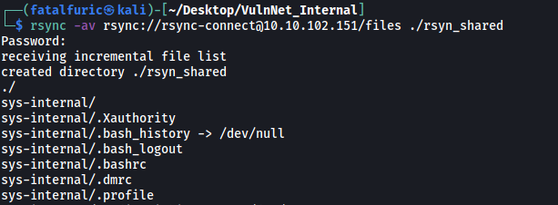

Looking at the files that were transferred, I realized that it was actually the entire home directory of the **sys-internal** user on the target machine!

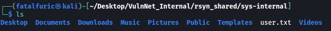

We have the **user.txt** file as well, giving us the user flag.

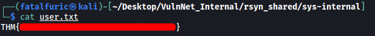

---

### [ What is the root flag? (root.txt) ]

In the home directory of the user, we can see the **.ssh** directory.

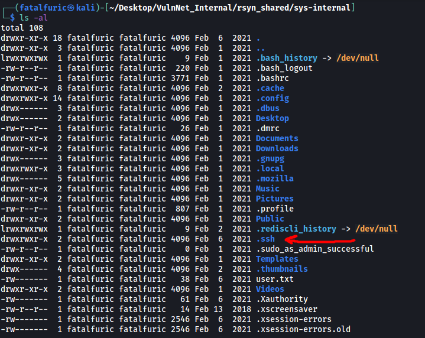

While it currently does not contain any keys that we can use, one way we can gain a foothold into the machine is by using rsync to upload our own public key into an **'authorized_keys'** file within that directory! From there, our public key will be authorized on the target machine, and we will be able to use our own private key to log into the user account via SSH.

Detailed steps on how to set this up can be found [here](https://kb.iu.edu/d/aews). 

```
// generate ssh key-pair
ssh-keygen -t rsa

// transfer our public key into an 'authorized_keys' file in the /.ssh folder of the 'sys-internal' user
rsync -av ~/.ssh/id_rsa.pub rsync://rsync-connect@10.10.102.151/files/sys-internal/.ssh/authorized_keys
```

Once this is done, we can log into the **sys-internal** user's account using our private key.

```
ssh sys-internal@10.10.102.151
```

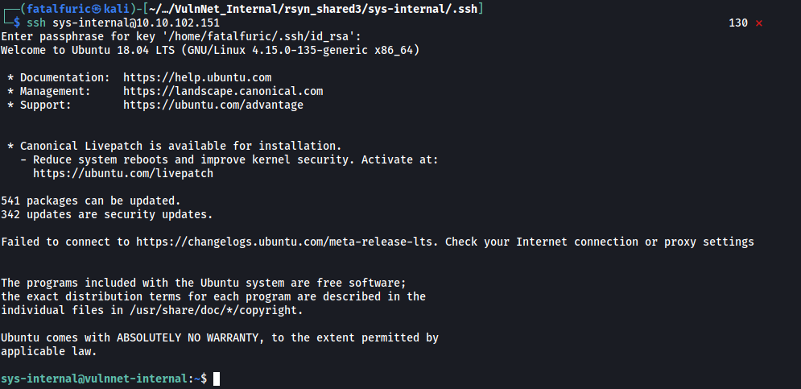

And we're in!

Now we need to find a way to escalate our privileges.

I did some manual enumeration, doing things such as searching for files with SUID-bit set and exploring the various directories within the machine. However, there was nothing I could really use.

I did notice an interesting directory located in the **/** directory though:

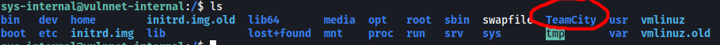

From my research, I found out that [TeamCity](https://www.jetbrains.com/teamcity/) is a build management and continuous integration server from JetBrains. The fact that this directory exists could indicate that the machine is running a TeamCity server (internally, which is why our nmap scan did not pick it up).

The default port for TeamCity servers is **8111**. To access it, we can use **SSH port forwarding**.

```
ssh -L 9999:localhost:8111 sys-internal@10.10.102.151
```

This will forward our requests to **localhost:9999** on our local machine, over to port **8111** of the target machine using the sys-internal account.

Let's now try and visit the TeamCity web page by visiting http://localhost:9999

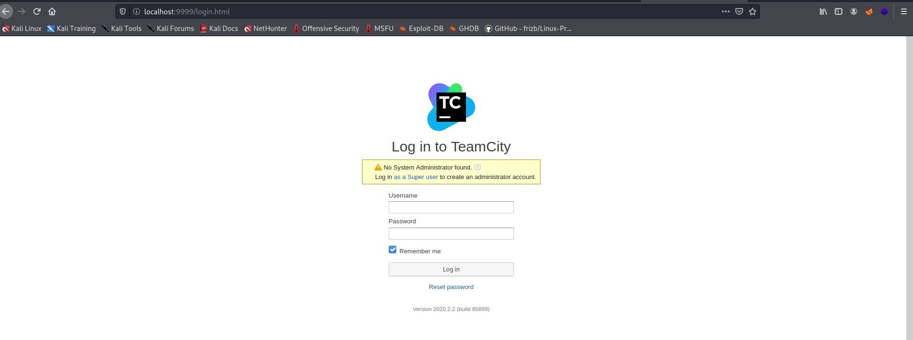

We have a login page!

I tried common credentials like admin:admin, but those did not work.

Since the web page prompted us to log in as a **Super user**, I clicked on the link, which brought me to this page:


Interesting! If we have an authentication token, we would be able to log in without needing a username or a password. My first thought was to try and find a working token within the TeamCity directory on the target machine.

There were many files within the TeamCity directory, so let's use `grep` to search for the string **'token'** in all of these files.

```
grep -ir 'token' 2>/dev/null
```

*-i ignores case distinctions and -r is for recursive search*

I ran the command in all of the sub-directories within /TeamCity.

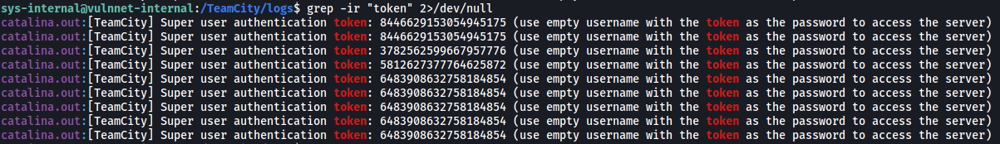

Eventually, I found tokens within the **/log** sub-directory! The token that allowed me to log in was: **6483908632758184854**

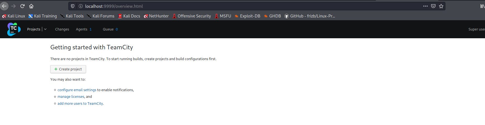

Normally with these sort of build management servers, we want to find a point where we can input commands for the server to execute when building. If we are able to achieve remote code execution, we can do things such as opening up a **reverse shell**.

First, let's create a new project.

Next, under **'Build Steps'** on the left sidebar, we can add a new build step and choose **Python** as the runner type.

In the options, under **'Command'**, we choose **'Custom script'** so that we can provide our own code.

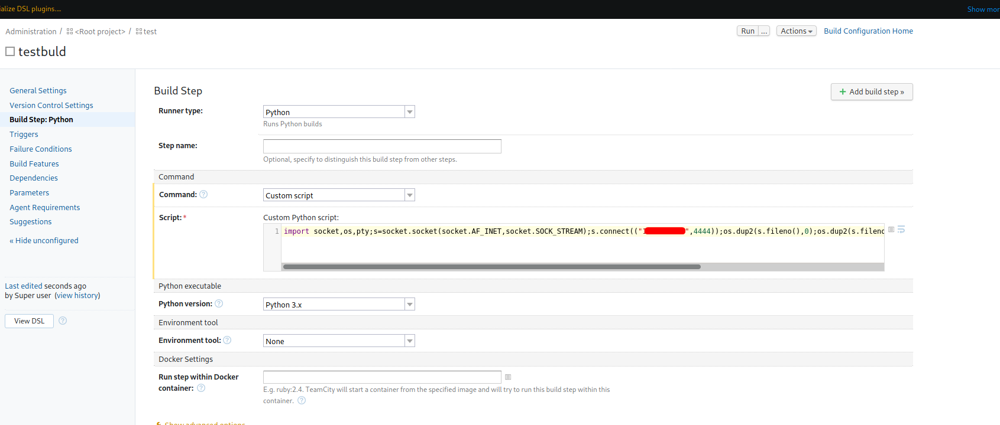

The reverse shell payload we'll use is from [PayloadsAllTheThings](https://github.com/swisskyrepo/PayloadsAllTheThings/blob/master/Methodology%20and%20Resources/Reverse%20Shell%20Cheatsheet.md#python).

After saving the configuration, we just need to set up a netcat listener on our local machine and then click '**Run**' on the top-right.

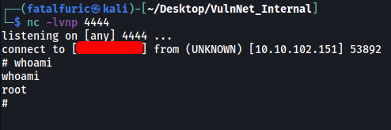

With that, we've successfully gained access into the machine as root :smile:

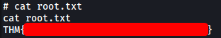

We can find the root flag in the home directory of root.
