|  | Difficulty |  |  IP Address   |  | Room Link |  |
|--| :--------: |--|:------------: |--| :--------:|--|
|  |   Medium   |  |  10.10.90.101 |  | [Blog](https://tryhackme.com/room/blog) |  |

---

**The ordering of the prompts in this room was kinda weird, so I reordered them.**

---

### [ What CMS was Billy using? ]

Before doing anything, we first add **blog.thm** to our /etc/hosts file:

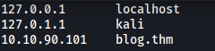

Let's now conduct an `nmap` scan on the target machine.

```
sudo nmap -sC -sV -vv -p- -T4 blog.thm
```

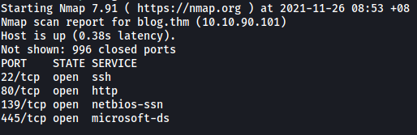

From the results, we can see that 4 ports are open: **22 (SSH)**, **80 (HTTP)**, **139 & 445 (Samba)**

Let's visit the HTTP Web server:

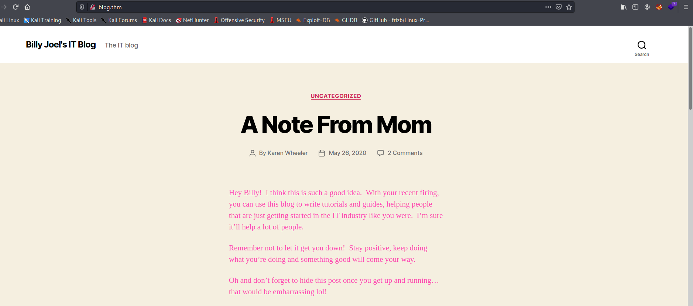

We are brought to Billy Joel's IT blog.

From the bottom of the page, we can see that the CMS Billy is using is **WordPress**:

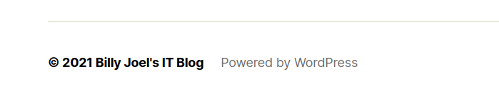

---

### [ What version of the above CMS was being used? ]

Let's use `wpscan` to find out the version of WordPress that Billy is running:

```
wpscan --url http://blog.thm
```

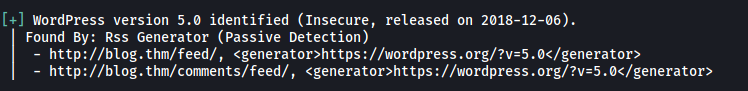

WordPress version: **5.0**

---

### [ user.txt ]

Let's now take a closer look at the posts on the website.

**'A Note From Mom' by Karen Wheeler:**

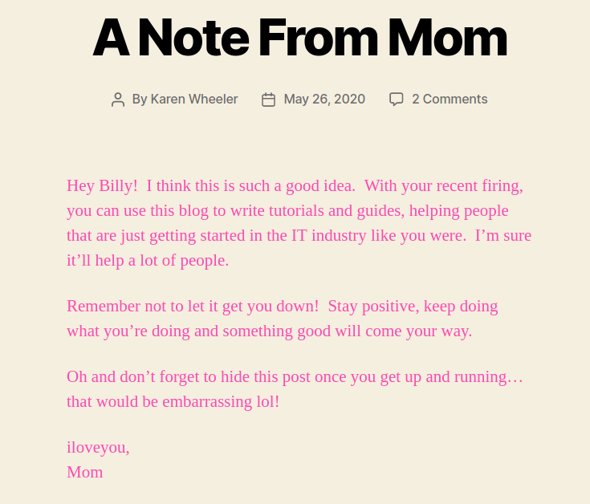

**'Welcome!' by Billy Joel**

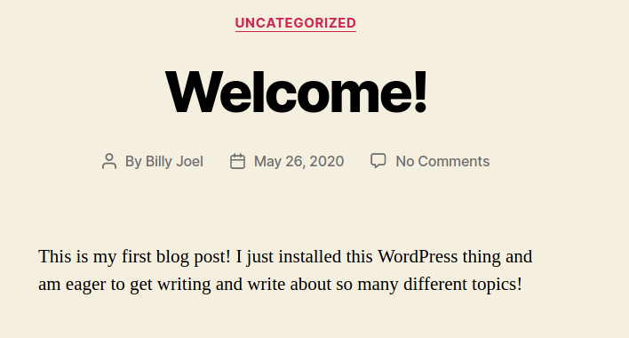

There wasn't anything particularly interesting within the posts, but at least we know that there are two users who have authorship over the website: **Billy Joel** and **Karen Wheeler**

Since this is a WordPress website, there will most probably be a login page at **/wp-admin**:

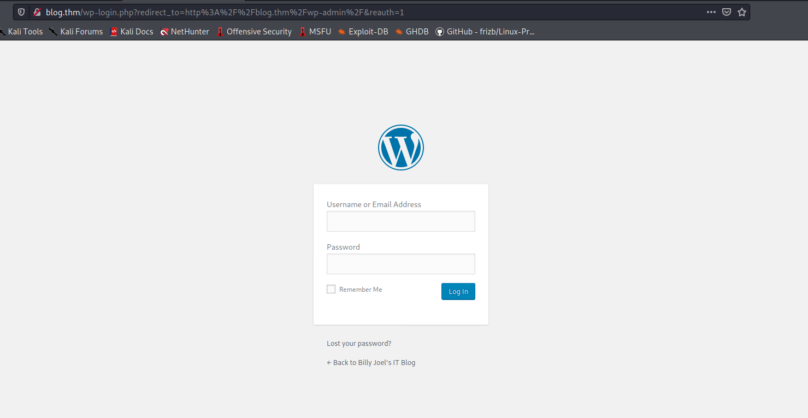

Nice!

The good thing about WordPress for hackers is that it actually exposes if a user exists on the server through the login form. If we try to login with a non-existent user, it will display the error message: 'Invalid username'

Meanwhile, if we log in with a user that exists, we will get a different error message instead: 'The password you entered for the username XXX is incorrect.'

We can use this to find out the username for Billy Joel and Karen Wheeler. 

I tried some potential usernames, like billy, karen, billyjoel, karenwheeler... Unfortunately, none of those worked.

Let's try using `wpscan` to enumerate the usernames instead:

```
wpscan --url http://blog.thm -e u
```

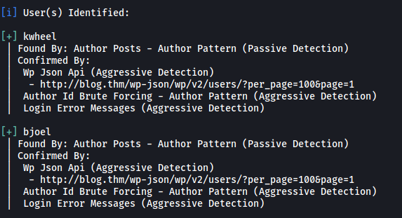

WPScan managed to find two usernames: 

> kwheel, bjoel

Next, let's check if there are any vulnerabilities for this version of WordPress. We'll check in Metasploit:

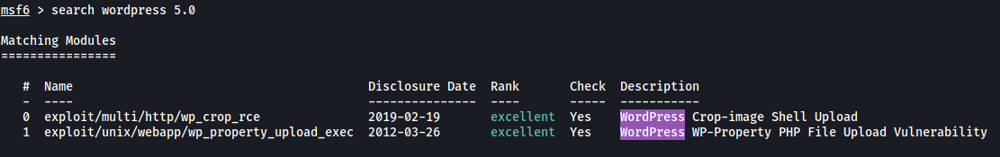

There are 2 exploits that we can use. Let's use the first one: **WordPress Crop-image Shell Upload**

Now let's take a look at the options of this exploit:

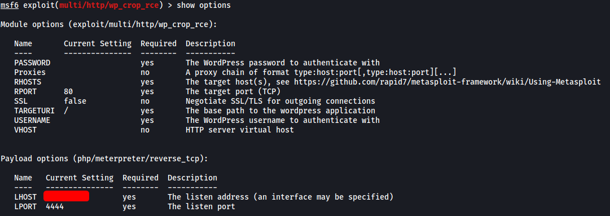

We see that we actually need a valid **username** and **password** in order for the exploit to work. We already have some usernames, now we just need their passwords!

We can use `wpscan` to run a dictionary attack on the two users that we enumerated earlier.

I first ran the attack on the user: **bjoel**. However, it was taking an extremely long time and I started to suspect that bjoel's password was not in the rockyou.txt wordlist.

Next I ran the attack on the user: **kwheel**. Fortunately, I managed to obtain her password after a few minutes!

```
wpscan --url http://blog.thm -U kwheel -P /usr/share/wordlists/rockyou.txt -t 50
```

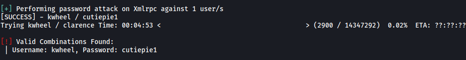

**kwheel's** password: 

> cutiepie1

With a valid set of credentials, I updated the options for the exploit and ran it:

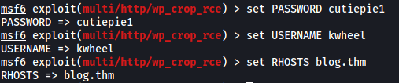

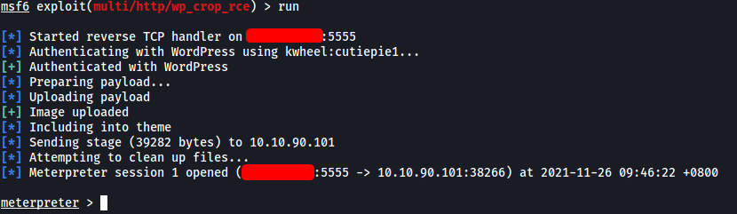

We're in!

Looking around the machine, I found the home directory of bjoel:

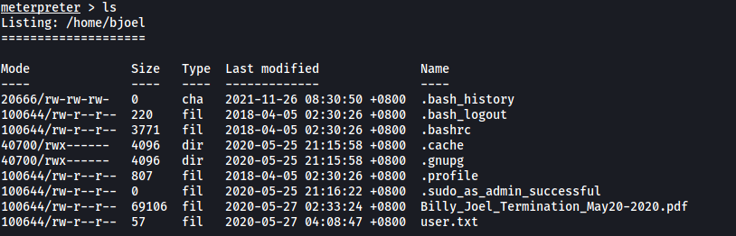

However, the user flag was not actually in the **user.txt** file:

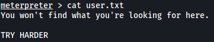

Let's try searching for the real user.txt file. We first have to open a shell using the command `shell` in meterpreter. 

Then, we use the `find` command like so:

```
find / -iname user.txt 2>/dev/null
```

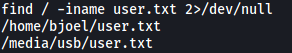

The real user.txt file is in **/media/usb**:

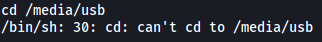

However, it seems that we do not have the necessary permissions to enter the directory. Guess we have to escalate our privileges if we wish to obtain the flag.

My first thought was to look for files with the **SUID-bit** set.

```
find / -type f -perm /u=s 2>/dev/null
```

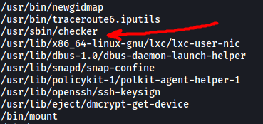

Looking through the results, I noticed an interesting binary called `checker`. Let's try running it!

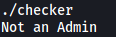

Hmm... It simply outputs 'Not an Admin' before closing. What if we use `ltrace` to trace the library calls that are called by the binary?

```
ltrace checker
```

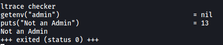

Interesting, it seems that it checks for the environment variable '**admin**'. Since it is currently not set, the binary then puts the 'Not an Admin' string onto the console. Let's try to set this environment variable!

```
export admin=yes // you can replace 'yes' with anything
```

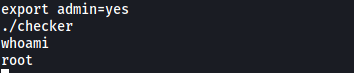

Great, `checker` actually opened up a privileged shell! We are now root :smile:

With that, we will be able to obtain the user flag:

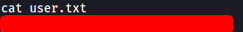

---

### [ Where was user.txt found? ]

The **user.txt** file was found in /media/usb.

---

### [ root.txt ]

**root.txt** can be found in /root:

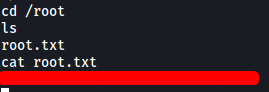