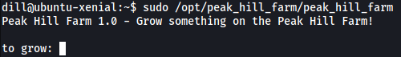

|  | Difficulty |  |  IP Address   |  | Room Link |  |
|--| :--------: |--|:------------: |--| :--------:|--|
|  |   Medium   |  | 10.10.149.209 |  | [Peak Hill](https://tryhackme.com/room/peakhill) |  |

---

### [ What is the user flag? ]

Let's first conduct a full `nmap` scan on the target machine.

```
sudo nmap -sC -sV -vv -T4 -p- 10.10.149.209
```

Our `nmap` scan reveals 3 open ports:

```
20/tcp   closed ftp-data
21/tcp   open   ftp
22/tcp   open   ssh
7321/tcp open   swx
```

Looks like we have a **FTP** and **SSH** server. There's also a service that I've never seen before: **swx**

Let's take a look at the FTP server first. The `nmap` scan actually reveals that **anonymous login** is enabled. This means that we will be able to log into the FTP server without a valid password:


After logging in, if we list the root directory of the FTP server with the `-a` option, we will find that there is a hidden **.creds** file:


Let's go ahead and download the **.creds** and **test.txt** file.

**Contents of test.txt:**


Nothing interesting here.

**Contents of .creds:**


Woah, **.creds** contains many 1s and 0s. This seems to be encoded in binary. Let's try decoding it using [Cyberchef](https://gchq.github.io/CyberChef/):


We get some really weird text.

After doing some [research](https://docs.python.org/3/library/pickle.html) online and poking around, I realized that the output is from a **Python Pickle** file! 

---

***From the docs:** The pickle module implements binary protocols for serializing and de-serializing a Python object structure. “Pickling” is the process whereby a Python object hierarchy is converted into a byte stream, and “unpickling” is the inverse operation, whereby a byte stream (from a binary file or bytes-like object) is converted back into an object hierarchy.*

---

Let's save this decoded output from cyberchef into a file called creds.dat. We'll then depickle it using the **pickle** module in Python:

```python
import pickle

f = open('creds.dat', 'rb')
result = pickle.load(f)
print(result)
```

**Results:**


We get a long list of tuples, with each tuple containing either one character of the username or password. Let's clean it up and extract the username and password:

```python
creds = [ output list from earlier ]

# separate username and password
username_lst = [(i[0][8:], i[1]) for i in creds if 'ssh_user' in i[0]]
password_lst = [(i[0][8:], i[1]) for i in creds if 'ssh_pass' in i[0]]

# sort username and password based on numbering
username_lst.sort(key=lambda y: int(y[0]))
password_lst.sort(key=lambda y: int(y[0]))

# convert username and password into string
username = ""
password = ""

for i in username_lst: username += i[1]
for i in password_lst: password += i[1]

print("username: " + username)
print("password: " + password)
```

We run our code:


And obtain our first set of credentials:

> gherkin : p1ckl3s_@11_@r0und_th3_w0rld

Let's try using these credentials to log into the SSH server:


And we're logged in as the user gherkin! :smiling_imp:

Looking around the machine, I found the **user.txt** file in the home directory of another user, dill:


Unfortunately, we do not have the permissions to read it. 

dill's public and private ssh keys can also be found in his **.ssh** directory. Unfortunately, I was unable to read his private key:


Hitting a dead-end, I decided to look into gherkin's home directory. I found a compiled python script called **cmd_service.pyc**: 


While we do not have the permissions to write or execute the file, we can download it onto our local machine and decompile it. This will allow us to read the script in its entirety. We can use [uncompyle6](https://pypi.org/project/uncompyle6/) to do so:

```
uncompyle6 cmd_service.pyc
```

**Snippet of cmd_service.pyc:**


The Python script simply starts up a TCP server on port **7321**. It also implements an authentication service for this server. Luckily for us, the username and password used to log in are actually exposed in the code itself! We can now convert the username and password to bytes using Python:


We get another set of credentials:

> dill : n3v3r_@_d1ll_m0m3nt

With that, let's now log into the TCP server on port 7321:

```
nc 10.10.149.209 7321
```


We have a prompt that allows us to input shell commands. We can now obtain **user.txt** from dill's home directory:


---

### [ What is the root flag? ]

Since we have a shell as dill's account, we can go ahead and grab his SSH private key from his **.ssh** directory:


I copied the contents of his private key into a file on my local machine *(Make sure to change permissions of the key to either 400 or 600)*. 

We can then use the key to log into dill's SSH account:


And we're in dill's account!

The first thing I did was to check dill's **sudo privileges**. We can do this with `sudo -l`:


Turns out there is a binary in the **/opt/peak_hill_farm** directory called `peak_hill_farm`. Furthermore, dill can actually run this binary with root privileges.

Let's try running it:



It seems that the binary is expecting some user prompt, we'll try inputting 'apples':


We get an error message: 'failed to decode base64'

Looks like the binary is expecting some base64 encoded input. Let's encode the string 'apples' and pass it into the binary:


Hmmmm... Nothing happened. 

Since a common theme in this room so far has been 'pickles', perhaps the farm grows pickles? (even though pickles can't really be grown :smile:) 

I tried both 'pickles' and 'pickle':


Still no luck...

So far, we've been dealing a lot with Python serialization. What if the `peak_hill_farm` binary takes in our input and tries to deserialize it? Could there be a way that we can exploit this?

I did some research and found the following [article](https://medium.com/@abhishek.dev.kumar.94/sour-pickle-insecure-deserialization-with-python-pickle-module-efa812c0d565) on insecure deserialization.

---

***From the article:** Insecure deserialization occurs when we deserialize data that is coming from a malicious source. Successful insecure deserialization attacks could allow an attacker to carry out denial-of-service (DoS) attacks, authentication bypasses and remote code execution attacks.*

---

Let's do a test to see if the `peak_hill_farm` binary properly deserializes data.

To generate our serialized payload, we can use the following Python script:

```python
import pickle
import os

class myPickle(object):
	def __reduce__(self):
		return (os.system, ('whoami', ))

pickle_result = pickle.dumps(myPickle())

with open("pickle_result", "wb") as file:
	file.write(pickle_result)
```

This script first serializes / pickles an object of the **myPickle** class. What's important to note is that the myPickle class has its **\__reduce__()** directive overwritten to run the `whoami` command. Hence, when a Python program attempts to deserialize a myPickle object, it will first refer to the \__reduce__() directive to see if there is any instructions that need to be executed while deserializing the data. It will then run whatever code that we have placed in the directive, allowing us to obtain remote code execution. In this case, the `whoami` command will be run.

 With the serialized object saved to a file, let's go ahead and base64-encode the data so that we can pass it to the `peak_hill_farm` binary:


We then pass it to the binary:


Nice, The exploit works and the `whoami` command was run! Now we just have to replace `whoami` with `bash` like so:

```python
class myPickle(object):
	def __reduce__(self):
		return (os.system, ('bash', ))
```

Similarly, we base64-encode the result and pass it it to the `peak_hill_farm` binary:


When our pickled data is deserialized, the `bash` command will be run, opening a shell as root. We now have root access!

The **root.txt** file is in the /root directory:


However, we are unable to read the file. It seems that there are probably some hidden spaces or characters in the filename.

My first instinct was to simply `cat` all of the files in the directory using the wildcard operator (*):

```
cat *
```


However, for some reason, the wildcard operator was not working.

---

*I looked at various writeups online and they were all able to read the file using `cat *`. I still don't really know why this doesn't work for me.*

---

An alternative method is to use:

```
find /root/ -name "*root.txt*" -exec cat {} \;
```


