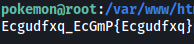

| Difficulty |  |  IP Address   |  |
| :--------: |--| :-----------: |--|
|    Easy    |  | 10.10.23.231  |  |

---

### [ Find the Grass-Type Pokemon  ]

Let's first start off with a full `nmap` scan on the target machine:

```
sudo nmap -sC -sV -vv -T4 -p- 10.10.23.231 
```

**Results:**

```
PORT   STATE SERVICE REASON         VERSION
22/tcp open  ssh     syn-ack ttl 61 OpenSSH 7.2p2 Ubuntu 4ubuntu2.8 (Ubuntu Linux; protocol 2.0)
| ssh-hostkey: 
|   2048 58:14:75:69:1e:a9:59:5f:b2:3a:69:1c:6c:78:5c:27 (RSA)
| ssh-rsa 
 [REDACTED]
|   256 23:f5:fb:e7:57:c2:a5:3e:c2:26:29:0e:74:db:37:c2 (ECDSA)
| ecdsa-sha2-nistp256  
 [REDACTED]
|   256 f1:9b:b5:8a:b9:29:aa:b6:aa:a2:52:4a:6e:65:95:c5 (ED25519)
|_ssh-ed25519 AAAAC3NzaC1lZDI1NTE5AAAAICabmX4EeiR66bXPzMHbCZpkcUu+GSkDJP1nZ2+30Vm+
80/tcp open  http    syn-ack ttl 61 Apache httpd 2.4.18 ((Ubuntu))
| http-methods: 
|_  Supported Methods: POST OPTIONS GET HEAD
|_http-server-header: Apache/2.4.18 (Ubuntu)
|_http-title: Can You Find Them All?
Service Info: OS: Linux; CPE: cpe:/o:linux:linux_kernel
```

We can see that there are 2 ports open: **22 (SSH)** and **80 (HTTP)** 

Let's take a look at the HTTP Web server:


We have a basic Apache2 welcome page. 

Looking at the console, I noticed that an array containing the names of some Pokemon was printed:


Analyzing the source code of the web page, we can see the portion of the code that is responsible for this behavior:


At the bottom of the page, we can see a comment telling us to check the console, which we already did.


There's also an interesting string:

> \<pokemon>:\<hack_the_pokemon> 

Could this be a set of credentials that we can use? Seeing as SSH is the only other service running, let's try using these creds to log into SSH:


It worked!

The Grass-Type Pokemon can be found on the desktop of the **pokemon** user: 


It's in a zip file, so all we have to do is run `unzip P0kEmOn.zip`:


Looks like the flag has been converted to hexadecimal characters. We can simply plug it into [CyberChef](https://gchq.github.io/CyberChef/) and decode it:


---

### [ Find the Water-Type Pokemon ]

To find the rest of the flags, we can use the `find` command. I'm going to assume all of the flag files have the format: `*-type.txt`

```
find / -iname '*-type.txt' 2>/dev/null
```


The Water-Type Pokemon is in **/var/www/html**:



However, it seems to have been encrypted.

I dropped the flag into CyberChef and tried decrypting it with various algorithms. Turns out the flag has been encrypted with **ROT-14**:


---

### [ Find the Fire-Type Pokemon ]

The Fire-Type Pokemon can be found in **/etc/why_am_i_here?**


It has been base64-encoded. Let's decode it:


---

### [ Who is Root's Favorite Pokemon? ]

Now we need to escalate our privileges.

The first thing I did was to check for pokemon's **sudo privileges**:


No luck here.

I poked around the filesystem, eventually finding an interesting file called **roots-pokemon.txt** in the /home directory:


The file is owned by another user **ash**. Looks like we need to find a way to login as ash!

After doing a lot more digging, I finally found an interesting set of directories in the **/home/pokemon/videos** directory:


There is an interesting file called **Could_this_be_what_Im_looking_for?.cplusplus**:


In it, we actually find the password for **ash's** account:

> pikapika

Now we can log into ash's account:


With that, we can obtain the **root flag** from the **roots-pokemon.txt** file:


