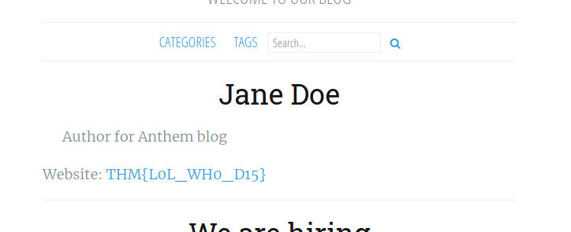
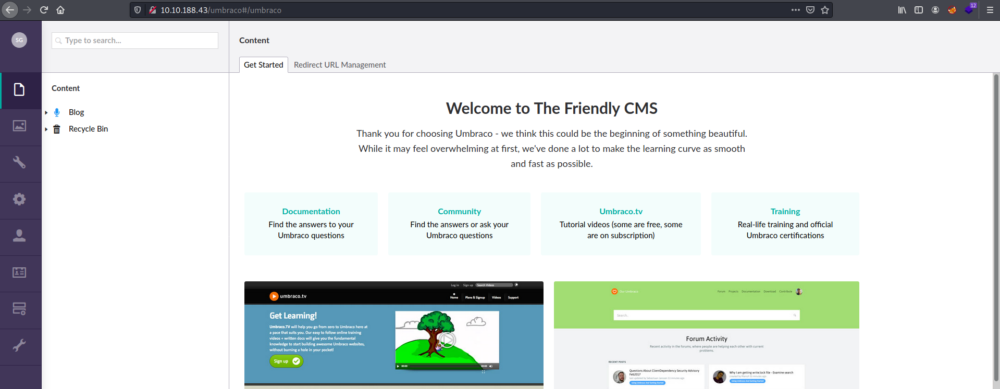

| Difficulty |  |  IP Address   |  |
| :--------: |--| :-----------: |--|
|    Easy    |  | 10.10.188.43  |  |

---

### [ Let's run nmap and check what ports are open. ]

As always, we start off with a `nmap` scan on the target machine.

```
sudo nmap -Pn -sC -sV -vv -T4 -p- 10.10.188.43
```

**Results:**

```
PORT     STATE SERVICE       REASON          VERSION
80/tcp   open  http          syn-ack ttl 125 Microsoft HTTPAPI httpd 2.0 (SSDP/UPnP)
3389/tcp open  ms-wbt-server syn-ack ttl 125 Microsoft Terminal Services
| rdp-ntlm-info: 
|   Target_Name: WIN-LU09299160F
|   NetBIOS_Domain_Name: WIN-LU09299160F
|   NetBIOS_Computer_Name: WIN-LU09299160F
|   DNS_Domain_Name: WIN-LU09299160F
|   DNS_Computer_Name: WIN-LU09299160F
|   Product_Version: 10.0.17763
|_  System_Time: 2021-12-11T03:03:13+00:00
| ssl-cert: Subject: commonName=WIN-LU09299160F
| Issuer: commonName=WIN-LU09299160F
| Public Key type: rsa
| Public Key bits: 2048
| Signature Algorithm: sha256WithRSAEncryption
| Not valid before: 2021-12-10T02:53:07
| Not valid after:  2022-06-11T02:53:07
| MD5:   0669 53dc 5021 7f3b c393 727a 647d a371
| SHA-1: 4f63 34c5 3613 82e0 68ed ef6a f64d e2c8 79e4 46fe
| -----BEGIN CERTIFICATE-----
[REDACTED]
|_-----END CERTIFICATE-----
|_ssl-date: 2021-12-11T03:04:26+00:00; +2s from scanner time.
Service Info: OS: Windows; CPE: cpe:/o:microsoft:windows
```

Ports **80** and **3389** are open.

---

### [ What port is for the web server? ]

Port **80**

---

### [ What port is for remote desktop service? ]

Port **3389**

---

### [ What is a possible password in one of the pages web crawlers check for? ]

Let's take a look at the HTTP website:


Looks like we have a blog. 

Before doing our happy-path enumeration, let's check out some low-hanging fruit, starting off with the **robots.txt** file:


The possible password is:

> UmbracoIsTheBest!

---

### [ What CMS is the website using? ]

From the robots.txt file, we also find some disallowed directories: **/umbraco/** and **/umbraco_client/**

The CMS being used is: **umbraco**

---

### [ What is the domain of the website? ]

The domain is: **anthem.com**

---

### [ What's the name of the Administrator ]

There are two blog posts on the website. Let's take a look at the earliest one:


The post contains a poem that is dedicated towards the admin of the blog. Doing a Google search of the poem reveals the name of the admin:


Admin's name: **Solomon Grundy**

---

### [ Can we find the email address of the administrator? ]

Let's take a look at the other blog post:


The post is by **Jane Doe** and we find out that her email is **JD@anthem.com**. 

By that logic, Solomon Grundy's email address is: **SG@anthem.com**

---

### [ What is flag 1? ]

Flag 1 can be found in the source code of the '**We are hiring**' blog post:


---

### [ What is flag 2? ]

Flag 2 can be found in the source code of the **main page**:


---

### [ What is flag 3? ]

Flag 3 can be found by clicking on **Jane Doe's profile**:



---

### [ What is flag 4? ]

Flag 4 can be found in the source code of the  '**A cheers to...**' blog post:


---

### [ Let's figure out the username and password to log in to the box.(The box is not on a domain) ]

:thumbsup:

---

### [ Gain initial access to the machine, what is the contents of user.txt? ]

If we navigate to **/umbraco**, we can find a login page:


Let's log into Umbraco with the the following credentials:

> SG@anthem.com : UmbracoIsTheBest!



From the **Help** section located on the left-bar, we find out that the version of Umbraco running is **7.15.4**:


Unfortunately, I was unable to find a working exploit for this version. I spent quite some time doing some manual enumeration of the CMS site, but was unable to find any potential points to launch an attack.

After some time, I remembered that Microsoft Remote Desktop Services *(also known as Terminal Services)* was running on port **3389**. A potential set of credentials that we can use to log into the machine could be:

> sg : UmbracoIsTheBest!

Let's try it out!

```
rdesktop -u sg 10.10.188.43
```


Nice! We're in :smile:

The **user.txt** file can be found on the desktop:


---

### [ Can we spot the admin password? ]

If we enable **Hidden Items** under the **View** settings in the file explorer, we will find a hidden folder called **backup** in the C drive:


This folder contains an interesting file called **restore.txt**. Unfortunately, we do not have the necessary permissions to open it:


We can use the Windows `icacls` command to change the file permissions of restore.txt (More information on icacls can be found [here](https://adamtheautomator.com/icacls/)).

We hop onto PowerShell and navigate to the backup folder. Then we run the following command:

```
icacls restore.txt /grant SG:F
```

(Documentation of icacls can be found [here](https://ss64.com/nt/icacls.html))

This grants **Full (F)** access rights to the user **SG** for the restore.txt file:


With that, we can now read the contents of restore.txt:


The admin password is:

> ChangeMeBaby1MoreTime

---

### [ Escalate your privileges to root, what is the contents of root.txt? ]

Now that we have the admin password, we can simply navigate directly to the administrator's Desktop at **C:\\Users\Administrator\Desktop**. We will be prompted to provide the admin password of course.

Once authenticated, we can read the **root.txt** file on the desktop:


