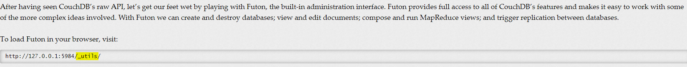
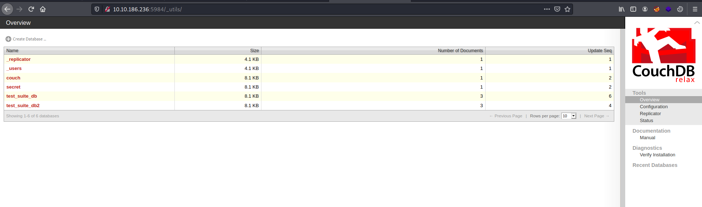
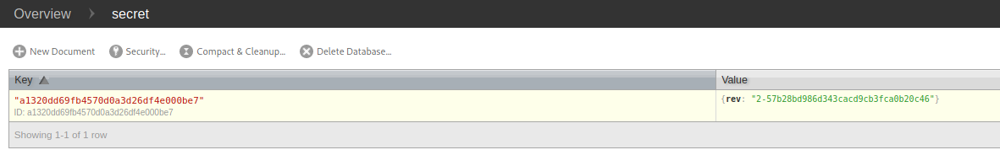
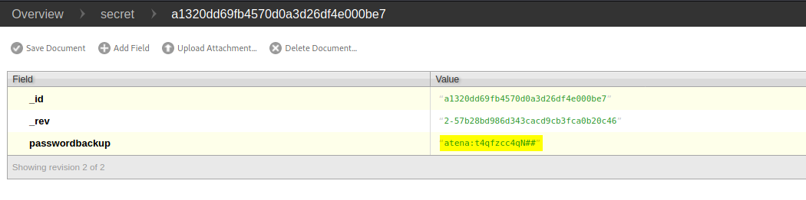
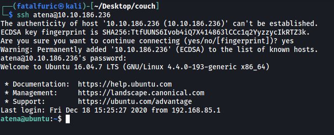
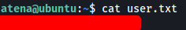
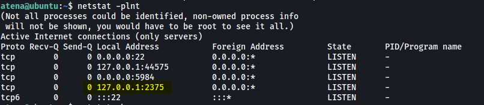
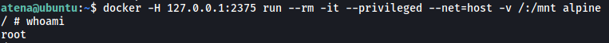
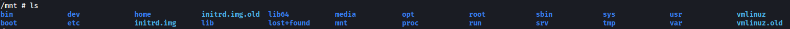
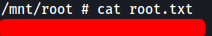

|  | Difficulty |  |  IP Address   |  | Room Link |  |
|--| :--------: |--|:------------: |--| :--------:|--|
|  |    Easy    |  | 10.10.186.236 |  | [Couch](https://tryhackme.com/room/couch) |  |

---

### [ Scan the machine. How many ports are open? ]

Let's start things off with a full `nmap` scan on the target machine.

```
sudo nmap -sC -sV -vv -T4 -p- 10.10.186.236
```

**Results:**

```
PORT     STATE SERVICE REASON         VERSION
22/tcp   open  ssh     syn-ack ttl 61 OpenSSH 7.2p2 Ubuntu 4ubuntu2.10 (Ubuntu Linux; protocol 2.0)
| ssh-hostkey: 
|   2048 34:9d:39:09:34:30:4b:3d:a7:1e:df:eb:a3:b0:e5:aa (RSA)
| ssh-rsa 
[REDACTED]
|   256 a4:2e:ef:3a:84:5d:21:1b:b9:d4:26:13:a5:2d:df:19 (ECDSA)
| ecdsa-sha2-nistp256 
[REDACTED]
|   256 e1:6d:4d:fd:c8:00:8e:86:c2:13:2d:c7:ad:85:13:9c (ED25519)
|_ssh-ed25519 AAAAC3NzaC1lZDI1NTE5AAAAIKLUyz2Tpwc5qPuFxV+HnGBeqLC6NWrmpmGmE0hk7Hlj
5984/tcp open  http    syn-ack ttl 61 CouchDB httpd 1.6.1 (Erlang OTP/18)
|_http-favicon: Unknown favicon MD5: 2AB2AAE806E8393B70970B2EAACE82E0
| http-methods: 
|_  Supported Methods: GET HEAD
|_http-server-header: CouchDB/1.6.1 (Erlang OTP/18)
|_http-title: Site doesn't have a title (text/plain; charset=utf-8).
Service Info: OS: Linux; CPE: cpe:/o:linux:linux_kernel
```

Looks like there are only 2 ports open: **22 (SSH)** and **5984 (CouchDB)**

---

### [ What is the database management system installed on the server? ]

**CouchDB** is the database management system that is installed on the server.

*(Apache CouchDB is an open-source document-oriented NoSQL database, implemented in Erlang)*

---

### [ What port is the database management system running on? ]

It is running on port **5984**.

---

### [ What is the version of the management system installed on the server? ]

From the nmap scan, we can see that it is running **version 1.6.1** of CouchDB.

---

### [ What is the path for the web administration tool for this database management system? ]

Doing some research online, I found the following [documentation](https://guide.couchdb.org/draft/tour.html):



The path for the web administration tool is: **_utils**

---

### [ What is the path to list all databases in the web browser of the database management system? ]

Apart from using the web administration tool to explore the database, we can also query the database directly using `curl`. The different paths that we can query can be found [here](https://book.hacktricks.xyz/pentesting/5984-pentesting-couchdb).

The path to list all databases is: **_all_dbs**

---

### [ What are the credentials found in the web administration tool? ]

Let's use CouchDB's web administration tool by visiting `http://10.10.186.236:5984/_utils/`



Fortunately for us, authentication is not required and we are able to access the entire database.

Let's take a look at the **secret** database:



There is a single entry. Inspecting the entry reveals a set of credentials:



Credentials:

> atena : t4qfzcc4qN##

---

### [ Compromise the machine and locate user.txt ]

Now that we have a set of credentials, we can try to use it to log into other services on the target machine. In this case, the only other service running is SSH:



Nice, the credentials worked! We are now logged in as the user **atena**.

**user.txt** can be found in the home directory of atena:



---

### [ Escalate privileges and obtain root.txt ]

Now let's escalate our privileges.

I checked for various privesc vectors, such as exploitable SUID-bit files and misconfigured sudo privileges, but was unable to find anything usable.

I spent some time at this enumeration stage before noticing something interesting when checking active TCP connections using `netstat`:

```
netstat -plnt
```

`-p`: display PID/Program name for sockets

`-l`:  display listening server sockets

`-n`: don’t resolve names

`-t`: TCP only



Here, we can see that port **2375** is currently listening for incoming connections. This port is the default port for the **docker** service!

A common docker exploit is to start a privileged container using the **alpine** image, then mount the actual filesystem onto the container. This will then allow us to access the actual filesystem as root by navigating through the container.

To do this, we run the following command:

```
docker -H 127.0.0.1:2375 run --rm -it --privileged --net=host -v /:/mnt alpine
```



With that, we are now root!

To access the **root directory** on the actual filesystem, we navigate to **/mnt** on the container:



**root.txt** can then be found in the /root directory *(/mnt/root on the container*):



