|  | Difficulty |  |  IP Address   |  | Room Link |  |
|--| :--------: |--| :-----------: |--| :--------:|--|
|  |   Medium   |  |  10.10.117.76 |  | [Lockdown](https://tryhackme.com/room/lockdown) |  |

---

### [ What is the user flag? ]

Let's start with a full nmap scan on the target machine.

```
sudo nmap -sC -sV -vv -T4 -p- 10.10.117.76
```

**Results:**

```
PORT   STATE SERVICE REASON         VERSION
22/tcp open  ssh     syn-ack ttl 61 OpenSSH 7.6p1 Ubuntu 4ubuntu0.3 (Ubuntu Linux; protocol 2.0)
[REDACTED]
80/tcp open  http    syn-ack ttl 61 Apache httpd 2.4.29 ((Ubuntu))
| http-cookie-flags: 
|   /: 
|     PHPSESSID: 
|_      httponly flag not set
| http-methods: 
|_  Supported Methods: GET HEAD POST OPTIONS
|_http-server-header: Apache/2.4.29 (Ubuntu)
|_http-title: Coronavirus Contact Tracer
Service Info: OS: Linux; CPE: cpe:/o:linux:linux_kernel
```

There are 2 ports open: **22 (SSH)** and **80 (HTTP)**

Let's take a look at the HTTP website:

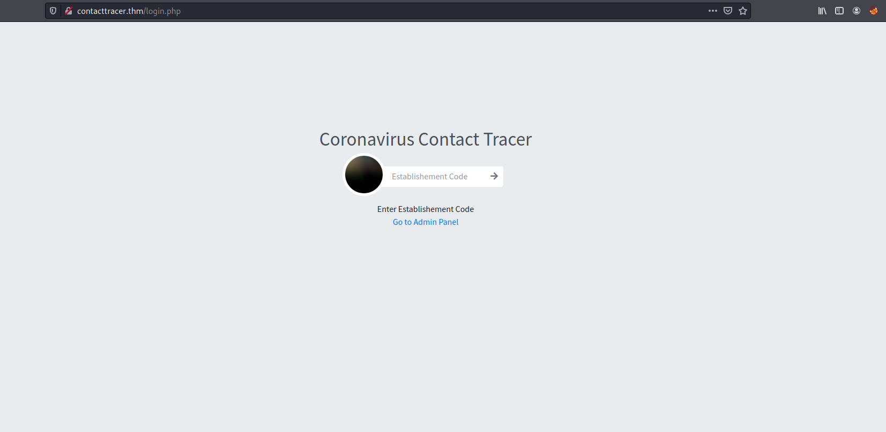

We are brought to a Coronavirus contact tracing page.

It seems that we can input an 'Establishment Code'. I tried to input some random data, but clicking the submit button does nothing. There is also a link to the admin panel. Let's visit it:

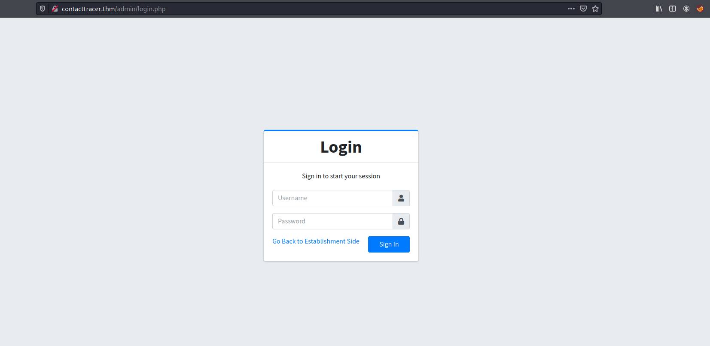

And we have a login page!

I tried logging in with various default credentials, but unfortunately none of them worked. Without a valid username, it is also difficult to try and brute-force any passwords.

From here, I did a lot of digging around the website before finding something interesting when intercepting the login response using Burpsuite:

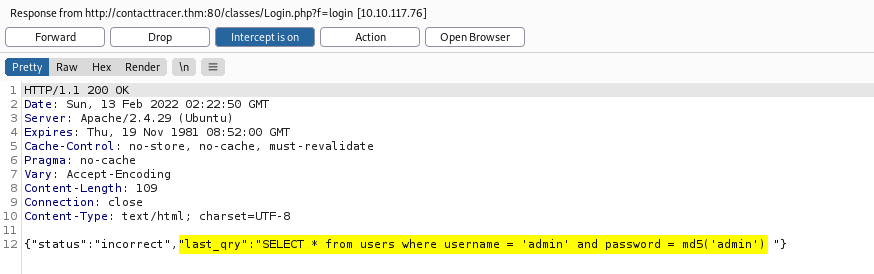

We can actually see the SQL query that is sent to the server when logging in! With that, I tried submitting a basic SQL injection payload in the username field, to log in as the user 'admin':

```
admin'-- 
```

 *(Make sure to include a space after '--')*

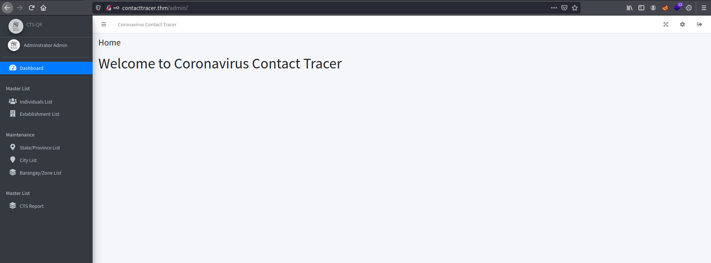

And we're in! We are brought to an administrative dashboard.

My first thought was to find a place where I can upload a PHP reverse shell. Looking around the dashboard, I found that I could update the **system logo** by clicking on the gear icon at the top-right of the screen. 

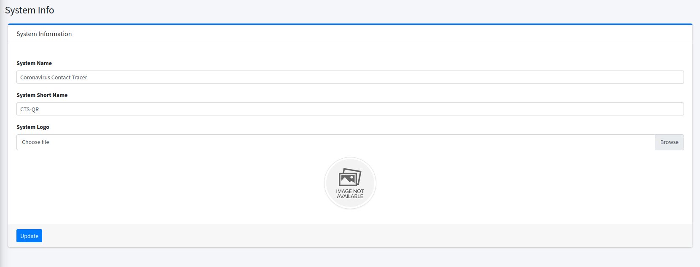

After uploading the reverse shell file, we can trigger the reverse shell by logging out and visiting the main page again:

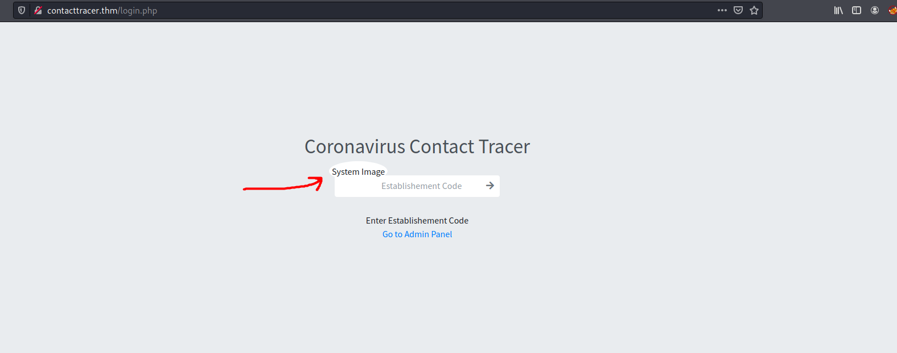

The web server will call the file that we uploaded, causing the reverse shell to be opened:

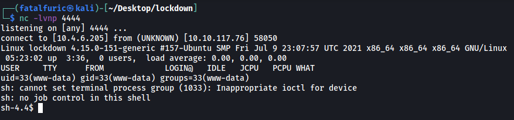

And we've now gained a foothold onto the machine!

Looking in the /home directory, we see that there are 2 users - **cyrus** and **maxine**:

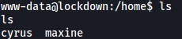

Unfortunately, we do not have the permissions to access their home directories.

Next, I visited the /var/www/html directory to see if I could find any interesting files. Sure enough, there was a file called **DBConnection.php** which contained valid credentials to access the SQL database:

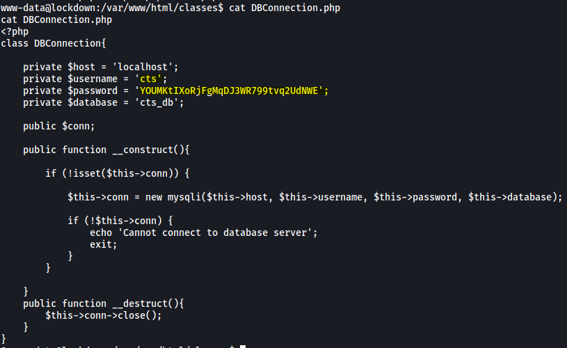

Let's log into the SQL database with our newfound credentials:

```
mysql -u cts -p
```

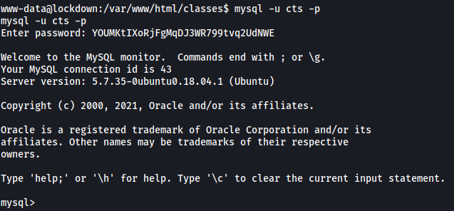

Exploring the database, I found a table called **users** in the **cts_db** database:

``` 
use cts_db;
select * from users;
```

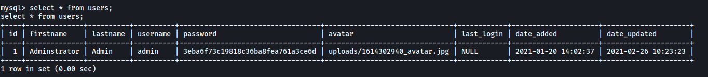

We see a hashed password under the password column.

I was able to easily crack this password using `john`:

```
john hash --wordlist=/usr/share/wordlists/rockyou.txt --format=Raw-MD5
```

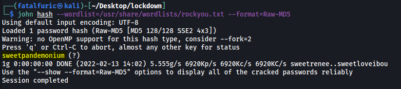

Nice! We have a potential password for either cyrus or maxine:

> sweetpandemonium

Let's try to log into their accounts. Make sure to upgrade your shell to a fully-interactive TTY shell first:

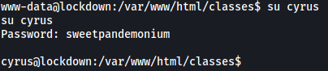

It turns out the password belongs to cyrus :smile:

With that, we can access cyrus' home directory and obtain **user.txt**:

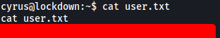

---

### [ What is the root flag? ]

Before moving on to escalating our privileges, let's first log into the machine via SSH so that we don't have to use the reverse shell anymore. When I tried to log in directly, I realised that the SSH server did not accept password-based login.

Fortunately for us, cyrus' home directory contains the **.ssh** directory with the **authorized_keys** file. Hence, all I had to do was to add my own public key into that file. With that, I could then ssh into the machine using my private key:

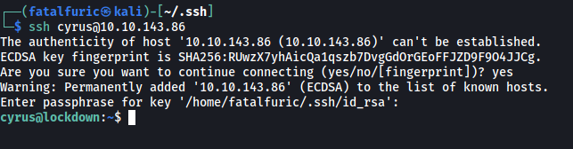

Cyrus' home directory contained an empty directory called **quarantine** and a file called **testvirus**:

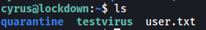

There wasn't much I could do with those files at the moment, so I moved on first.

Checking cyrus' **sudo privileges**, we see that they can run a script called **scan.sh** as root:

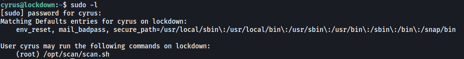

Let's take a look at this script:

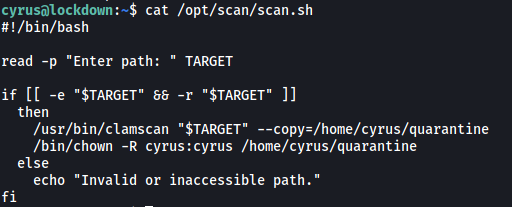

The script takes in a path as user input. Next, it uses `clamscan`, which is a command-line antivirus scanner, to scan all files within the specified directory. Any files with viruses detected are then copied into /home/cyrus/quarantine. Finally, the copied files will have their owner changed to cyrus.

My first thought was to have this script scan the **/root** directory directly. Then maybe the **root.txt** would be copied over to the quarantine directory. However, I realized that this would not work as the root.txt will not be recognized as a virus and hence, won't be copied over...

What if there was a way to define our own virus rules? Doing some research online, I stumbled across the following [website](https://docs.clamav.net/manual/Signatures/YaraRules.html). It seems that we can define **YARA rules** in ClamAV!

*(below shows an example YARA rule file from the website):*

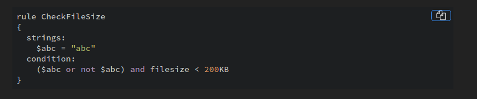

I created my own rule file called `root.yar` and stored it in **/var/lib/clamav** (where ClamAV keeps its virus database):

```
rule obtainroot
{
	strings:
		$a = "THM"
	condition:
		$a
}
```

Since we know the root flag has the format 'THM{...}', I defined the rule such that any file with the string **'THM'** will be considered as a virus.

With everything set up, let's run scan.sh again on the **/root** directory:

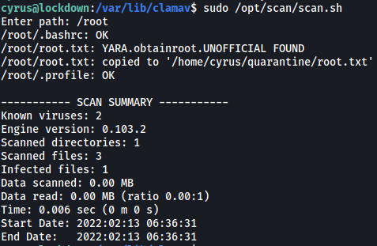

We can see that the **root.txt** file was successfully detected as a virus, and was copied over to /home/cyrus/quarantine.

Since the copied root.txt file has its owner changed to cyrus, we can read it and obtain the **root flag**:

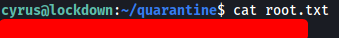